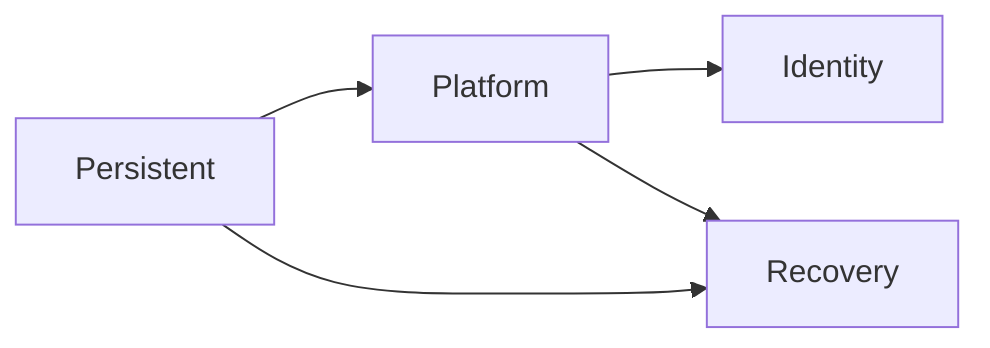

# Repository maintainer guide

This document identifies the authoritative execution paths and the safest
starting point for common changes.

## Choose the correct entry point

| Goal | Start here | Do not start here |
|---|---|---|
| Consume a reusable module | Module README and matching `terraform/environments/module-tests/<module>` root | IRE lifecycle roots |
| Change reusable VPC behavior | `terraform/modules/vpc` | Sandbox desired-state files |
| Change the governed IRE topology | `terraform/environments/sandbox/config/platform.tfvars` | Reusable module defaults |
| Change Platform composition | `terraform/stacks/platform` | Reusable modules unrelated to the change |
| Change administrative identity | `terraform/stacks/identity` | Platform state |
| Change temporary recovery compute | `terraform/stacks/recovery` | Platform or Identity state |
| Change persistent vaults or logging KMS | `terraform/stacks/persistent` | Recovery state |
| Change AAP stack bindings | `playbooks/vars/terraform_stack_bindings.yml` | Terraform module defaults |

## Authoritative lifecycle model

| Stack | Terraform root | Sandbox configuration | State key |
|---|---|---|---|
| Persistent | `terraform/stacks/persistent` | `common-tags.tfvars`, `persistent.tfvars` | `ire/sandbox/persistent/terraform.tfstate` |
| Platform | `terraform/stacks/platform` | `common-tags.tfvars`, `platform.tfvars`, `platform-network-policy.tfvars` | `ire/sandbox/platform/terraform.tfstate` |
| Identity | `terraform/stacks/identity` | `common-tags.tfvars`, `identity.tfvars` | `ire/sandbox/identity/terraform.tfstate` |
| Recovery | `terraform/stacks/recovery` | `common-tags.tfvars`, `recovery.tfvars` | `ire/sandbox/recovery/terraform.tfstate` |

The exact configuration file allowlists and cross-stack outputs are owned by
`playbooks/vars/terraform_stack_bindings.yml`.

## Local execution boundary

There is no monolithic "full-stack apply" root. The supported IRE deployment
path is AAP/AWX, executed in lifecycle order:

1. Persistent;
2. Platform;
3. Identity; and
4. Recovery.

AAP/AWX owns the assumed-role session, account verification, backend binding,
ordered var files, upstream contract resolution, sensitive credential
injection, plan guardrails, apply authorization and cleanup of temporary
artifacts.

Local Terraform is supported for isolated module-validation roots and
backend-disabled static validation. Direct local apply of an IRE lifecycle root is not a
documented deployment path. Reproducing only part of the AAP binding can select
the wrong state or account, omit an upstream contract, or bypass an approval
guardrail.

## How the Platform network fits together

The Platform root is split by concern because it composes multiple VPCs and
services. Follow this order when tracing a network change:

1. `variables-network.tf` defines the accepted topology contract.
2. `platform.tfvars` supplies the environment topology.
3. `locals-network.tf` normalizes caller-provided VPC definitions.
4. `networking.tf` creates VPCs and Transit Gateway attachments.
5. `routing.tf` creates approved connectivity paths.
6. `security.tf`, `ssm-management.tf`, `client_vpn.tf`, and firewall files
   consume the VPC and subnet outputs.
7. `outputs.tf` publishes the Platform contract for Identity and Recovery.

The reusable VPC module intentionally owns only VPCs, subnets, route tables,
route-table associations, and an optional Internet Gateway. Routes to other
services remain with the consuming composition root.

## State and replacement safety

- Moving a Terraform block between `.tf` files in the same root does not change
  its resource address.
- Renaming resource or module blocks can change addresses and requires an
  explicitly reviewed migration.
- Moving a resource between lifecycle roots changes state ownership and must
  never be treated as a readability refactor.
- Never apply a plan merely because it has no destroys. Review all creates,
  replacements, account bindings, backend keys, and Regions.
- Never manage one AWS resource from two Terraform states.

## Validation terminology

`terraform/environments/module-tests` contains deployable module-validation
roots. They verify that reusable modules initialize and validate in realistic
consumer compositions. They are not native Terraform `.tftest.hcl` suites.

Run the repository validation helpers with Bash. Environment plans and applies
remain separate AAP-controlled operations.

For incident diagnosis and recurring operational checks, use
`docs/operations/troubleshooting.md`. It includes the execution-binding
worksheet, state-safety sequence, network dependency trace, common failure
patterns, and maintenance evidence table.
