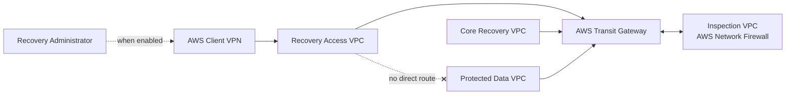

# AWS Isolated Recovery Environment (IRE)

Enterprise infrastructure-as-code and automation framework for deploying, operating, and validating an AWS **Isolated Recovery Environment (IRE)**.

The repository combines reusable Terraform modules with Ansible Automation Platform (AAP) orchestration to provide controlled infrastructure provisioning, network isolation, administrative access, recovery services, and lifecycle automation.

> [!IMPORTANT]
> Terraform is the infrastructure provisioning engine. Ansible Automation Platform (AAP) is the orchestration, authentication, approval, and execution-control layer.

## Start here

- New maintainers: read [`MAINTAINERS.md`](MAINTAINERS.md).
- Troubleshooting and maintenance: use
  [`docs/operations/troubleshooting.md`](docs/operations/troubleshooting.md).
- Governed IRE deployments: use the four roots under `terraform/stacks` through
  the approved AAP workflow.
- Reusable module validation: use the consumer roots under
  `terraform/environments/module-tests`.

Environment configuration lives under `terraform/environments`; it is not a
Terraform deployment root. Do not infer state ownership from directory names;
use the lifecycle bindings and backend keys documented in `MAINTAINERS.md`.

---

## Contents

- [Overview](#overview)
- [Architecture](#architecture)
- [Trust and traffic model](#trust-and-traffic-model)
- [Platform capabilities](#platform-capabilities)
- [Capability status](#capability-status)
- [Repository structure](#repository-structure)
- [Terraform design model](#terraform-design-model)
- [Configuration model](#configuration-model)
- [Client VPN authentication](#client-vpn-authentication)
- [AAP orchestration model](#aap-orchestration-model)
- [Remote state](#remote-state)
- [Security controls](#security-controls)
- [Validation and CI](#validation-and-ci)
- [Git delivery model](#git-delivery-model)
- [Prerequisites](#prerequisites)
- [Deployment workflow](#deployment-workflow)
- [Destroy workflow](#destroy-workflow)
- [Runtime validation boundary](#runtime-validation-boundary)
- [Sensitive data and repository hygiene](#sensitive-data-and-repository-hygiene)
- [Roadmap](#roadmap)

---

## Overview

The IRE design separates recovery functions into distinct network and trust zones so that administrative access, core recovery services, protected workloads, and inspection controls can be governed independently.

The reference implementation uses four VPCs within the recovery AWS account and Region:

1. **Recovery Access VPC** — administrative entry, Client VPN target networks, management tooling, private endpoints, and Transit Gateway attachment subnets.
2. **Core Recovery VPC** — recovery services, directory-service subnets, platform services, private endpoints, and Transit Gateway attachment subnets.
3. **Protected Data VPC** — restored workloads, ingestion services, databases, file services, private endpoints, and Transit Gateway attachment subnets.
4. **Inspection VPC** — AWS Network Firewall endpoints and Transit Gateway attachment subnets for centralized east-west inspection.

The environment is composed from reusable Terraform modules. Environment-specific values remain outside the reusable modules and are supplied through strongly typed inputs.

---

## Architecture



Transit Gateway route tables and VPC routes steer approved inter-VPC traffic through the Inspection VPC when inspection mode is enabled. Security groups, Network Firewall policy, Client VPN authorization, and route ownership together define the effective trust boundary.

### Design objectives

The architecture is intended to provide:

- isolated administrative access;
- explicit trust boundaries;
- no implicit any-to-any routing;
- centralized inspection for approved inter-VPC paths;
- separation between administrative and recovered-workload access;
- private-by-default recovery services;
- controlled backup and restore services;
- automation-first infrastructure lifecycle management; and
- enterprise integration points for identity, networking, and approvals.

---

## Trust and traffic model

| Source | Destination | Default treatment |
|---|---|---|
| Client VPN | Recovery Access | Controlled by Client VPN authorization and security groups |
| Recovery Access | Core Recovery | Approved path through Transit Gateway; inspected when firewall mode is enabled |
| Core Recovery | Recovery Access | Symmetric return path |
| Core Recovery | Protected Data | Approved path through Transit Gateway; inspected when firewall mode is enabled |
| Protected Data | Core Recovery | Symmetric return path |
| Recovery Access | Protected Data | No direct route |
| Workloads within one VPC | Same VPC | Controlled primarily by security groups and workload controls |
| On-premises | Core Recovery | Planned controlled hybrid path through Transit Gateway and inspection |
| On-premises | Protected Data | Not part of the default trust model; exceptions require explicit design and approval |

### Network inspection modes

The environment supports two routing modes through `network_inspection_mode`.

#### `firewall`

Use for the full centralized-inspection topology.

- AWS Network Firewall is deployed in the Inspection VPC.
- Approved adjacent-zone traffic is routed through the inspection path.
- Transit Gateway appliance mode supports symmetric stateful inspection.
- Firewall `ALERT` and `FLOW` logs are published to encrypted CloudWatch log groups.

#### `bypass`

Use where the logical trust model must be retained without routing approved inter-VPC traffic through Network Firewall.

- Approved Recovery Access ↔ Core Recovery and Core Recovery ↔ Protected Data paths use Transit Gateway directly.
- No direct Recovery Access ↔ Protected Data path is introduced.
- The Inspection VPC remains part of the environment model.

> [!NOTE]
> `bypass` changes the traffic treatment, not the logical trust relationships between IRE zones.

---

## Platform capabilities

### Networking and security

- Strongly typed VPC module.
- Caller-defined subnets and route tables.
- Stable key-based and group-based outputs.
- Optional Internet Gateway ownership without implicit route creation.
- Transit Gateway attachments, route tables, associations, propagations, and appliance mode.
- Centralized Inspection VPC.
- AWS Network Firewall deployment and policy modules.
- Stateful rule-group support.
- Network Firewall routing integration.
- Network Firewall logging integration.
- Network Firewall TLS-inspection module.
- Reusable security-group and standalone security-group-rule modules.
- Version-controlled security-group and Network Firewall policy definitions.
- Explicit absence of a direct Recovery Access-to-Protected Data route.

### Recovery services

- Standard AWS Backup vault.
- Logically air-gapped AWS Backup vault.
- Backup plan and copy actions.
- Backup IAM role.
- Backup resource selection.
- Reusable customer-managed KMS keys.
- Reusable EC2 module.
- Reusable EC2 key-pair module using public-key input only.
- Reusable AWS Managed Microsoft AD module.

### Administrative access

- AWS Client VPN association to the Recovery Access VPC.
- Optional AWS Client VPN with certificate or SAML-federated authentication.
- Enterprise SAML/MFA as the target organizational access pattern.
- Optional Terraform-managed IAM SAML provider composition.
- Client VPN authorization rules scoped to approved destinations.

---

## Capability status

The following matrix distinguishes reusable implementation, environment integration, and runtime validation status.

| Capability | Reusable implementation | Integrated environment | Runtime validation |
|---|---|---|---|
| VPC networking | Yes | Yes | Deployment validation pending |
| Transit Gateway | Yes | Yes | Deployment validation pending |
| AWS Network Firewall | Yes | Yes | Deployment validation pending |
| Security groups and rules | Yes | Yes | Deployment validation pending |
| Client VPN certificate authentication | Yes | Yes | Environment validation required |
| Client VPN SAML federation | Yes | Configuration supported | Enterprise IdP integration and validation pending |
| AWS Backup | Yes | Yes | Backup and recovery testing pending |
| KMS | Yes | Yes | Deployment validation pending |
| EC2 / key pair | Yes | Yes | Environment validation required |
| AWS Managed Microsoft AD | Yes | Not enabled in the current integrated environment | Environment validation pending |
| AWS Site-to-Site VPN | Planned | No | Not applicable |

> [!NOTE]
> A reusable capability being present in code does not by itself indicate production acceptance. Environment-specific deployment, integration, and operational validation remain separate activities.

---

## Repository structure

```text
.
├── .github/
│   └── workflows/
│       └── ci.yml
├── collections/
│   └── ansible_collections/
│       └── ire_platform/
│           └── aws/
├── docs/
├── playbooks/
│   ├── terraform_backend_bucket.yml
│   ├── terraform_deploy.yml
│   ├── terraform_destroy.yml
│   ├── test_assume_role.yml
│   └── test_caller_identity.yml
├── scripts/
│   └── ci/
├── terraform/
│   ├── stacks/
│   │   ├── persistent/
│   │   ├── platform/
│   │   ├── identity/
│   │   └── recovery/
│   ├── environments/
│   │   ├── sandbox/
│   │   │   └── config/
│   │   ├── module-tests/
│   └── modules/
│       ├── backup-*/
│       ├── client-vpn/
│       ├── iam-saml-provider/
│       ├── ec2/
│       ├── key-pair/
│       ├── kms/
│       ├── managed-microsoft-ad/
│       ├── route53-resolver/
│       ├── network-firewall/
│       ├── network-firewall-logging/
│       ├── network-firewall-policy/
│       ├── network-firewall-routing/
│       ├── network-firewall-rule-group/
│       ├── network-firewall-tls-inspection/
│       ├── security-group/
│       ├── security-group-rule/
│       ├── transit-gateway/
│       └── vpc/
├── ansible.cfg
└── requirements.yml
```

The four directories under `terraform/stacks` are the active lifecycle roots.
Sandbox desired-state files consumed by AAP are under
`terraform/environments/sandbox/config`. Reusable module logic remains under
`terraform/modules` and is validated independently through module-validation
roots under `terraform/environments/module-tests`.

---

## Terraform design model

The repository separates reusable infrastructure modules from environment composition.

```text
Environment inputs
      ↓
Environment root
      ↓
Locals / normalization
      ↓
Reusable Terraform modules
      ↓
AWS resources
      ↓
Outputs
```

### Module ownership

The major ownership boundaries are:

| Component | Responsibility |
|---|---|
| VPC module | VPCs, subnets, route tables, route-table associations, optional IGW |
| Transit Gateway module | TGW, attachments, TGW route tables, associations, propagation |
| Network Firewall modules | Firewall, policy, rule groups, logging, routing, TLS inspection |
| Security modules | Security groups and standalone rules |
| Client VPN module | Client VPN endpoint, associations, authorization, authentication configuration |
| IAM SAML provider module | Optional IAM SAML provider creation from approved metadata |
| Backup modules | Vaults, plans, copy actions, roles, selections |
| EC2 / key-pair modules | Compute and public-key registration |
| Managed Microsoft AD module | AWS Managed Microsoft AD resources |

Route creation is intentionally separated from generic VPC construction where routing ownership belongs to the higher-level network design.

---

## Configuration model

The repository uses a three-layer configuration model.

| Layer | Source | Purpose |
|---|---|---|
| Architecture | Git | Stable non-sensitive desired state |
| Environment binding | AAP | Region, execution role, backend and external resource references |
| Runtime intent | AAP | Plan/apply and temporary workload lifecycle |

AAP passes the following Git-controlled Sandbox files explicitly to the active
Platform root:

~~~text
terraform/environments/sandbox/config/common-tags.tfvars
terraform/environments/sandbox/config/platform.tfvars
terraform/environments/sandbox/config/platform-network-policy.tfvars
~~~

Git-controlled architecture includes:

- `network_config`;
- `network_inspection_mode`;
- `client_vpn_enabled`;
- `authentication_type`;
- SSM management architecture;
- naming;
- standard tagging;
- Recovery workload AMIs, placement, access methods and SSH exception registry;
- Persistent Resources integration enablement; and
- network security policy.

The deployment Region is an AAP environment binding. The playbook derives
Terraform `aws_region` from `assume_role_aws_region`.

The backend Region remains independently configured because the state bucket
may reside in a different AWS Region.

`terraform.tfvars` remains ignored and is used only for local/runtime bindings.
Non-sensitive desired-state environment configuration belongs in the tracked
stack-specific `.tfvars` files selected by AAP rather than being re-entered by
operators on every run.

Secrets, credentials, state, plans and sensitive runtime artifacts remain
outside Git.

## Lifecycle stacks and Persistent Resources

Normal AAP execution is separated into four lifecycle stacks:

| Stack | Ownership | Backend key |
|---|---|---|
| Persistent | Optional long-lived Backup vaults and logging KMS key | `ire/<environment>/persistent/terraform.tfstate` |
| Platform | Network, security, access plane and shared platform services | `ire/<environment>/platform/terraform.tfstate` |
| Identity | Directory and identity services | `ire/<environment>/identity/terraform.tfstate` |
| Recovery | Temporary recovery workloads, plans and validation resources | `ire/<environment>/recovery/terraform.tfstate` |

The Persistent stack name describes lifecycle, not an account/network foundation.
Its existing AWS resource prefix remains `ire-sandbox-foundation` to avoid
replacement during the Terraform root rename.

AAP supports two Persistent contract sources:

- `managed`: consume approved outputs from Persistent Terraform state;
- `external`: consume approved existing AWS references without managing them.

Backup vault and logging-KMS creation are independent, Git-controlled
capabilities. Network Firewall logging does not require a customer-managed KMS
key; when no ARN is supplied, CloudWatch Logs default encryption is used.

See `terraform/stacks/persistent/README.md`, `docs/aap/variables.md`, and
`docs/aap/job-templates.md` for exact managed/external and lifecycle usage.

## Client VPN authentication

AWS Client VPN is an optional access-plane component of the Sandbox.

Initial infrastructure bootstrap uses:

~~~hcl
client_vpn_enabled  = false
authentication_type = "federated"
~~~

This allows VPCs, Transit Gateway, routing, security controls, SSM and the
remaining persistent IRE platform to deploy before enterprise PKI and Identity
dependencies are available.

When Client VPN is enabled, a server TLS certificate is required. Federated
authentication additionally consumes the approved enterprise IAM SAML provider.

Enterprise enablement therefore follows:

~~~text
Persistent IRE platform
      |
      | client_vpn_enabled = false
      v
Platform bootstrap succeeds
      |
      +--> PKI provisions server certificate
      |
      +--> Identity team configures SAML + MFA
      |
      +--> IAM SAML provider becomes available
      |
      v
Reviewed Git change
client_vpn_enabled = true
      |
      v
AAP supplies external certificate/SAML ARNs
      |
      v
Client VPN endpoint created
~~~

The normal enterprise target is SAML-federated authentication with MFA
controlled by the enterprise identity provider.

Mutual certificate authentication remains supported by the reusable module for
controlled use cases, but it is not the normal enterprise AAP/laptop access
pattern.

Client VPN authorization remains scoped to approved destinations and does not
create a direct Recovery Access-to-Protected Data trust path.

## AAP orchestration model

AAP orchestrates Terraform; it does not redefine the infrastructure
architecture.

Common account, role, Region, backend, and Persistent contract bindings are
sourced once from a Git-controlled AAP inventory. Fixed JTs contain only stack
selection, lifecycle intent, destroy gates, and allowlisted runtime bindings.
The customer-neutral inventory structure is documented under `inventories/`;
real values belong in the private deployment-configuration repository.

~~~text
Git reviewed desired state
        |
        v
AAP assumes approved AWS role
        |
        v
AAP injects deployment Region
        |
        v
Terraform init
        |
        v
Terraform validate
        |
        v
Terraform plan
        |
        +--> plan only by default
        |
        v
approved apply
~~~

The deployment Region has one AAP source of truth:

~~~text
assume_role_aws_region
      -> Terraform aws_region
~~~

The remote-state backend Region remains independently configured.

For Sandbox, AAP runtime Terraform variables are explicitly allowlisted.
Stable architecture such as network CIDRs, inspection mode, Client VPN
authentication mode, SSM architecture, naming, tags and security policy cannot
be changed through the normal runtime map.

The initial persistent-platform run can therefore use:

~~~yaml
terraform_variables: {}
~~~

A recovery exercise needs only:

~~~yaml
terraform_variables:
  demo_ec2_enabled: true
~~~

The reviewed Recovery stack configuration owns each workload's AMI, access
method, placement, backup intent, and optional SSH key-pair reference. AAP
cannot replace these through the normal Sandbox runtime map.

When Git later enables enterprise federated Client VPN, AAP supplies the
existing external certificate and SAML-provider ARNs.

Identity secrets are separated from ordinary runtime variables. When Git enables
Managed AD, an approved AAP custom credential injects the bootstrap password as
`IRE_TERRAFORM_MANAGED_AD_PASSWORD`. The playbooks reserve
`managed_ad_password`, reject operator override, and resolve the credential
internally under `no_log`. With Managed AD disabled, Identity continues to use
`terraform_variables: {}` without requiring the credential.

The deploy workflow defaults to plan-only execution. Destroy remains separately
guarded by explicit enablement and confirmation controls.

Temporary Terraform variable and plan files are created only inside the
execution workspace and are cleaned up after execution.

## Remote state

Terraform remote state is initialized separately from the reusable module configuration.

Backend values are supplied at runtime rather than being embedded in `backend.tf`.

The environment backend declaration remains minimal:

```hcl
terraform {
  backend "s3" {}
}
```

Typical initialization:

```bash
terraform init \
  -input=false \
  -reconfigure \
  -backend-config=backend.hcl
```

Backend configuration files containing environment-specific values must remain outside version control.

The backend lifecycle is intentionally separated from infrastructure destroy operations so that destroying the IRE environment does not implicitly remove its state storage.

---

## Security controls

The current design includes the following controls:

- no implicit Transit Gateway any-to-any routing;
- no direct Recovery Access-to-Protected Data route;
- centralized east-west inspection in firewall mode;
- symmetric stateful routing through Transit Gateway appliance mode;
- explicit security-group policy;
- version-controlled Network Firewall policy;
- Client VPN authorization scoped to approved networks;
- Terraform support for certificate and SAML-federated Client VPN authentication;
- enterprise IdP ownership of MFA policy;
- KMS encryption for protected logging and recovery resources where configured;
- public-key-only EC2 key-pair registration;
- temporary AWS STS credentials for AAP execution;
- plan-only defaults for infrastructure deployment and destruction workflows;
- explicit confirmation before destructive execution; and
- cleanup of temporary Terraform plan and variable artifacts.

### Security-group composition and naming

Platform security groups are role based rather than one-per-VPC. Workload
groups such as `management`, `core`, and `protected` remain separate from the
private Systems Manager endpoint groups. A resource may attach more than one
logical group when it needs both a baseline policy and a workload-specific
policy. Rules remain standalone resources and are supplied through the
configuration-driven `security_group_rules` collection, so additional rules do
not require changes to the reusable security-group modules.

Security-group map keys are stable Terraform identities. They are also the
keys used by workload placement, endpoint bindings, Client VPN bindings, rules,
and outputs. AWS-visible names are deliberately separate from those identities:

- `security_group_naming_mode = "logical"` is the compatibility default and
  preserves the historical AWS names;
- `security_group_naming_mode = "standard"` derives names from the Platform
  `naming` object and the logical purpose; and
- an optional `name` on a security-group definition, or
  `security_group_name` on an SSM endpoint binding, provides an approved exact
  AWS name when a derived name is not suitable.

Changing the effective AWS name of an existing security group requires
replacement. Environments must therefore keep `logical` mode until an explicit
migration plan introduces replacement groups, moves attachments and rules, and
retires the legacy groups. Changing `naming.organization` from a neutral value
such as `org` to an organization code such as `fv` is similarly an environment
configuration decision and must not be introduced as an AAP runtime override.

---

## Validation and CI

The repository uses tiered validation so that development changes receive fast feedback while promotion to `main` receives broader validation.

### `development`

Pull requests and pushes targeting `development` validate:

- Terraform formatting;
- integrated environment validation;
- affected Terraform module-test consumers;
- YAML linting;
- Ansible linting;
- Ansible playbook syntax; and
- advisory Checkov scanning.

### `main`

Pull requests and pushes targeting `main` validate:

- Terraform formatting;
- integrated environment validation;
- all Terraform module-test roots;
- YAML linting;
- Ansible linting;
- Ansible playbook syntax; and
- advisory Checkov scanning.

Checkov is currently advisory so that policy findings can be reviewed and remediated deliberately without weakening the primary Terraform and Ansible validation gates.

---

## Git delivery model

```text
feature branch
      ↓
Pull Request to development
      ↓
Squash and merge
      ↓
development
      ↓
Pull Request to main
      ↓
Merge commit
      ↓
main
```

After promotion, `development` is synchronized with `main` before the next feature begins.

This model provides:

- short-lived feature branches;
- clean integration history in `development`;
- explicit promotion history in `main`; and
- consistent CI validation at each stage.

---

## Prerequisites

The execution environment must provide:

- Terraform CLI at the repository-approved version;
- Ansible Core at the repository-approved version;
- required Ansible collections from `requirements.yml`;
- Python dependencies required by the AWS collections;
- network connectivity to the AWS APIs required by the deployment;
- permission to assume the approved AWS execution role; and
- access to the configured Terraform remote-state backend.

Stable non-sensitive architecture is version controlled. External identity/PKI references and sensitive values are supplied through the approved enterprise deployment process when the dependent capability is enabled.

> [!IMPORTANT]
> Production execution should use a standardized AAP Execution Environment so that Terraform, Ansible, collections, and supporting dependencies are controlled and repeatable.

---

## Deployment workflow

`playbooks/terraform_deploy.yml` provides guarded Terraform deployment orchestration.

The workflow performs:

1. input validation;
2. AWS IAM role assumption;
3. temporary workspace creation;
4. runtime Terraform variable-file generation;
5. Terraform backend initialization;
6. `terraform validate`;
7. saved Terraform plan generation;
8. plan-summary reporting; and
9. application of the saved plan only when explicitly enabled.

The safe default is:

```yaml
terraform_apply_enabled: false
```

With the default value, the workflow stops after a successful plan.

### Controlled apply

AAP or the approved operator must explicitly enable the apply path.

The saved plan is applied rather than generating a second plan immediately before execution.

---

## Destroy workflow

`playbooks/terraform_destroy.yml` uses a separate destructive entry point.

The safe defaults are:

```yaml
terraform_destroy_enabled: false
terraform_destroy_confirmation: ""
```

Destruction requires the enable flag, the selected stack's elevated allow flag,
and the exact stack-specific confirmation. For example, Recovery requires:

```yaml
terraform_destroy_enabled: true
terraform_allow_recovery_destroy: true
terraform_destroy_confirmation: "DESTROY RECOVERY"
```

The workflow:

1. validates destroy inputs;
2. validates the explicit destroy authorization;
3. assumes the approved AWS IAM role;
4. initializes Terraform against the configured backend;
5. validates the configuration;
6. creates a saved `terraform plan -destroy` plan;
7. reports the destroy plan; and
8. applies the saved destroy plan only when the required controls are satisfied.

> [!WARNING]
> Production AAP workflows should add platform-level approval controls in addition to the playbook-level destroy guard.

---

## Runtime validation boundary

Repository validation verifies configuration structure, static validation, module composition, and orchestration behavior through the Terraform planning boundary.

End-to-end operational acceptance requires an approved deployment and environment-specific runtime validation of items such as:

- Client VPN connectivity;
- enterprise SAML/IdP authentication;
- network reachability between approved zones;
- absence of prohibited routes;
- Network Firewall rule matches;
- CloudWatch log delivery;
- Transit Gateway route behavior;
- directory-service reachability and authentication;
- AWS Backup execution;
- restore and recovery workflows;
- application health; and
- teardown and redeployment procedures.

Runtime validation results should be recorded separately from reusable module documentation so that environment-specific evidence does not become embedded in the generic repository interface.

---

## Sensitive data and repository hygiene

Do not commit:

- `terraform.tfvars` containing real environment values;
- `backend.hcl` containing environment-specific backend details;
- Terraform state;
- saved Terraform plans;
- AWS credentials;
- private keys;
- passwords;
- sensitive SAML metadata;
- AAP runtime-variable files containing secrets; or
- generated logs containing sensitive runtime information.

Use tracked `*.example` files as templates and inject approved values through the enterprise deployment process.

### Repository standards

Repository content must not contain:

- AWS credentials;
- private keys;
- passwords;
- sensitive identity-provider metadata;
- local workstation paths;
- generated Terraform state or plan files; or
- runtime artifacts containing sensitive information.

Environment-specific values must be supplied through approved configuration, credential, or secret-management mechanisms.

---

## Detailed documentation

Use the root README for architecture, operating model, and repository-wide controls.
Detailed implementation guidance is maintained in the following documents:

| Document | Purpose |
|---|---|
| [`docs/aap/README.md`](docs/aap/README.md) | AAP orchestration and execution model |
| [`docs/aap/variables.md`](docs/aap/variables.md) | AAP runtime-input and credential contract |
| [`inventories/README.md`](inventories/README.md) | SCM inventory ownership and private-environment usage |
| [`docs/aap/examples/terraform-job-vars.example.yml`](docs/aap/examples/terraform-job-vars.example.yml) | Enterprise-safe example runtime configuration |
| [`docs/terraform/configuration-reference.md`](docs/terraform/configuration-reference.md) | Terraform root-input reference and variable-to-resource intent |
| [`docs/terraform/module-map.md`](docs/terraform/module-map.md) | Architecture-to-code and environment-to-module map |

> [!IMPORTANT]
> Environment-specific secrets and credentials are not stored in the example files.
> They must be supplied through approved AAP credentials or enterprise secret-management integrations.

---

## Roadmap

The following capabilities are outside the current baseline and are expected to be introduced through separately reviewed changes:

- AAP Job Template and credential integration;
- workflow-level plan and deployment approval gates;
- standardized AAP Execution Environment dependencies;
- AWS account and environment safety assertions;
- automated post-deployment infrastructure validation;
- integration and validation with the approved enterprise SAML identity provider and MFA policy;
- inspected AWS Site-to-Site VPN connectivity into Core Recovery;
- organization-approved tagging integration where required; and
- incremental policy-as-code hardening.

Planned hybrid connectivity follows the controlled path:

```text
On-premises
    ↓
AWS Site-to-Site VPN
    ↓
AWS Transit Gateway
    ↓
Inspection VPC
    ↓
Core Recovery VPC
```

A general on-premises-to-Protected Data route is not part of the default architecture.

---

## Related documentation

Additional module-specific and environment-specific documentation is maintained alongside the relevant code, including:

- Terraform module READMEs;
- module-test READMEs;
- environment configuration examples;
- backend bootstrap guidance; and
- CI validation scripts.

Keep this root README focused on the repository contract, architecture, operating model, and enterprise usage boundaries.
