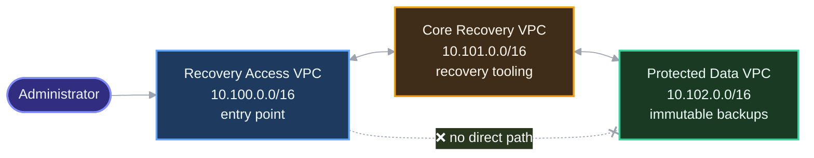
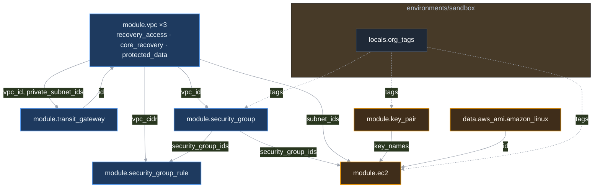
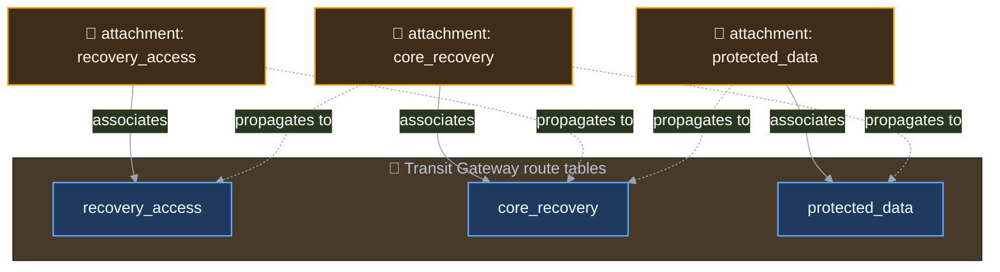
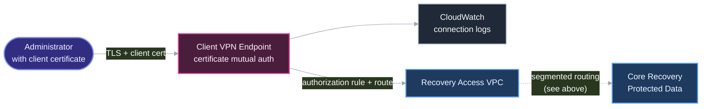
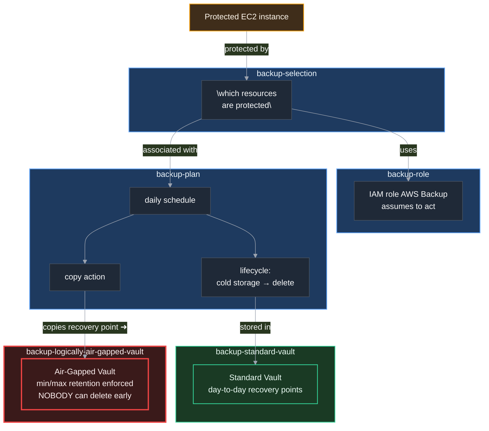
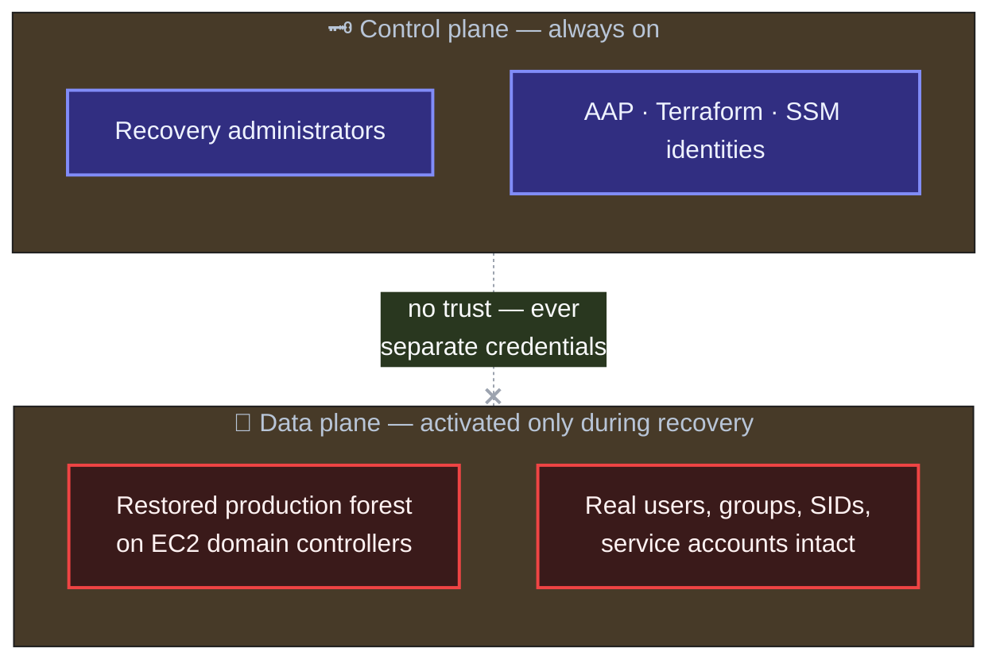

# AWS Isolated Recovery Environment — Terraform Module Library

A reusable Terraform module library that builds an **Isolated Recovery Environment (IRE)** on AWS: a segmented, network-isolated landing zone designed so that recovery infrastructure and immutable backup data remain reachable even when the production estate is compromised.

The repository is written to serve two purposes at once. It is a working infrastructure library with composable modules and a deployable sandbox environment, and it is an annotated reference — every module is commented to explain the Terraform language features it uses, so the code can be read as a teaching resource.

---

## What an Isolated Recovery Environment is

> **In plain English:** if ransomware ever takes down the main company network, this is the separate, locked-down environment where recovery happens — one that never trusts the compromised network it's recovering from, not even a little, until someone has proven it's clean again.

An IRE is a recovery estate that shares no trust relationship with production. If ransomware or a credential compromise takes out the production account, the recovery environment must still be usable — which means it cannot depend on production identity, production networking, or production backups.

The network model implemented here is a three-tier trust chain:



Recovery Access is where administrators arrive. Core Recovery hosts the tooling that performs restores. Protected Data holds the backup repositories and is the most sensitive tier. **Recovery Access has no route to Protected Data.** Reaching the data requires transiting Core Recovery, which gives you a single controlled hop to monitor, inspect, and eventually place a firewall in.

That property is not a convention or a comment — it is enforced structurally by Transit Gateway route tables, described in [Network segmentation](#network-segmentation) below.

---

## Repository layout

```
terraform/
├── environments/
│   └── sandbox/                          Deployable environment; composes the modules below
├── modules/
│   ├── vpc/                              VPC, subnets, route tables, conditional IGW
│   ├── transit-gateway/                  TGW, attachments, segmented route tables
│   ├── security-group/                   Security group shells (no inline rules)
│   ├── security-group-rule/              Standalone ingress/egress rules
│   ├── key-pair/                         EC2 key pairs from existing public keys
│   ├── ec2/                              EC2 instances
│   ├── client-vpn/                       Certificate-authenticated remote access
│   ├── backup-standard-vault/            Primary AWS Backup vault
│   ├── backup-logically-air-gapped-vault/ Immutable, ransomware-resistant vault
│   ├── backup-plan/                      Backup schedule, lifecycle, copy actions
│   ├── backup-role/                      IAM role AWS Backup assumes
│   ├── backup-selection/                 Which resources AWS Backup protects
│   └── managed-microsoft-ad/             Identity — design complete, build in progress
├── policies/              IAM policy documents
└── bootstrap/             State backend bootstrap

collections/               Ansible collection (separate from this library)
playbooks/                 Ansible playbooks
.github/workflows/         CI: lint, validate, security scan
```

Modules not listed above (`network-firewall`, `vpc-endpoints`, `route53-resolver`, `vpc-peering`, `s3-object-lock`, `rds`, `efs`, `iam`, `guardduty`, `cloudtrail`) are scaffolded directory structures reserved for planned work. They contain no implementation yet.

---

## Module status

| Module | Status | Summary |
|---|---|---|
| [`vpc`](terraform/modules/vpc) | Complete | VPC, public/private subnets across AZs, conditional Internet Gateway, route tables, Transit Gateway routes |
| [`transit-gateway`](terraform/modules/transit-gateway) | Complete | Transit Gateway, VPC attachments, per-domain route tables, associations, propagations |
| [`security-group`](terraform/modules/security-group) | Complete | Security group creation, rules delegated to `security-group-rule` |
| [`security-group-rule`](terraform/modules/security-group-rule) | Complete | Standalone ingress/egress rules using the modern split resource types |
| [`key-pair`](terraform/modules/key-pair) | Complete | EC2 key pairs from caller-supplied public keys |
| [`ec2`](terraform/modules/ec2) | Complete | EC2 instances with optional root volume configuration |
| [`client-vpn`](terraform/modules/client-vpn) | Complete | Certificate-authenticated Client VPN endpoint, connection logging, authorization rules and routes |
| [`backup-standard-vault`](terraform/modules/backup-standard-vault) | Complete | Primary AWS Backup vault for day-to-day recovery points |
| [`backup-logically-air-gapped-vault`](terraform/modules/backup-logically-air-gapped-vault) | Complete | Immutable vault with enforced min/max retention — the ransomware-resistant copy |
| [`backup-plan`](terraform/modules/backup-plan) | Complete | Backup schedule, lifecycle rules, and copy actions between vaults |
| [`backup-role`](terraform/modules/backup-role) | Complete | IAM role AWS Backup assumes to perform backup and restore |
| [`backup-selection`](terraform/modules/backup-selection) | Complete | Associates specific AWS resources with a Backup Plan |
| [`managed-microsoft-ad`](terraform/modules/managed-microsoft-ad) | 🚧 In progress | Identity architecture fully designed and documented; Terraform implementation not yet written |
| `network-firewall`, `vpc-endpoints`, `route53-resolver`, `vpc-peering` | Planned | Scaffolded, not implemented |
| `s3-object-lock`, `rds`, `efs`, `iam`, `guardduty`, `cloudtrail` | Planned | Scaffolded, not implemented |

| Environment | Status | Summary |
|---|---|---|
| [`sandbox`](terraform/environments/sandbox) | Complete | Three VPCs, Transit Gateway with segmented routing, security groups, EC2 instances, Client VPN, AWS Backup with dual-vault cyber recovery pattern |

---

## How the modules compose

The sandbox environment is a composition, not a monolith. Each module owns one concern and exposes outputs the next module consumes.



The VPC and Transit Gateway modules reference each other, which is legal and intentional: the TGW module consumes `vpc_id` and `private_subnet_ids` to build attachments, while the VPC module consumes `transit_gateway_id` to install routes. Terraform resolves this because the dependency is between *different resources* inside each module, not a true cycle.

---

## Network segmentation

This is the part of the design worth understanding in detail, because it is where the security property actually lives.

> **In plain English:** think of the Transit Gateway as a signal box in a rail yard. By default it would let every train (VPC) run to every other track. This design deliberately removes most of the tracks, so a train from Recovery Access can only ever reach Core Recovery — it physically cannot reach Protected Data, no matter what.

A Transit Gateway by default puts every attachment into one shared route table, which produces any-to-any connectivity between all attached VPCs. This library disables that (`default_route_table_association = "disable"`, `default_route_table_propagation = "disable"`) and builds explicit routing domains instead.

Two independent concepts control reachability:

- **Association** — which route table an attachment *consults* when sending traffic into the TGW. Each attachment associates with exactly one.
- **Propagation** — which route tables *learn* an attachment's VPC CIDR. One attachment can propagate into many.

Association decides where you look up routes; propagation decides who can see you. The sandbox wires them like this:



Reading the result: the `recovery_access` route table only ever learns Core Recovery's CIDR, because only the `core_recovery` attachment propagates into it. The `protected_data` route table likewise only learns Core Recovery. Neither table contains a route to the other, so **there is no path between Recovery Access and Protected Data at the Transit Gateway layer** — not a denied path, an absent one.

The resulting reachability matrix:

| From ↓ / To → | Recovery Access | Core Recovery | Protected Data |
|---|---|---|---|
| **Recovery Access** | — | ✅ | ❌ no route |
| **Core Recovery** | ✅ | — | ✅ |
| **Protected Data** | ❌ no route | ✅ | — |

VPC route tables mirror this. Each VPC receives only the TGW routes its tier is permitted to reach, so the restriction is enforced at both the VPC and the Transit Gateway layer.

---

## Remote access — AWS Client VPN

> **In plain English:** there is exactly one front door into this environment, and it checks ID (a digital certificate) at the door instead of just a password. Nobody walks in from the open internet — the whole environment has none.

The [`client-vpn`](terraform/modules/client-vpn) module provisions the only way in: an AWS Client VPN endpoint using **certificate-based mutual authentication** — both the server and the connecting client must present a certificate signed by a trusted Certificate Authority, so a stolen password alone is worthless here.



Two separate concepts control what a connected administrator can actually do, and the module treats them as distinct on purpose:

- **Routes** decide *how* the VPN endpoint forwards traffic to a destination network.
- **Authorization rules** decide *whether* it's allowed to — the actual access-control gate.

Both must exist for traffic to flow; a route with no authorization rule goes nowhere, and vice versa. Every connection is logged to CloudWatch (connection attempts, authentication events, session start and end) for audit and troubleshooting.

Practical defaults baked into the module: split tunnel (only AWS-bound traffic goes through the VPN — normal internet browsing on the administrator's laptop is unaffected), UDP transport, session re-authentication at a configurable interval, and log retention validated against AWS's own allowed values so a typo can't silently produce an invalid configuration.

---

## Cyber recovery backups — the dual-vault pattern

> **In plain English:** this is a bank vault with a second, time-locked vault behind it. Every day's backup goes into the first vault as normal — but a copy is also pushed into a second vault where, for a set number of days, **nobody** can delete or shorten that copy's lifetime, not an administrator, not even someone with the AWS root password. If ransomware — or an attacker with stolen admin credentials — tries to destroy your backups to stop you recovering, the locked copy is what survives.

Five modules work together to implement this, mirroring the identity-recovery design philosophy elsewhere in this repository: **never trust a single copy, and make the safety copy immutable, not just separate.**



| Module | What it does |
|---|---|
| [`backup-standard-vault`](terraform/modules/backup-standard-vault) | The primary, everyday vault every scheduled backup lands in first |
| [`backup-logically-air-gapped-vault`](terraform/modules/backup-logically-air-gapped-vault) | A separate `aws_backup_logically_air_gapped_vault` with enforced `min_retention_days` / `max_retention_days` — recovery points copied here **cannot** be deleted early by anyone, including an AWS account administrator |
| [`backup-plan`](terraform/modules/backup-plan) | Defines the schedule (cron), lifecycle (when to move to cold storage, when to delete), and the copy action that pushes a recovery point from the standard vault into the air-gapped vault |
| [`backup-role`](terraform/modules/backup-role) | The narrow IAM role AWS Backup itself assumes — scoped to exactly the AWS-managed backup policy, nothing more |
| [`backup-selection`](terraform/modules/backup-selection) | Declares which specific AWS resources (today: the Core Recovery EC2 instance) the plan actually protects |

The sandbox wires a daily schedule with a 30‑day cold-storage transition and a copy action that lands every recovery point in the air-gapped vault, retained there for up to a year — the same "immutable, validated vault the source cannot destroy" principle that Sheltered Harbor requires for financial data, applied here to infrastructure backups.

---

## Identity — Active Directory recovery (in progress)

> **In plain English:** recovered applications need to log people in using the same usernames, passwords, and permissions they had in production — not a fresh copy with new IDs that breaks every file permission in the company. Getting this right is subtle enough that the design was worked through in full before a single line of Terraform was written.

The [`managed-microsoft-ad`](terraform/modules/managed-microsoft-ad) module is currently **design-complete, implementation in progress**: its README contains a full architecture review (challenged assumptions, options compared, a recommended dual-plane design, failure-mode analysis, and a compliance mapping against NIST, CIS, and Sheltered Harbor), but the Terraform resources themselves are not yet written.



The one-sentence reason this took real design work before implementation: **a synchronized copy of a compromised directory is a compromised directory with better availability.** The full reasoning, including why a live sync into AWS Managed Microsoft AD is not actually achievable the way it's often assumed to be, lives in the module's [README](terraform/modules/managed-microsoft-ad/README.md).

---

## Deployment flow

```mermaid
%%{init: {'theme':'base', 'themeVariables': {'primaryColor':'#1f2937','primaryTextColor':'#f9fafb','primaryBorderColor':'#4b5563','lineColor':'#9ca3af'}}}%%
flowchart LR
    A["State backend\nS3 bucket"] --> B["terraform init"]
    B --> C["terraform plan"]
    C --> D["terraform apply"]
    D --> E["VPCs + subnets\n+ route tables"]
    E --> F["Transit Gateway\n+ attachments"]
    F --> G["TGW route tables\nassociations · propagations"]
    G --> H["VPC routes\ntoward TGW"]
    H --> I["Security groups\n+ rules"]
    I --> J["Key pair + EC2"]
    J --> K["Client VPN\nendpoint"]
    K --> L["AWS Backup\nvaults · plan · selection"]

    classDef step fill:#1f2937,stroke:#9ca3af,color:#f9fafb;
    class A,B,C,D,E,F,G,H,I,J,K,L step;
```



Terraform derives this ordering automatically from resource references — no `depends_on` is used anywhere in the library.

### Prerequisites

- Terraform `>= 1.10.0` (the S3 backend uses native lockfile locking, added in 1.10)
- AWS credentials with permission to manage VPC, EC2, Transit Gateway, Client VPN, and AWS Backup resources
- An S3 bucket for remote state, referenced in `terraform/environments/sandbox/backend.tf`
- An SSH public key on disk, referenced via `public_key_path`
- An ACM server certificate and root CA certificate chain for Client VPN, referenced via `server_certificate_arn` and `root_certificate_chain_arn`

### Deploying the sandbox

```bash
cd terraform/environments/sandbox

cp terraform.tfvars.example terraform.tfvars
# then edit terraform.tfvars — see Known limitations below

terraform init      # backend configuration lives in backend.tf
terraform plan
terraform apply
```

To tear it down:

```bash
terraform destroy
```

---

## Design decisions

**Modules own one concern each.** The VPC module does not create security groups; the security group module does not create rules. Small interfaces mean a module can be replaced or reused without dragging unrelated resources along.

**Everything is keyed by name, never by position.** Every resource uses `for_each` over a map rather than `count` over a list. Adding or removing one subnet, instance, or rule leaves the others untouched in state. `count` is used in exactly one place — the conditional Internet Gateway — where it acts as an existence toggle rather than a collection.

**Security group rules are standalone.** Inline `ingress`/`egress` blocks on `aws_security_group` conflict with standalone rule resources, and the two fight on every apply. This library uses only the standalone `aws_vpc_security_group_ingress_rule` / `_egress_rule` types, which also lets two groups reference each other without a circular dependency.

**Routing is passed in, not inferred.** The VPC module accepts a list of Transit Gateway routes instead of discovering peers itself. The module has no knowledge of the IRE topology, which is what keeps it reusable in an unrelated environment.

**Tagging has a single precedence order.** Deployable roots compose protected mandatory organization tags in `local.org_tags` and pass them through provider-level `default_tags` and generic module `tags` inputs. Per-resource tags merge on top, while the AWS display tag `Name` remains resource-specific.

**Backups are separated by concern, the same way networking is.** Vault, plan, role, and selection are four modules instead of one, so a plan can target a different vault, or a selection can reuse the same plan across resources, without touching unrelated Terraform.

---

## Security considerations

**Implemented**

- Private subnets have no `0.0.0.0/0` route — no NAT gateway and no internet path exist for them
- The Internet Gateway is created only for VPCs that declare public subnets; Core Recovery and Protected Data have none
- Transit Gateway default route table association and propagation are disabled, so no attachment gains connectivity implicitly
- Recovery Access has no route to Protected Data at either the VPC or the Transit Gateway layer
- EC2 root volumes default to `encrypted = true`
- Remote access is certificate-based mutual TLS via Client VPN, with connection logging to CloudWatch
- Backup recovery points are copied into a logically air-gapped vault with enforced minimum retention that no principal can override
- Remote state is encrypted at rest with locking enabled
- CI runs Checkov static analysis over all Terraform, and pre-commit hooks scan for AWS credentials and private keys before commit

**Deliberate sandbox deviations**

These would not be acceptable in the production IRE design and exist only to keep the sandbox cheap and reachable:

- The Recovery Access VPC has public subnets and an Internet Gateway. The production design has no IGW or NAT anywhere; administrative access arrives via Client VPN.
- The `management` security group allows SSH from `0.0.0.0/0`. Restrict this to a known administrative CIDR before using the pattern anywhere real.
- All three security groups allow unrestricted egress.
- The Client VPN's authorization rules currently scope access to the Recovery Access VPC only; extending this to Core Recovery and Protected Data is expected as the environment matures.

**Not yet implemented**

- VPC Flow Logs
- Inline inspection between tiers (the `network-firewall` module is scaffolded for this)
- Restriction of each VPC's default security group
- Active Directory / identity — design complete, Terraform build in progress (see [Identity](#identity--active-directory-recovery-in-progress) above)

---

## Continuous integration

`.github/workflows/ci.yml` runs on pushes to `main` and `development` and on pull requests targeting them:

| Job | What it does |
|---|---|
| Ansible / YAML lint | `yamllint` and `ansible-lint` across the collection and playbooks |
| Terraform fmt + validate | `terraform fmt -check -recursive`, then `init -backend=false` and `validate` on the sandbox |
| Checkov IaC scan | Static security analysis; advisory on pull requests to `development`, blocking on pull requests to `main` |

`.pre-commit-config.yaml` provides the local equivalent, plus credential and private key detection:

```bash
pip install pre-commit
pre-commit install
```

---
