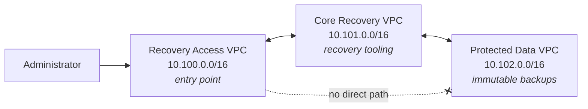
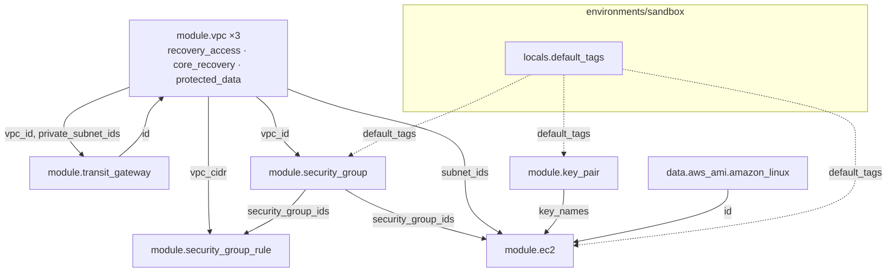
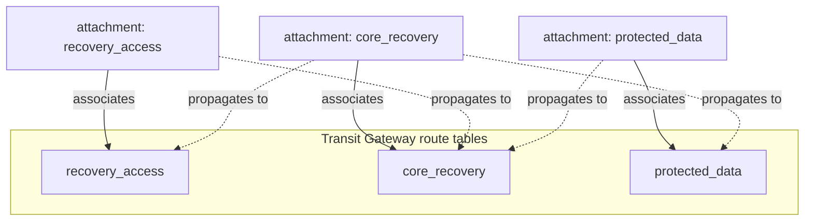
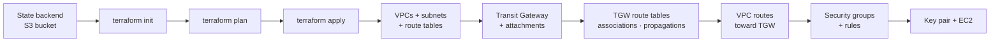

# AWS Isolated Recovery Environment — Terraform Module Library

A reusable Terraform module library that builds an **Isolated Recovery Environment (IRE)** on AWS: a segmented, network-isolated landing zone designed so that recovery infrastructure and immutable backup data remain reachable even when the production estate is compromised.

The repository is written to serve two purposes at once. It is a working infrastructure library with composable modules and a deployable sandbox environment, and it is an annotated reference — every module is commented to explain the Terraform language features it uses, so the code can be read as a teaching resource.

---

## What an Isolated Recovery Environment is

An IRE is a recovery estate that shares no trust relationship with production. If ransomware or a credential compromise takes out the production account, the recovery environment must still be usable — which means it cannot depend on production identity, production networking, or production backups.

The network model implemented here is a three-tier trust chain:



Recovery Access is where administrators arrive. Core Recovery hosts the tooling that performs restores. Protected Data holds the backup repositories and is the most sensitive tier. **Recovery Access has no route to Protected Data.** Reaching the data requires transiting Core Recovery, which gives you a single controlled hop to monitor, inspect, and eventually place a firewall in.

That property is not a convention or a comment — it is enforced structurally by Transit Gateway route tables, described in [Network segmentation](#network-segmentation) below.

---

## Repository layout

```
terraform/
├── environments/
│   └── sandbox/           Deployable environment; composes the modules below
├── modules/
│   ├── vpc/               VPC, subnets, route tables, conditional IGW
│   ├── transit-gateway/   TGW, attachments, segmented route tables
│   ├── security-group/    Security group shells (no inline rules)
│   ├── security-group-rule/  Standalone ingress/egress rules
│   ├── key-pair/          EC2 key pairs from existing public keys
│   └── ec2/               EC2 instances
├── policies/              IAM policy documents
└── bootstrap/             State backend bootstrap

collections/               Ansible collection (separate from this library)
playbooks/                 Ansible playbooks
.github/workflows/         CI: lint, validate, security scan
```

Modules not listed above (`network-firewall`, `client-vpn`, `vpc-endpoints`, `route53-resolver`, `vpc-peering`, `s3-object-lock`, `rds`, `efs`, `iam`, `guardduty`, `cloudtrail`) are scaffolded directory structures reserved for planned work. They contain no implementation yet.

---

## Module status

| Module | Status | Summary |
|---|---|---|
| [`vpc`](terraform/modules/vpc) | Complete | VPC, public/private subnets across AZs, conditional Internet Gateway, route tables, Transit Gateway routes |
| [`transit-gateway`](terraform/modules/transit-gateway) | Complete | Transit Gateway, VPC attachments, per-domain route tables, associations, propagations |
| [`security-group`](terraform/modules/security-group) | Complete | Security group creation, rules delegated to `security-group-rule` |
| [`security-group-rule`](terraform/modules/security-group-rule) | Complete | Standalone ingress/egress rules using the modern split resource types |
| [`key-pair`](terraform/modules/key-pair) | Complete | EC2 key pairs from caller-supplied public keys |
| [`ec2`](terraform/modules/ec2) | Complete | EC2 instances with optional root volume configuration |
| `network-firewall`, `client-vpn`, `vpc-endpoints`, `route53-resolver`, `vpc-peering` | Planned | Scaffolded, not implemented |
| `s3-object-lock`, `rds`, `efs`, `iam`, `guardduty`, `cloudtrail` | Planned | Scaffolded, not implemented |

| Environment | Status | Summary |
|---|---|---|
| [`sandbox`](terraform/environments/sandbox) | Complete | Three VPCs, Transit Gateway with segmented routing, security groups, three EC2 instances |

---

## How the modules compose

The sandbox environment is a composition, not a monolith. Each module owns one concern and exposes outputs the next module consumes.



The VPC and Transit Gateway modules reference each other, which is legal and intentional: the TGW module consumes `vpc_id` and `private_subnet_ids` to build attachments, while the VPC module consumes `transit_gateway_id` to install routes. Terraform resolves this because the dependency is between *different resources* inside each module, not a true cycle.

---

## Network segmentation

This is the part of the design worth understanding in detail, because it is where the security property actually lives.

A Transit Gateway by default puts every attachment into one shared route table, which produces any-to-any connectivity between all attached VPCs. This library disables that (`default_route_table_association = "disable"`, `default_route_table_propagation = "disable"`) and builds explicit routing domains instead.

Two independent concepts control reachability:

- **Association** — which route table an attachment *consults* when sending traffic into the TGW. Each attachment associates with exactly one.
- **Propagation** — which route tables *learn* an attachment's VPC CIDR. One attachment can propagate into many.

Association decides where you look up routes; propagation decides who can see you. The sandbox wires them like this:



Reading the result: the `recovery_access` route table only ever learns Core Recovery's CIDR, because only the `core_recovery` attachment propagates into it. The `protected_data` route table likewise only learns Core Recovery. Neither table contains a route to the other, so **there is no path between Recovery Access and Protected Data at the Transit Gateway layer** — not a denied path, an absent one.

The resulting reachability matrix:

| From ↓ / To → | Recovery Access | Core Recovery | Protected Data |
|---|---|---|---|
| **Recovery Access** | — | ✅ | ❌ no route |
| **Core Recovery** | ✅ | — | ✅ |
| **Protected Data** | ❌ no route | ✅ | — |

VPC route tables mirror this. Each VPC receives only the TGW routes its tier is permitted to reach, so the restriction is enforced at both the VPC and the Transit Gateway layer.

---

## Deployment flow



Terraform derives this ordering automatically from resource references — no `depends_on` is used anywhere in the library.

### Prerequisites

- Terraform `>= 1.10.0` (the S3 backend uses native lockfile locking, added in 1.10)
- AWS credentials with permission to manage VPC, EC2, and Transit Gateway resources
- An S3 bucket for remote state, referenced in `terraform/environments/sandbox/backend.tf`
- An SSH public key at `~/.ssh/management.pub` (see [Known limitations](#known-limitations))

### Deploying the sandbox

```bash
cd terraform/environments/sandbox

cp terraform.tfvars.example terraform.tfvars

terraform init      # backend configuration lives in backend.tf
terraform plan
terraform apply
```

To tear it down:

```bash
terraform destroy
```

---

## Design decisions

**Modules own one concern each.** The VPC module does not create security groups; the security group module does not create rules. Small interfaces mean a module can be replaced or reused without dragging unrelated resources along.

**Everything is keyed by name, never by position.** Every resource uses `for_each` over a map rather than `count` over a list. Adding or removing one subnet, instance, or rule leaves the others untouched in state. `count` is used in exactly one place — the conditional Internet Gateway — where it acts as an existence toggle rather than a collection.

**Security group rules are standalone.** Inline `ingress`/`egress` blocks on `aws_security_group` conflict with standalone rule resources, and the two fight on every apply. This library uses only the standalone `aws_vpc_security_group_ingress_rule` / `_egress_rule` types, which also lets two groups reference each other without a circular dependency.

**Routing is passed in, not inferred.** The VPC module accepts a list of Transit Gateway routes instead of discovering peers itself. The module has no knowledge of the IRE topology, which is what keeps it reusable in an unrelated environment.

**Tagging has a single precedence order.** Provider-level `default_tags` apply to everything; module-level tags merge on top; per-resource tags merge on top of those; `Name` is always authoritative. The order is the same in every module.

---

## Security considerations

**Implemented**

- Private subnets have no `0.0.0.0/0` route — no NAT gateway and no internet path exist for them
- The Internet Gateway is created only for VPCs that declare public subnets; Core Recovery and Protected Data have none
- Transit Gateway default route table association and propagation are disabled, so no attachment gains connectivity implicitly
- Recovery Access has no route to Protected Data at either the VPC or the Transit Gateway layer
- EC2 root volumes default to `encrypted = true`
- Remote state is encrypted at rest with locking enabled
- CI runs Checkov static analysis over all Terraform, and pre-commit hooks scan for AWS credentials and private keys before commit

**Deliberate sandbox deviations**

These would not be acceptable in the production IRE design and exist only to keep the sandbox cheap and reachable:

- The Recovery Access VPC has public subnets and an Internet Gateway. The production design has no IGW or NAT anywhere; administrative access arrives via Client VPN.
- The `management` security group allows SSH from `0.0.0.0/0`. Restrict this to a known administrative CIDR before using the pattern anywhere real.
- All three security groups allow unrestricted egress.

**Not yet implemented**

- VPC Flow Logs
- Inline inspection between tiers (the `network-firewall` module is scaffolded for this)
- Restriction of each VPC's default security group

---

## Continuous integration

`.github/workflows/ci.yml` runs on pushes to `main` and `development` and on pull requests targeting them:

| Job | What it does |
|---|---|
| Ansible / YAML lint | `yamllint` and `ansible-lint` across the collection and playbooks |
| Terraform fmt + validate | `terraform fmt -check -recursive`, then `init -backend=false` and `validate` on the sandbox |
| Checkov IaC scan | Static security analysis; advisory on pull requests to `development`, blocking on pull requests to `main` |

`.pre-commit-config.yaml` provides the local equivalent, plus credential and private key detection:

```bash
pip install pre-commit
pre-commit install
```

---

## Known limitations

- **`key_pair` reads a local file path.** `terraform/environments/sandbox/main.tf` calls `file("~/.ssh/management.pub")`, which makes the sandbox non-portable — it will not plan on a machine without that file. Promoting this to an input variable is the first change to make before sharing the environment.
- **`ec2`, `key-pair`, `security-group` and `security-group-rule` have no populated `versions.tf`.** They inherit constraints from the calling environment today, which works in this repository but does not pin versions if the modules are consumed standalone.
- **`terraform validate` runs only against the sandbox in CI.** A defect that appears only when a module is used outside this composition would not be caught.

---

## License

MIT No Attribution. See [LICENSE](LICENSE).
