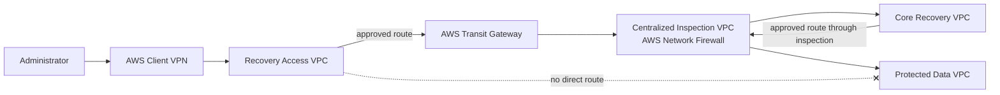

# AWS Isolated Recovery Environment — Terraform Module Library

This repository contains reusable Terraform modules and a composed AWS
**Isolated Recovery Environment (IRE)** Sandbox. The current implementation
focuses on network isolation, centralized inspection, controlled administrative
access, encrypted logging, immutable backup copies, and portable environment
configuration.

> **Deployment status:** the Sandbox configuration has been formatted,
> validated, and planned successfully. No Terraform apply was performed as part
> of the current design and documentation work.

## Current Sandbox architecture

The Sandbox composes four private VPCs inside one AWS account and Region:

1. **Recovery Access VPC** — administrative entry and approved management tools.
2. **Core Recovery VPC** — recovery services, directory services, and platform
   tooling.
3. **Protected Data VPC** — protected workloads, ingestion, databases, file
   services, and private endpoints.
4. **Centralized Inspection VPC** — AWS Network Firewall endpoints and Transit
   Gateway attachment subnets.



The visual position of the Inspection VPC is not the control boundary by
itself. Transit Gateway route tables and VPC routes determine which flows are
steered through the firewall.

## Approved traffic treatment

| Flow | Central inspection | Current treatment |
|---|---:|---|
| Recovery Access → Core Recovery | Yes | Routed through Transit Gateway and Network Firewall |
| Core Recovery → Recovery Access | Yes | Symmetric stateful return path |
| Core Recovery → Protected Data | Yes | Routed through centralized inspection |
| Protected Data → Core Recovery | Yes | Symmetric stateful return path |
| Recovery Access → Protected Data | No route | Explicitly absent |
| Client VPN → Recovery Access admin host | No firewall hairpin | Controlled by Client VPN authorization and security groups |
| Admin host → Core Recovery | Yes | Crosses the Recovery Access/Core trust boundary |
| Site-to-Site VPN → Core Recovery | Planned | Will terminate on TGW and traverse inspection |
| Site-to-Site VPN → Protected Data | Not generally allowed | Future exception must be narrowly scoped |
| Traffic within one VPC | Normally no | Controlled with security groups and workload controls |

## Implemented capabilities

### Networking and security

- Strongly typed, topology-neutral VPC module.
- Caller-defined subnet and route-table maps.
- Stable key-based and group-based outputs.
- Optional Internet Gateway ownership without automatic routes.
- Transit Gateway with explicit route tables, associations, propagations, and
  attachment appliance mode.
- Dedicated centralized Inspection VPC across two Availability Zones.
- AWS Network Firewall with strict-order stateful policy.
- Same-AZ firewall endpoint routing for symmetric inspection.
- Encrypted Network Firewall `ALERT` and `FLOW` CloudWatch logs.
- Security groups and standalone ingress/egress rule resources.
- Certificate-authenticated AWS Client VPN associated only with Recovery Access.
- No Internet Gateway, NAT Gateway, or internet default route in the Sandbox.
- No direct Recovery Access-to-Protected Data path.

### Recovery services

- Standard AWS Backup vault.
- Logically air-gapped AWS Backup vault.
- Backup plan, copy action, IAM role, and backup selection modules.
- Reusable KMS module.
- Reusable Managed Microsoft AD module and independent module test; the
  directory remains disabled in the Sandbox composition.
- EC2, key-pair, and supporting security modules.

### Portability

Environment-specific values are supplied through input variables:

- `network_config` — account, VPC, subnet, and Client VPN CIDRs.
- `naming` — organization, project, environment, Region code, and optional
  suffix.
- `resource_name_overrides` — optional exact organization-approved names.
- Enterprise tagging variables beginning with `org_`.

Terraform logical keys, trust relationships, routes, firewall actions, and
Suricata SIDs remain reviewed code rather than deployment-time values.

## Repository layout

```text
terraform/
├── bootstrap/                     Remote-state bootstrap documentation
├── environments/
│   ├── sandbox/                   Four-VPC integrated IRE root module
│   ├── module-tests/              Independent reusable-module test roots
│   └── vpn-test/                  Client VPN composition test
└── modules/
    ├── vpc/
    ├── transit-gateway/
    ├── client-vpn/
    ├── network-firewall/
    ├── network-firewall-policy/
    ├── network-firewall-rule-group/
    ├── network-firewall-routing/
    ├── network-firewall-logging/
    ├── network-firewall-tls-inspection/
    ├── security-group/
    ├── security-group-rule/
    ├── ec2/
    ├── key-pair/
    ├── kms/
    ├── managed-microsoft-ad/
    └── backup-*/
```

The repository also contains an Ansible collection and playbooks. Their
documentation lifecycle is separate from this Terraform documentation refresh.

## Module status

| Area | Status | Notes |
|---|---|---|
| VPC | Complete | Keyed VPC, subnet, route-table, association, and optional IGW interface |
| Transit Gateway | Complete | Attachments, route tables, associations, propagation, appliance mode, outputs |
| Network Firewall suite | Complete | Firewall, policy, rule groups, routing, logging, and TLS-inspection modules |
| Sandbox firewall integration | Complete in code | Centralized two-AZ inspection and encrypted logging; not runtime-tested in AWS |
| Client VPN | Complete | Recovery Access association and authorization; no direct Core/Protected route |
| Security groups and rules | Complete | Separate group and standalone rule modules |
| EC2 and key pair | Complete | Private-instance composition with external public-key input |
| KMS | Complete | Reusable customer-managed key module |
| AWS Backup modules | Complete | Standard vault, air-gapped vault, role, plan, and selection |
| Managed Microsoft AD | Complete module | Independent test root exists; disabled in Sandbox |
| Site-to-Site VPN | Planned | Next controlled-connectivity feature |
| Empty scaffold modules | Not implemented | Their directories must not be treated as delivered capabilities |

## Network routing ownership

The reusable VPC module owns:

- VPCs;
- subnets;
- route tables;
- subnet-to-route-table associations;
- an optional Internet Gateway.

It creates no `aws_route` resources.

The Transit Gateway module owns:

- the Transit Gateway;
- VPC attachments;
- Transit Gateway route tables;
- attachment associations;
- route propagation.

The Network Firewall routing module owns the standalone VPC and static Transit
Gateway routes used by the Sandbox inspection path.

## Local Sandbox configuration

```bash
cd terraform/environments/sandbox

cp terraform.tfvars.example terraform.tfvars
cp backend.hcl.example backend.hcl
```

Keep `terraform.tfvars`, `backend.hcl`, credentials, state, plans, and logs out
of Git.

Initialization must explicitly use the matching backend configuration:

```bash
terraform init \
  -input=false \
  -reconfigure \
  -backend-config=backend.hcl
```

Validation and planning:

```bash
terraform fmt -check -recursive
terraform validate

terraform plan \
  -input=false \
  -var-file=terraform.tfvars \
  -out=tfplan
```

The current empty-state Sandbox baseline is:

```text
Plan: 187 to add, 0 to change, 0 to destroy.
```

Review the plan and remove the generated file:

```bash
terraform show tfplan
rm -f tfplan
```

Do not apply the Sandbox unless the deployment is explicitly approved and the
planned resources, cost, identity, certificates, routing, and teardown process
have been reviewed.

## Module tests

Each directory under `terraform/environments/module-tests` is an independent
Terraform root. Validation-only execution uses:

```bash
terraform init -backend=false -input=false
terraform validate
```

Approved AWS-backed lifecycle testing must use a unique backend state key,
reviewed local values, a saved plan, and immediate teardown for billable
services such as Network Firewall, Transit Gateway, Managed Microsoft AD, and
Client VPN.

See [`terraform/environments/module-tests/README.md`](terraform/environments/module-tests/README.md).

## Security properties

- No implicit Transit Gateway any-to-any routing.
- No Recovery Access-to-Protected Data route.
- Approved adjacent-zone traffic is inspected in both directions.
- Inspection attachment appliance mode preserves symmetric firewall routing.
- No Sandbox IGW, NAT Gateway, or default internet route.
- Client VPN is an administrative entry mechanism, not a direct extension into
  Core Recovery or Protected Data.
- Network Firewall logs are encrypted with a dedicated KMS key.
- Mandatory organization tags are protected from accidental override.
- Private key generation is kept outside general Terraform modules.

## Current validation boundary

The repository proves Terraform composition and plan semantics. It does not yet
prove runtime packet flow, firewall rule hits, CloudWatch log delivery, failover,
or application recovery. Those checks require an approved AWS deployment and a
documented test plan.

## Planned next work

The next network feature is inspected Site-to-Site VPN connectivity:

```text
On-premises
  → AWS Site-to-Site VPN
  → Transit Gateway hybrid route table
  → Centralized Inspection VPC
  → Core Recovery VPC
```

It will not add a general route from on-premises to Protected Data.
