# IRE Organization AAP Configuration-as-Code Blueprint

## 1. Purpose

This document defines the recommended **organization-level Ansible Automation Platform (AAP) Configuration-as-Code (CaC) blueprint** for the AWS Isolated Recovery Environment (IRE).

It covers the complete end-to-end lifecycle for:

- Persistent infrastructure
- Platform infrastructure
- Inspection / AWS Network Firewall
- Identity / AWS Managed Microsoft AD
- Managed AD bootstrap and unbootstrap
- Client VPN server certificate lifecycle
- Client VPN authentication using:
  - **Active Directory**
  - **Mutual certificate authentication**
  - **Active Directory + Mutual certificate authentication**
- Client certificate issuance
- Remote Access
- Recovery workloads
- AWS Secrets Manager credential validation
- Full Deploy workflow
- Full Destroy workflow
- Persistent teardown as a separate controlled operation

The **organization's existing AAP/CaC repository** should own this configuration.

> Do not place organization AAP CaC inside the Terraform repository's local/untracked `aap/` directory.

---

## 2. Core Design Principles

1. Terraform stacks remain independently operable.
2. Plan and Apply are separate AAP Job Templates.
3. Destroy Plan and actual Destroy are separate AAP Job Templates.
4. Destroy safety values are fixed in CaC.
5. Persistent resources survive normal environment teardown.
6. Client VPN PKI is persistent and independent of Remote Access.
7. Client certificate private keys remain endpoint-local.
8. Managed AD bootstrap is operational automation, not Terraform.
9. Environment-specific account/role/backend values live in AAP inventory or approved credential configuration.
10. Secrets remain in AWS Secrets Manager.
11. Apply, Destroy, PKI mutation, and certificate-signing templates must not run concurrently.
12. The Terraform repository remains reusable and free of personal/runtime-specific values.

---

## 3. High-Level AAP / Terraform Operating Model

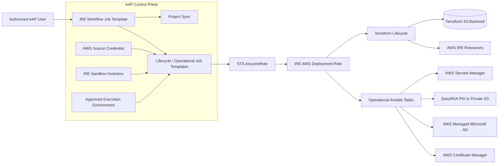

---

## 4. Common Organization Job Template Settings

| Setting | Recommended Organization Value |
|---|---|
| Project | Organization IRE Terraform project |
| SCM source | IRE Terraform repository |
| SCM branch | Approved integration/release branch |
| Inventory | Organization IRE Sandbox inventory |
| Execution Environment | Org-approved EE with Terraform, Ansible, AWS SDK and pinned collections |
| AWS credential | Organization AAP AWS source credential |
| Become | `false` |
| Privilege escalation | None |
| Concurrent jobs | Disabled for mutation jobs |
| Job slicing | Disabled |
| Forks | Default |
| Instance group | Organization-approved execution group |
| SCM update on launch | Prefer `false` |
| Project sync | Explicit workflow node |
| Inventory prompt | `false` |
| Credential prompt | `false` |
| Project prompt | `false` |
| EE prompt | `false` |

Example environment runtime values supplied by AAP inventory:

```yaml
terraform_environment: sandbox

assume_role_role_arn: "<ORG_IRE_ROLE_ARN>"
assume_role_expected_account_id: "<ORG_AWS_ACCOUNT_ID>"
assume_role_aws_region: us-east-1
assume_role_application_name: ire-terraform

terraform_backend_bucket: "<ORG_TERRAFORM_STATE_BUCKET>"
terraform_backend_region: us-east-1
terraform_backend_encrypt: true
terraform_backend_use_lockfile: true

terraform_persistent_contract_source: managed
terraform_external_persistent_resources: {}
```

Do not commit personal AWS account IDs, personal backend buckets, workstation values, secrets, passwords, or certificate private keys.

---

## 5. Stack Ownership Model

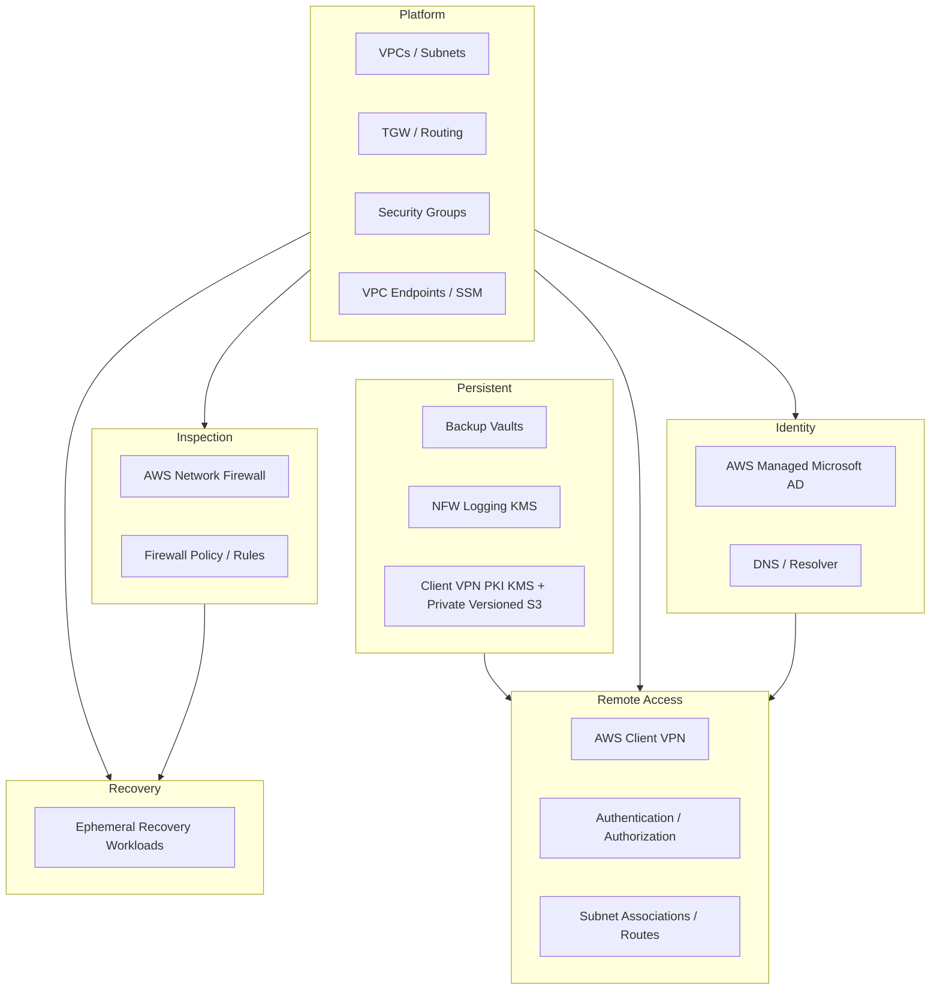

---

## 6. Persistent Stack

Persistent owns long-lived resources such as:

- Standard Backup vault
- Logically air-gapped Backup vault
- Network Firewall logging KMS key
- Client VPN PKI KMS key
- Private versioned S3 bucket for EasyRSA PKI state

Current Client VPN-focused deployment can use:

```hcl
backup_vaults_enabled                 = false
network_firewall_logging_kms_enabled  = false
client_vpn_pki_artifacts_enabled      = true
```

### Job Templates

#### `IRE-Sandbox-Persistent-Plan`

Purpose: read-only Terraform plan.

```yaml
terraform_apply_enabled: false
terraform_destroy_enabled: false
```

Expected validation:

- No unexpected destroys
- No unexpected replacements
- Only intended Persistent resources

#### `IRE-Sandbox-Persistent-Apply`

Purpose: apply approved Persistent infrastructure.

```yaml
terraform_apply_enabled: true
terraform_destroy_enabled: false
```

Concurrency: disabled.

#### `IRE-Sandbox-Persistent-Destroy-Plan`

Exceptional administration only.

```yaml
terraform_destroy_enabled: false
terraform_destroy_confirmation: ""
```

#### `IRE-Sandbox-Persistent-Destroy`

Exceptional administration only.

```yaml
terraform_destroy_enabled: true
terraform_destroy_confirmation: "DESTROY PERSISTENT"
```

Persistent must not be part of routine Full Destroy.

---

## 7. Platform Stack

Platform owns:

- VPCs
- Subnets
- Route tables
- Transit Gateway
- TGW attachments / route tables
- Security groups
- SSM plumbing
- VPC endpoints
- Shared network infrastructure

### Job Templates

#### `IRE-Sandbox-Platform-Plan`

```yaml
terraform_apply_enabled: false
terraform_destroy_enabled: false
```

#### `IRE-Sandbox-Platform-Apply`

```yaml
terraform_apply_enabled: true
terraform_destroy_enabled: false
```

#### `IRE-Sandbox-Platform-Destroy-Plan`

```yaml
terraform_destroy_enabled: false
terraform_destroy_confirmation: ""
```

#### `IRE-Sandbox-Platform-Destroy`

```yaml
terraform_destroy_enabled: true
terraform_destroy_confirmation: "DESTROY PLATFORM"
```

---

## 8. Inspection Stack

Inspection owns:

- AWS Network Firewall
- Firewall policy
- Firewall rule groups
- Inspection-specific routing
- Logging integration owned by this stack

### Job Templates

#### `IRE-Sandbox-Inspection-Plan`

Read-only plan.

#### `IRE-Sandbox-Inspection-Apply`

Apply approved Inspection infrastructure.

#### `IRE-Sandbox-Inspection-Destroy-Plan`

```yaml
terraform_destroy_enabled: false
terraform_destroy_confirmation: ""
```

#### `IRE-Sandbox-Inspection-Destroy`

```yaml
terraform_destroy_enabled: true
terraform_destroy_confirmation: "DESTROY INSPECTION"
```

---

## 9. Identity Stack

Identity owns:

- AWS Managed Microsoft AD
- DNS configuration
- Route 53 Resolver integration
- Identity Terraform contract outputs

### Job Templates

#### `IRE-Sandbox-Identity-Plan`

Read-only plan.

#### `IRE-Sandbox-Identity-Apply`

Creates or updates directory infrastructure.

#### `IRE-Sandbox-Identity-Destroy-Plan`

```yaml
terraform_destroy_enabled: false
terraform_destroy_confirmation: ""
```

#### `IRE-Sandbox-Identity-Destroy`

```yaml
terraform_destroy_enabled: true
terraform_destroy_confirmation: "DESTROY IDENTITY"
```

---

## 10. Managed AD Operational Automation

Managed AD bootstrap and unbootstrap are operational Ansible tasks and should remain outside Terraform ownership.

### `IRE-Sandbox-Managed-AD-Bootstrap`

Responsibilities:

- Read Identity contract
- Resolve Managed AD details
- Create or validate recovery access groups
- Retrieve or publish required group SID
- Validate expected directory state
- Publish identity contract data needed by Remote Access

### `IRE-Sandbox-Managed-AD-Unbootstrap`

Responsibilities:

- Remove only objects created by bootstrap
- Avoid deleting unrelated directory objects
- Run before Identity Terraform destroy

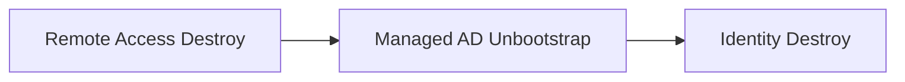

---

## 11. Client VPN Authentication Modes

The Remote Access stack should support all three organizational authentication combinations.

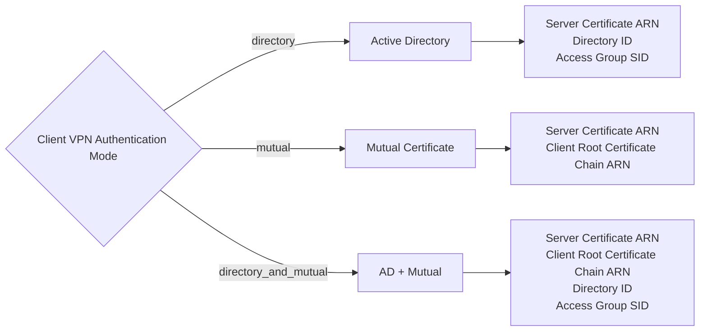

---

## 12. Client VPN Mode 1 — Active Directory

Terraform configuration:

```hcl
authentication_type = "directory"
```

Runtime requirements:

```yaml
server_certificate_arn: "<ACM_SERVER_CERTIFICATE_ARN>"
directory_id: "<AWS_MANAGED_AD_DIRECTORY_ID>"
client_vpn_access_group_id: "<AD_GROUP_SID>"
```

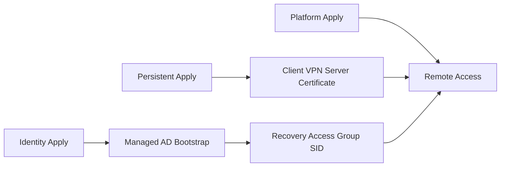

Characteristics:

- User authentication is performed against AWS Managed Microsoft AD.
- Client certificate authentication is not required.
- Server-side TLS certificate is still required.
- Remote Access depends on Identity and Managed AD bootstrap.

---

## 13. Client VPN Mode 2 — Mutual Certificate Authentication

Terraform configuration:

```hcl
authentication_type = "mutual"
```

Runtime requirements:

```yaml
server_certificate_arn: "<ACM_SERVER_CERTIFICATE_ARN>"
client_root_certificate_chain_arn: "<ACM_CLIENT_ROOT_CERTIFICATE_CHAIN_ARN>"
```

Current EasyRSA implementation can use the same imported ACM certificate ARN for both values because the imported ACM object contains the server certificate, server private key, and CA chain. This is an implementation choice rather than a universal AWS requirement.

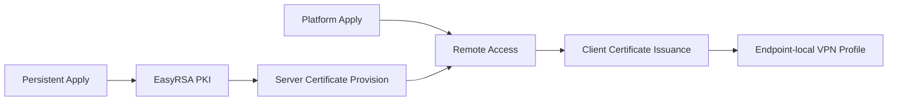

Characteristics:

- Managed AD is not required for Client VPN authentication.
- Client authentication is certificate-based.
- Client private key remains on the endpoint.
- AAP signs only the CSR.

---

## 14. Client VPN Mode 3 — Active Directory + Mutual

Terraform configuration:

```hcl
authentication_type = "directory_and_mutual"
```

Runtime requirements:

```yaml
server_certificate_arn: "<ACM_SERVER_CERTIFICATE_ARN>"
client_root_certificate_chain_arn: "<ACM_CLIENT_ROOT_CERTIFICATE_CHAIN_ARN>"
directory_id: "<AWS_MANAGED_AD_DIRECTORY_ID>"
client_vpn_access_group_id: "<AD_GROUP_SID>"
```

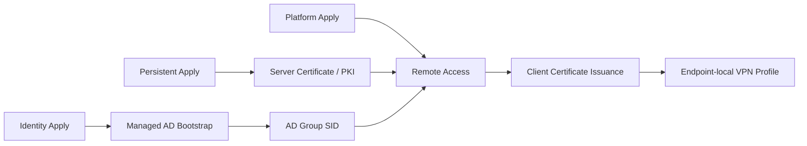

Characteristics:

- User must satisfy directory authentication.
- Client must also present a certificate from the trusted chain.
- Remote Access depends on both Identity and PKI contracts.

---

## 15. Client VPN Server Certificate Lifecycle

Job Template:

`IRE-Sandbox-Client-VPN-Server-Certificate`

Playbook:

```text
playbooks/remote-access/provision_client_vpn_certificate.yml
```

Normal setting:

```yaml
client_vpn_certificate_easyrsa_allow_ca_creation: false
```

First-time PKI bootstrap only:

```yaml
client_vpn_certificate_easyrsa_allow_ca_creation: true
```

After initial creation, return the value to `false`.

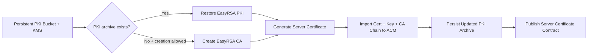

Concurrency:

```text
allow_simultaneous: false
```

Reason: EasyRSA PKI is mutable shared state.

---

## 16. Client Certificate Issuance Lifecycle

Job Template:

`IRE-Client-VPN-Issue-Client-Certificate`

Playbook:

```text
playbooks/remote-access/issue_client_vpn_certificate.yml
```

Recommended prompt-on-launch inputs:

```yaml
client_vpn_certificate_common_name: ""
client_vpn_certificate_csr: ""
```

The exact names should match the implemented role/playbook variables.

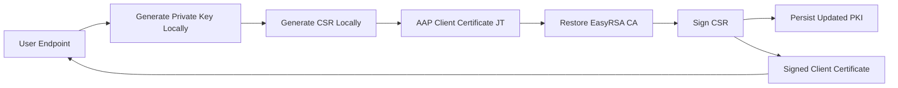

> AAP must never receive or generate the user's private key.

Concurrency:

```text
allow_simultaneous: false
```

---

## 17. Remote Access Stack

Remote Access owns:

- AWS Client VPN endpoint
- Authentication configuration
- Authorization rules
- Subnet associations
- Routes
- Security-group integration

### Job Templates

#### `IRE-Sandbox-Remote-Access-Plan`

Read-only Terraform plan. Runtime values are resolved according to authentication mode.

#### `IRE-Sandbox-Remote-Access-Apply`

Applies the approved Remote Access configuration.

#### `IRE-Sandbox-Remote-Access-Destroy-Plan`

```yaml
terraform_destroy_enabled: false
terraform_destroy_confirmation: ""
```

#### `IRE-Sandbox-Remote-Access-Destroy`

```yaml
terraform_destroy_enabled: true
terraform_destroy_confirmation: "DESTROY REMOTE ACCESS"
```

---

## 18. Recovery Stack

Recovery owns ephemeral recovery workloads and recovery-specific infrastructure.

### Job Templates

#### `IRE-Sandbox-Recovery-Plan`

Read-only plan.

Current staged validation can retain:

```yaml
backup_integration_enabled: false
```

until backup integration is intentionally enabled.

#### `IRE-Sandbox-Recovery-Apply`

Creates recovery resources.

#### `IRE-Sandbox-Recovery-Destroy-Plan`

```yaml
terraform_destroy_enabled: false
terraform_destroy_confirmation: ""
```

#### `IRE-Sandbox-Recovery-Destroy`

```yaml
terraform_destroy_enabled: true
terraform_destroy_confirmation: "DESTROY RECOVERY"
```

Recovery should normally be the first Terraform stack destroyed.

---

## 19. AWS Secrets Manager Validation

Job Template:

`IRE-Secrets-Manager-Credential-Validation`

Playbook:

```text
playbooks/aws/validate_secrets_manager_credential.yml
```

Prompt:

```yaml
aws_secret_id: ""
```

Purpose:

- Validate AssumeRole
- Validate `GetSecretValue`
- Validate secret JSON structure
- Confirm username field
- Confirm password field exists
- Never expose password value

Use this as a diagnostic / integration validation JT, not as a mandatory deployment node unless another workflow genuinely depends on the secret.

---

## 20. End-to-End Full Deploy — Mode-Aware Blueprint

Recommended workflow name:

```text
IRE-Sandbox-Full-Deploy
```

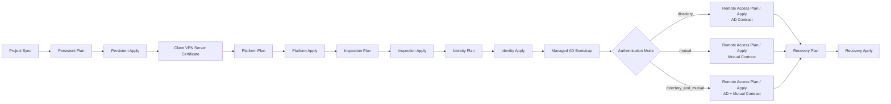

For the first organizational rollout, a linear workflow is preferred because it is easier to audit and troubleshoot. Later, non-dependent nodes can be parallelized.

---

## 21. Mode-Specific Deployment Dependencies

### Active Directory

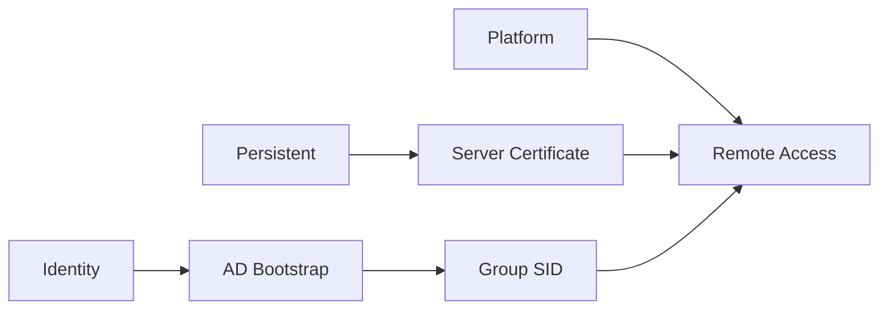

### Mutual

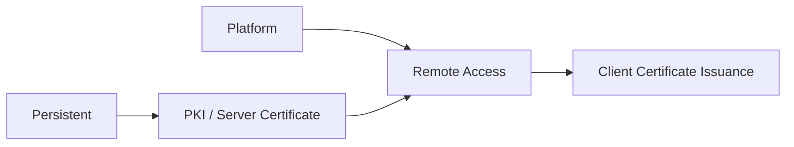

### Active Directory + Mutual

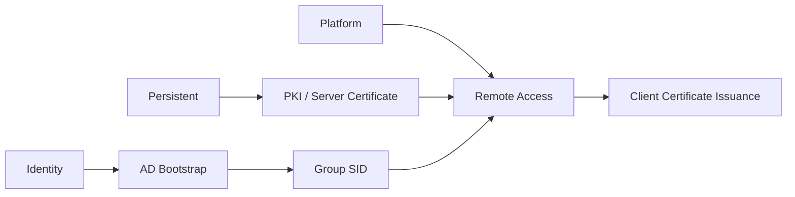

---

## 22. Full Destroy Workflow

Recommended workflow name:

```text
IRE-Sandbox-Full-Destroy
```

Persistent is intentionally excluded.

```mermaid
flowchart LR
    SYNC[Project Sync] --> RDP[Recovery Destroy Plan] --> RD[Recovery Destroy]
    RD --> RADP[Remote Access Destroy Plan] --> RAD[Remote Access Destroy]
    RAD --> ADU[Managed AD Unbootstrap]
    ADU --> IDP[Identity Destroy Plan] --> IDD[Identity Destroy]
    IDD --> INP[Inspection Destroy Plan] --> IND[Inspection Destroy]
    IND --> PLP[Platform Destroy Plan] --> PLD[Platform Destroy]
    PLD --> STOP[Stop - Preserve Persistent]
```

| Stack | Routine Full Destroy |
|---|---|
| Recovery | Destroy |
| Remote Access | Destroy |
| Identity | Destroy |
| Inspection | Destroy |
| Platform | Destroy |
| Persistent | Preserve |

---

## 23. Persistent Teardown Workflow

Recommended workflow:

```text
IRE-Sandbox-Persistent-Teardown
```

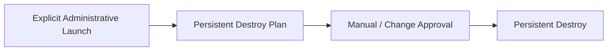

Recommended controls:

- Restricted RBAC
- Explicit approval/change control
- No inclusion in routine Full Destroy
- Exact destroy confirmation
- No simultaneous execution

---

## 24. Destroy Safety Model

Each Destroy Plan template should fix:

```yaml
terraform_destroy_enabled: false
terraform_destroy_confirmation: ""
```

Each real Destroy template should fix:

| Stack | Confirmation |
|---|---|
| Recovery | `DESTROY RECOVERY` |
| Remote Access | `DESTROY REMOTE ACCESS` |
| Identity | `DESTROY IDENTITY` |
| Inspection | `DESTROY INSPECTION` |
| Platform | `DESTROY PLATFORM` |
| Persistent | `DESTROY PERSISTENT` |

And:

```yaml
terraform_destroy_enabled: true
```

Do not make normal destroy confirmation values survey-driven. The Job Template itself should represent the explicit destructive operation.

---

## 25. Recommended Organization Job Template Inventory

### Persistent

- `IRE-Sandbox-Persistent-Plan`
- `IRE-Sandbox-Persistent-Apply`
- `IRE-Sandbox-Persistent-Destroy-Plan`
- `IRE-Sandbox-Persistent-Destroy`

### Platform

- `IRE-Sandbox-Platform-Plan`
- `IRE-Sandbox-Platform-Apply`
- `IRE-Sandbox-Platform-Destroy-Plan`
- `IRE-Sandbox-Platform-Destroy`

### Inspection

- `IRE-Sandbox-Inspection-Plan`
- `IRE-Sandbox-Inspection-Apply`
- `IRE-Sandbox-Inspection-Destroy-Plan`
- `IRE-Sandbox-Inspection-Destroy`

### Identity

- `IRE-Sandbox-Identity-Plan`
- `IRE-Sandbox-Identity-Apply`
- `IRE-Sandbox-Identity-Destroy-Plan`
- `IRE-Sandbox-Identity-Destroy`

### Managed AD

- `IRE-Sandbox-Managed-AD-Bootstrap`
- `IRE-Sandbox-Managed-AD-Unbootstrap`

### Client VPN PKI

- `IRE-Sandbox-Client-VPN-Server-Certificate`
- `IRE-Client-VPN-Issue-Client-Certificate`

### Remote Access

- `IRE-Sandbox-Remote-Access-Plan`
- `IRE-Sandbox-Remote-Access-Apply`
- `IRE-Sandbox-Remote-Access-Destroy-Plan`
- `IRE-Sandbox-Remote-Access-Destroy`

### Recovery

- `IRE-Sandbox-Recovery-Plan`
- `IRE-Sandbox-Recovery-Apply`
- `IRE-Sandbox-Recovery-Destroy-Plan`
- `IRE-Sandbox-Recovery-Destroy`

### Validation / Operations

- `IRE-Secrets-Manager-Credential-Validation`

### Workflow Job Templates

- `IRE-Sandbox-Full-Deploy`
- `IRE-Sandbox-Full-Destroy`
- `IRE-Sandbox-Persistent-Teardown`

---

## 26. Recommended Prompting Strategy

Avoid turning AAP surveys into a second configuration system.

### Fixed in Job Template / Inventory

Keep these fixed or inventory-driven:

- AWS account ID
- AssumeRole ARN
- AWS region
- backend bucket
- Terraform environment
- backend lock settings
- stack lifecycle mode
- destroy safety switch
- destroy confirmation phrase
- project
- execution environment
- credentials
- inventory

### Prompt Only When Operationally Required

Reasonable prompt-on-launch values:

- `aws_secret_id`
- client certificate common name
- client certificate CSR
- one-time EasyRSA CA creation override, if the organization deliberately chooses approval-driven prompting

Authentication mode itself should preferably be an approved environment configuration value rather than an ad-hoc user prompt.

---

## 27. Concurrency Controls

Disable simultaneous execution for:

- Persistent Apply / Destroy
- Platform Apply / Destroy
- Inspection Apply / Destroy
- Identity Apply / Destroy
- Remote Access Apply / Destroy
- Recovery Apply / Destroy
- Managed AD Bootstrap / Unbootstrap
- Client VPN server certificate provisioning
- Client certificate issuance

Reasons:

- Terraform state mutation
- Shared infrastructure mutation
- EasyRSA PKI shared mutable state
- Directory object mutation
- Certificate serial/database mutation

Plan JTs can be less restrictive, but avoiding overlapping Plan/Apply against the same state is still preferred.

---

## 28. Failure and Restart Model

AAP workflows should fail closed.

If a node fails:

1. Stop dependent downstream nodes.
2. Diagnose the failed Job Template.
3. Correct the underlying issue.
4. Relaunch only the failed node when safe.
5. Resume from the appropriate checkpoint.
6. Do not destroy/recreate healthy prerequisite stacks merely to recover orchestration.

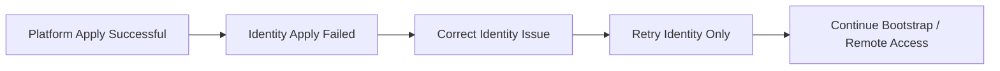

---

## 29. Recommended Organizational Rollout Sequence

```mermaid
flowchart LR
    A[Approve Org Inventory / Credentials] --> B[Project Sync]
    B --> C[Persistent Plan]
    C --> D[Persistent Apply]
    D --> E[PKI / Server Certificate]
    E --> F[Platform Plan / Apply]
    F --> G[Inspection Plan / Apply]
    G --> H[Identity Plan / Apply]
    H --> I[Managed AD Bootstrap]
    I --> J[Select Approved Client VPN Mode]
    J --> K[Remote Access Plan]
    K --> L[Remote Access Apply]
    L --> M[Client Certificate Issue if Required]
    M --> N[VPN Connection Validation]
    N --> O[Recovery Plan / Apply]
    O --> P[Recovery Validation]
```

---

## 30. Client VPN Validation Matrix

| Authentication Mode | Server Cert | Root Chain | Managed AD | Group SID | Client Cert |
|---|---:|---:|---:|---:|---:|
| `directory` | Required | No | Required | Required | No |
| `mutual` | Required | Required | No | No | Required |
| `directory_and_mutual` | Required | Required | Required | Required | Required |

### Directory Validation

- Server certificate exists
- Directory ID resolves correctly
- Group SID is published from bootstrap
- Authorized AD user can authenticate
- Unauthorized AD user is denied

### Mutual Validation

- Server certificate exists
- Trusted client root chain configured
- Client certificate validates
- Endpoint private key never leaves endpoint
- Invalid/revoked certificate is denied

### Directory + Mutual Validation

- Directory authentication succeeds
- Client certificate validates
- Authorization group SID applies
- Both authentication dependencies are satisfied

---

## 31. Separation of Responsibility

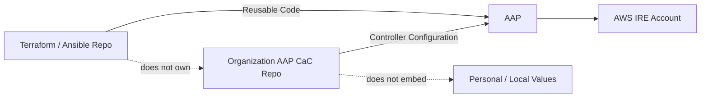

The Terraform repository owns:

- Terraform modules
- Terraform stack roots
- Ansible roles
- lifecycle playbooks
- operational playbooks
- reusable logic

The organization AAP/CaC repository owns:

- Job Templates
- Workflow Job Templates
- inventories
- organization-specific credential bindings
- execution environment bindings
- instance groups
- surveys where justified
- controller RBAC
- controller-side workflow orchestration

---

## 32. Final Recommended Blueprint

The organization AAP implementation should provide:

- Independent Plan / Apply / Destroy lifecycle for every Terraform stack
- Persistent resources protected from routine teardown
- Managed AD bootstrap/unbootstrap outside Terraform
- EasyRSA PKI persisted independently of Remote Access
- Server certificate provisioning as a dedicated operational JT
- Client certificate issuance as a dedicated operational JT
- Support for Active Directory, Mutual, and Active Directory + Mutual Client VPN modes
- Secrets Manager validation without password disclosure
- Explicit Project Sync
- Deterministic Full Deploy workflow
- Reverse-order Full Destroy workflow
- Separate Persistent teardown workflow
- Fixed destroy confirmations
- Restricted mutation concurrency
- Environment-specific values supplied by AAP rather than hard-coded in the reusable repository

This model preserves IRE isolation, recoverability, state ownership, security boundaries, operational safety, and future scalability while keeping troubleshooting and change control understandable for the organization.
