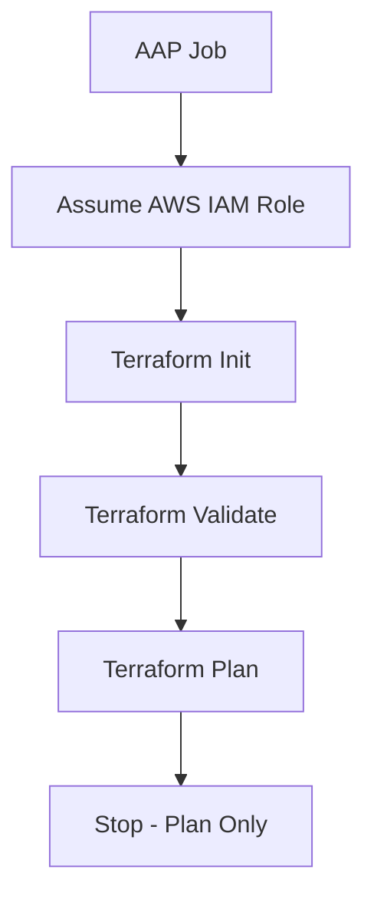
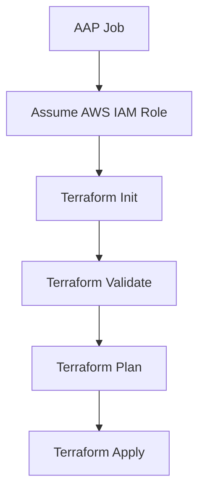
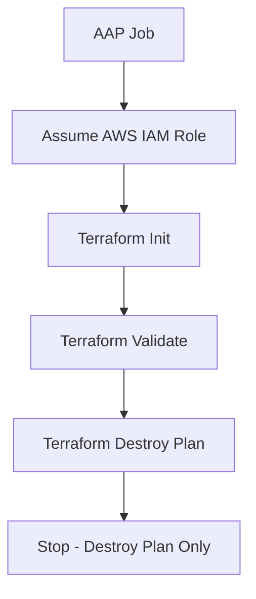
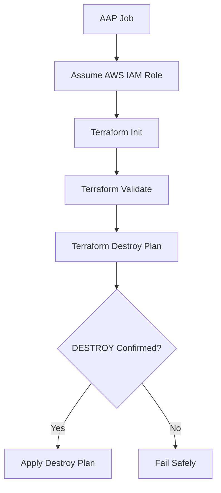
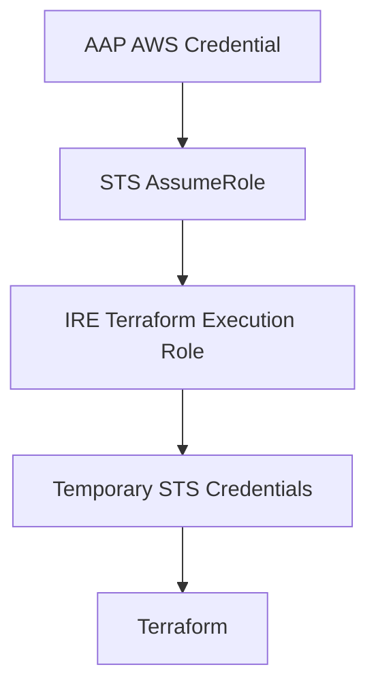
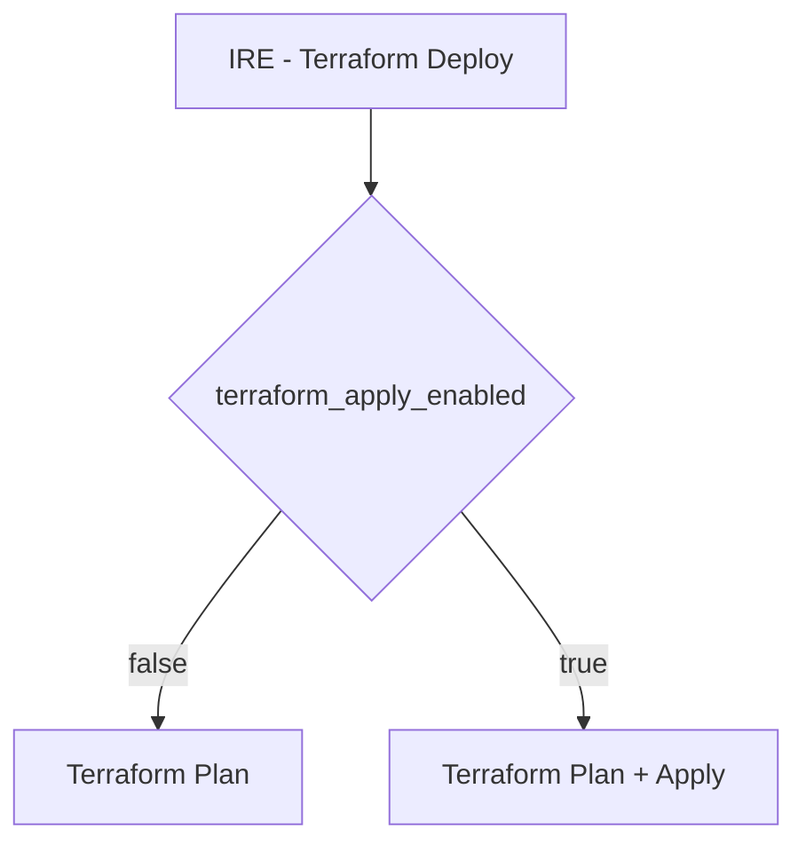
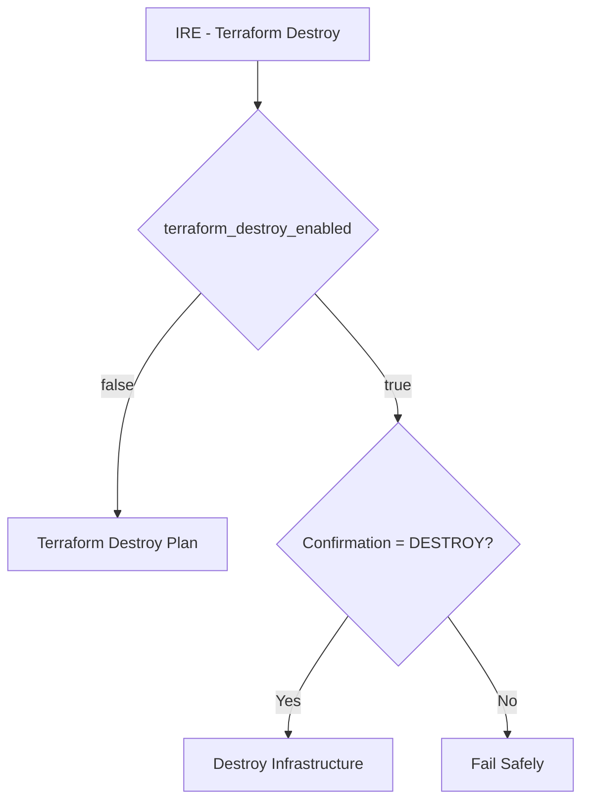

# AAP Job Template Configuration

This document defines the recommended Ansible Automation Platform (AAP) Job Template configuration for Terraform execution in the AWS Isolated Recovery Environment (IRE).

The Terraform orchestration uses two playbooks:

- `playbooks/terraform_deploy.yml`
- `playbooks/terraform_destroy.yml`

The production Execution Environment is maintained separately by the Red Hat/platform team.

---

## 1. IRE - Terraform Deploy

### Purpose

Runs Terraform planning and, when explicitly enabled, applies the generated Terraform plan.

The same playbook supports both operations:

- Plan only
- Plan and apply

### AAP Configuration

| Setting | Value |
|---|---|
| Job Template Name | `IRE - Terraform Deploy` |
| Job Type | Run |
| Project | IRE Terraform project |
| Inventory | Localhost / approved AAP inventory |
| Execution Environment | Approved organization-managed EE |
| Playbook | `playbooks/terraform_deploy.yml` |
| Credential | Approved AWS bootstrap/application credential |

### Fixed Extra Variables

The following values should normally be maintained in the Job Template or approved environment configuration rather than entered manually at every launch:

~~~yaml
assume_role_role_arn: "<APPROVED_IAM_ROLE_ARN>"
assume_role_expected_account_id: "<APPROVED_AWS_ACCOUNT_ID>"
assume_role_aws_region: "us-east-1"
assume_role_application_name: "ire-terraform"

terraform_environment: "sandbox"

terraform_backend_bucket: "<APPROVED_STATE_BUCKET>"
terraform_backend_key: "<ENVIRONMENT>/terraform.tfstate"
terraform_backend_region: "us-east-1"

terraform_public_key: "<APPROVED_SSH_PUBLIC_KEY>"

terraform_variables:
  # Environment-specific Terraform configuration.
  #
  # Examples include:
  # - AWS Region
  # - VPC and subnet CIDRs
  # - approved AMI
  # - organization tags
  # - resource naming
  # - Client VPN authentication configuration
  # - SAML provider configuration
~~~

Actual environment-specific values are supplied through the `terraform_variables` mapping.

The structure is documented in:

- `docs/aap/examples/deploy-job-vars.example.yml`
- `docs/aap/variables.md`

### Runtime Control

The deployment operation is controlled by:

~~~yaml
terraform_apply_enabled: false
~~~

Behavior:

| Value | Result |
|---|---|
| `false` | Terraform plan only |
| `true` | Terraform plan followed by Terraform apply |

The playbook defaults to:

~~~yaml
terraform_apply_enabled: false
~~~

This provides a safe default when an explicit apply operation has not been requested.

### Plan Example

~~~yaml
terraform_apply_enabled: false
~~~

Execution flow:

### Apply Example

~~~yaml
terraform_apply_enabled: true
~~~

Execution flow:

---

## 2. IRE - Terraform Destroy

### Purpose

Creates a Terraform destroy plan and, when explicitly authorized, destroys the Terraform-managed infrastructure.

The same destroy playbook supports:

- Destroy plan only
- Actual infrastructure destruction

### AAP Configuration

| Setting | Value |
|---|---|
| Job Template Name | `IRE - Terraform Destroy` |
| Job Type | Run |
| Project | IRE Terraform project |
| Inventory | Localhost / approved AAP inventory |
| Execution Environment | Approved organization-managed EE |
| Playbook | `playbooks/terraform_destroy.yml` |
| Credential | Approved AWS bootstrap/application credential |

### Fixed Extra Variables

The Destroy Job Template uses the same environment configuration as the Deploy Job Template, including:

- AWS AssumeRole configuration
- Terraform environment
- Terraform backend
- Terraform public key
- Terraform variables

Example:

~~~yaml
assume_role_role_arn: "<APPROVED_IAM_ROLE_ARN>"
assume_role_expected_account_id: "<APPROVED_AWS_ACCOUNT_ID>"
assume_role_aws_region: "us-east-1"
assume_role_application_name: "ire-terraform"

terraform_environment: "sandbox"

terraform_backend_bucket: "<APPROVED_STATE_BUCKET>"
terraform_backend_key: "<ENVIRONMENT>/terraform.tfstate"
terraform_backend_region: "us-east-1"

terraform_public_key: "<APPROVED_SSH_PUBLIC_KEY>"

terraform_variables:
  # Same approved environment configuration
  # used by the deployment Job Template.
~~~

The reference structure is documented in:

- `docs/aap/examples/destroy-job-vars.example.yml`
- `docs/aap/variables.md`

### Runtime Controls

Destroy operations have two controls:

~~~yaml
terraform_destroy_enabled: false
terraform_destroy_confirmation: ""
~~~

By default, destruction is disabled.

### Destroy Plan Only

~~~yaml
terraform_destroy_enabled: false
terraform_destroy_confirmation: ""
~~~

Execution flow:

### Actual Destroy

Actual destruction requires both:

~~~yaml
terraform_destroy_enabled: true
terraform_destroy_confirmation: "DESTROY"
~~~

Execution flow:

If destruction is enabled without the exact confirmation value:

~~~text
DESTROY
~~~

the playbook fails before infrastructure destruction is allowed.

---

## 3. AWS Credential Model

AAP provides the initial approved AWS identity.

The `ire_platform.aws.assume_role` role then assumes the configured IRE Terraform execution role using AWS STS.

The assumed-role credentials are temporary STS credentials and are supplied to Terraform only during execution.

Long-lived AWS credentials must not be stored in:

- playbooks
- Terraform source files
- Terraform variable files
- Git
- AAP survey values

The bootstrap identity should have only the permissions required to assume the approved IRE execution role.

---

## 4. Configuration Ownership

The following ownership model is recommended.

| Configuration | Recommended Location |
|---|---|
| AWS bootstrap credential | AAP Credential |
| AssumeRole ARN | Job Template / approved environment configuration |
| AssumeRole Region | Job Template / approved environment configuration |
| Terraform environment | Job Template / approved environment configuration |
| Terraform backend bucket | Job Template / approved environment configuration |
| Terraform backend key | Job Template / approved environment configuration |
| Terraform backend Region | Job Template / approved environment configuration |
| VPC CIDRs | `terraform_variables` |
| Subnet CIDRs | `terraform_variables` |
| AMI | `terraform_variables` |
| Organization tags | `terraform_variables` |
| Naming configuration | `terraform_variables` |
| Client VPN configuration | `terraform_variables` |
| SAML configuration | `terraform_variables` |
| Terraform public key | Approved AAP/environment configuration |
| Apply control | AAP launch/runtime input |
| Destroy control | AAP launch/runtime input |
| Destroy confirmation | AAP launch/runtime input |
| Execution Environment | Red Hat/platform-managed EE repository |

Architecture and environment values should be maintained as controlled configuration rather than manually re-entered by operators for every job execution.

---

## 5. Operator Inputs

AAP operators should be presented with only the controls required to select the intended operation.

### Deployment

The primary runtime control is:

~~~yaml
terraform_apply_enabled: false
~~~

Recommended choices:

~~~text
false = Plan
true  = Plan + Apply
~~~

Infrastructure architecture values such as VPC CIDRs, subnet CIDRs, backend configuration, IAM role ARNs, AMIs, tags, and SAML configuration should not normally require manual entry during each launch.

### Destruction

Runtime controls are:

~~~yaml
terraform_destroy_enabled: false
terraform_destroy_confirmation: ""
~~~

For actual destruction:

~~~yaml
terraform_destroy_enabled: true
terraform_destroy_confirmation: "DESTROY"
~~~

This keeps destructive execution visibly separate from normal deployment execution.

---

## 6. Terraform Variable Configuration

Environment-specific Terraform configuration is supplied through:

~~~yaml
terraform_variables:
~~~

Typical configuration includes:

~~~text
terraform_variables
├── aws_region
├── ami_id
├── authentication_type
├── server_certificate_arn
├── root_certificate_chain_arn
├── saml_provider_arn
├── manage_saml_provider
├── saml_provider_name
├── saml_metadata_document
├── org_* tags
├── naming
└── network_config
    ├── account CIDR
    ├── Client VPN CIDR
    └── VPC/subnet CIDRs
~~~

These values represent approved environment configuration.

They are not AWS bootstrap credentials.

---

## 7. Execution Environment

The production AAP Execution Environment is maintained in a separate repository by the Red Hat/platform team.

The IRE automation expects the approved Execution Environment to provide the runtime dependencies required by the playbooks, including:

- Ansible Core
- `amazon.aws`
- `boto3`
- `botocore`
- Terraform CLI
- required enterprise CA trust

The authoritative Execution Environment definition remains with the organization-managed Red Hat/platform repository.

A reference Execution Environment definition may be maintained separately in this repository in the future if required for development or documentation.

---

## 8. Reference Variable Files

Example variable structures are maintained under:

~~~text
docs/aap/examples/deploy-job-vars.example.yml
docs/aap/examples/destroy-job-vars.example.yml
docs/aap/examples/terraform-job-vars.example.yml
~~~

These files are examples only.

They must not contain:

- production credentials
- AWS secret access keys
- STS session tokens
- passwords
- private keys
- other production secrets

---

## 9. Job Template Summary

The intended AAP model is:

and:

This provides separate deployment and destruction entry points while retaining simple variable-controlled execution within each playbook.
