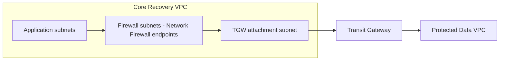
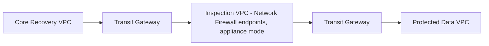

# ADR-001: Network Firewall Placement — Distributed vs. Centralized Inspection

## Status

Proposed — pending Architecture Review Board decision. Not yet implemented.

## Context

The IRE's trust model requires that traffic moving between the Core Recovery VPC and the Protected Data VPC be inspected before it crosses that boundary. AWS Network Firewall is the chosen inspection engine. Where its endpoints physically live is an open architectural question with two established AWS deployment patterns, both of which are valid depending on scale and operational priorities.

The high-level design currently marks this decision explicitly pending, rather than assuming an answer, because the two options carry materially different costs to both the network topology and the Terraform module set.

## Decision drivers

- Whether the environment is expected to grow beyond three fixed trust-tier VPCs
- Operational simplicity during an actual time-pressured recovery event
- Terraform implementation cost against the existing module set
- Cost of Transit Gateway data processing for inspected east-west traffic

## Options considered

### Option A — Distributed

AWS Network Firewall endpoints are deployed in dedicated firewall subnets inside the Core Recovery VPC itself. Route tables in Core Recovery steer Protected-Data-bound traffic through the firewall endpoint before it reaches the Transit Gateway attachment subnet.

**Advantages**
- Keeps the three-VPC, three-trust-boundary model intact
- One fewer Transit Gateway attachment and one fewer route table to reason about
- No appliance-mode symmetric-routing configuration required
- Lower Transit Gateway data-processing cost — traffic is inspected locally before the single TGW hop, rather than crossing TGW twice

**Trade-offs**
- Inspection becomes part of the Core Recovery trust boundary rather than shared, neutral infrastructure
- Requires new routing capability in the existing `vpc` module: today the module has exactly two route-table behaviors (a conditional public table and one shared private table with no interception logic). Distributed inspection requires a third behavior — traffic destined for a specific peer VPC must be routed through a firewall endpoint before reaching the TGW-attachment route — which does not exist in `vpc/routing.tf` today
- This is not a purely additive change; it modifies the existing `vpc` module rather than composing a new one alongside it

### Option B — Centralized

A dedicated Inspection VPC, holding no workloads, is attached to the Transit Gateway with its attachment placed in appliance mode. All Core Recovery to Protected Data traffic is routed through it via Transit Gateway route tables.

**Advantages**
- Matches AWS's own documented centralized inspection reference architecture for Transit Gateway
- Firewall policy and administration are decoupled from any single trust tier
- Scales cleanly if additional spoke VPCs are onboarded later
- Implementable almost entirely additively: the existing `transit-gateway` module already accepts arbitrary `route_tables`, `vpc_attachments`, and `propagate_to` entries, and the attachment object type already carries an unused `appliance_mode_support` field. A new Inspection VPC is another `module "vpc"` call composed alongside the existing ones — no existing module logic changes

**Trade-offs**
- Introduces a fourth VPC. It is infrastructure, not a fourth trust tier — it holds no workloads and no independent security posture — but it is a fourth VPC nonetheless, and a fourth Transit Gateway attachment
- Requires correctly configured appliance mode to guarantee symmetric flows; a misconfiguration here is a known operational pitfall in this pattern
- Doubles Transit Gateway data-processing charges for inspected east-west traffic, since traffic crosses the Transit Gateway twice (into the Inspection VPC, then out again)
- The primary justification for centralized inspection — many spoke VPCs sharing one policy engine — does not exist in this environment today, which has three fixed VPCs with no stated growth plan

## Decision

Not yet made. This ADR exists to record the trade-off precisely so the Architecture Review Board can decide with full context, rather than defaulting to whichever option was implemented first.

Gateway Load Balancer is excluded from both options regardless of outcome. AWS Network Firewall has its own native endpoint model and does not require GWLB. GWLB earns its place specifically when load-balancing a scaled pool of third-party appliances, which is not part of this design.

## Consequences

Whichever option is selected, the decision should be recorded by updating the Status of this ADR to Accepted, with the rejected option left in place above for future reference rather than deleted, so the reasoning remains auditable.

If Option A is selected, the `vpc` module's routing model requires a scoped design change before implementation begins — this should not be treated as a drop-in addition.

If Option B is selected, implementation can proceed as a new `module "vpc"` instantiation for the Inspection VPC plus new `transit-gateway` route table and propagation entries, using interfaces that already exist.

## Related

- ADR-004: Recovery Artifact Repository (traffic from the artifact pipeline may also cross this inspection boundary depending on where ingestion compute is placed)
