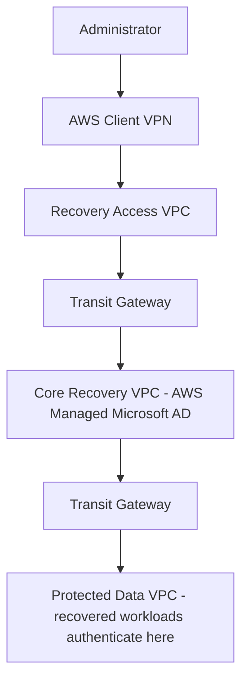

# ADR-002: AWS Managed Microsoft AD Placement

## Status

Accepted.

## Context

Recovered applications and Windows workloads require Active Directory authentication during a cyber recovery event. AWS Managed Microsoft AD provides this. The question is which VPC it should be deployed into: Recovery Access, Core Recovery, or Protected Data.

Each VPC in the IRE has a distinct, deliberately narrow purpose:

## Decision drivers

- Recovery Access exists for connectivity, not for hosting shared services; mixing the two blurs a boundary that is otherwise kept clean throughout this design
- Protected Data holds workloads that have just been restored from backup and are still moving through the recovery validation pipeline — they are not yet fully trusted at the point AD would need to authenticate against them
- Identity infrastructure is Tier-0: it should not sit network-adjacent to the specific class of data this environment exists to be suspicious of
- AWS landing zone conventions place shared services such as directory, DNS, and automation in a core or shared-services VPC, not an ingress VPC

## Decision

AWS Managed Microsoft AD is deployed in the Core Recovery VPC.

Core Recovery is neither the untrusted entry point (Recovery Access) nor the not-yet-vetted recovered data tier (Protected Data). It is the one tier positioned to serve as a platform-services layer without extending trust in either direction.

## Consequences

Every authentication request from a recovered workload in Protected Data now crosses the inspection boundary between Core Recovery and Protected Data — every Kerberos ticket, LDAP bind, and SYSVOL/NETLOGON access. This is intentional, but it has a concrete operational requirement: whichever network firewall placement is selected under ADR-001 must carry explicit allow rules for the ports Active Directory requires between Core Recovery and Protected Data:

| Port | Protocol | Purpose |
|---|---|---|
| 53 | TCP/UDP | DNS |
| 88 | TCP/UDP | Kerberos |
| 389 | TCP/UDP | LDAP |
| 636 | TCP | LDAPS |
| 445 | TCP | SMB (SYSVOL, NETLOGON) |
| 464 | TCP/UDP | Kerberos password change |
| 3268 | TCP | Global Catalog |
| 3269 | TCP | Global Catalog over SSL |
| 49152-65535 | TCP | RPC dynamic range, unless NTDS/Netlogon are pinned to a static port range on the domain controllers |

Without these rules explicitly present, a stateful firewall between Core Recovery and Protected Data will silently break authentication for recovered workloads — this should be treated as a required input to whichever ADR-001 option is implemented, not an afterthought discovered during a recovery drill.

## Alternatives considered

**Recovery Access VPC.** Rejected. This would convert an ingress-only VPC into a shared-services VPC, mixing two responsibilities that are kept separate everywhere else in this design.

**Protected Data VPC.** Rejected. This is the option most likely to be assumed by proximity to the workloads it serves, so it is recorded explicitly rather than silently discarded. Protected Data holds workloads that are still moving through malware scanning, integrity validation, and approval at the point they would first need to authenticate. Placing Tier-0 identity infrastructure in the same VPC as data that has not yet cleared validation is the specific risk this ADR avoids.

## Related

- ADR-005: Dual Active Directory (this ADR concerns the control-plane directory's network placement; ADR-005 addresses why a second, separate directory also exists and how the two relate)
- ADR-001: Network Firewall Placement (the port table above is a direct input to that decision)
