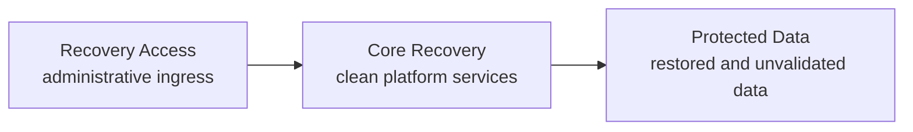
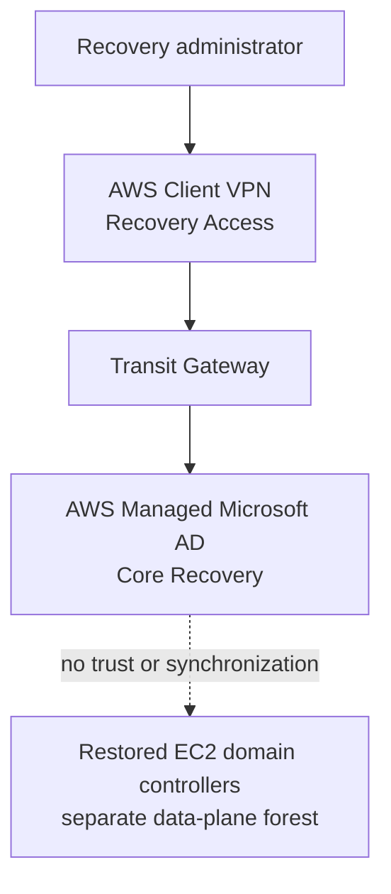

# ADR-002: AWS Managed Microsoft AD Placement

## Status

Accepted.

## Context

The IRE needs a clean administrative directory that does not inherit identities, trusts, or compromise from production. Its initial purpose is user-based authentication for the administrative access path, including AWS Client VPN, and a small population of approved recovery administrators.

Recovered applications have a different identity requirement. They depend on production-matching SIDs, service-account secrets, SPNs, and machine trusts. As established by ADR-005, those applications authenticate against a separately restored and validated production-derived forest on EC2—not against AWS Managed Microsoft AD.

The placement decision is therefore about the clean administrative control-plane directory, not the recovered application directory.

## Decision drivers

- Recovery Access is an ingress and administrative landing tier, not a shared-services hosting tier.
- Protected Data contains restored material that is not trusted until validation completes.
- Administrative identity is Tier-0 and must remain isolated from production-derived identity.
- No trust or synchronization may exist between Managed AD and the restored production forest.
- Placement must remain environment configuration rather than a hardcoded Terraform-module assumption.
- AWS Managed Microsoft AD requires two subnets in different Availability Zones.

## Decision

The Sandbox places AWS Managed Microsoft AD in the Core Recovery VPC using the existing `directory-services` subnet group.

Placement is resolved through the Platform contract:

- `identity_placement.vpc_key`
- `identity_placement.subnet_group`
- `identity_placement.required_subnet_count`

The reusable module receives only resolved VPC and subnet IDs. It does not hardcode Core Recovery, CIDRs, subnet names, Availability Zones, or Region. A future environment can select a different approved placement without changing the module.

Managed AD remains disabled by default. Enabling it requires Git-controlled configuration, an approved AAP credential, an Identity plan, and explicit apply authorization.

## Consequences

- Client VPN user authentication requires explicitly reviewed routing, DNS, and directory-service flows between Recovery Access and Core Recovery.
- Managed AD does not authenticate recovered applications and does not require a trust relationship with their restored forest.
- Direct `directory-services` reachability into Protected Data is not implied by this decision. Existing route eligibility must be reviewed separately before production hardening.
- The current Sandbox `directory-services` subnets satisfy the two-subnet, different-AZ placement requirement; no additional Managed AD subnets are required.
- Changing the directory domain, edition, VPC, or subnets can require replacement and must receive explicit plan review.
- AWS provider `6.57.1` requires the initial Admin password through its sensitive `password` argument and does not expose a write-only alternative. The bootstrap value is therefore retained in Terraform state.
- The state backend must be encrypted and tightly access-controlled. AAP must inject the password from a secret credential, never from Git or ordinary Job Template YAML.
- The Admin password must be rotated through an approved operational workflow after creation. Terraform ignores subsequent password configuration changes so password rotation cannot replace the directory.
- User, group, MFA, and directory operational administration are separate identity-management responsibilities and are not created by this Terraform resource.

## Alternatives considered

### Recovery Access VPC

Rejected. Hosting Tier-0 directory services in the administrative ingress tier mixes connectivity and shared-service responsibilities and increases exposure.

### Protected Data VPC

Rejected. It places the clean administrative directory beside restored material that has not yet passed recovery validation.

### Dedicated Identity VPC

Not required for the current Sandbox. It remains a future option if scale, compliance, multi-account design, or production isolation requirements justify a separate identity boundary and CIDR allocation.

## Related

- ADR-005: Dual Active Directory—defines the separation between administrative Managed AD and the restored production forest.
- ADR-003: DNS Strategy—governs name-resolution integration.
- ADR-001: Network Firewall Placement—governs inspected inter-VPC flows.
