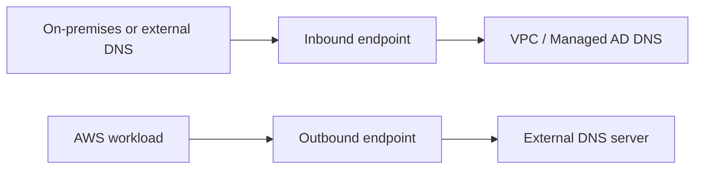
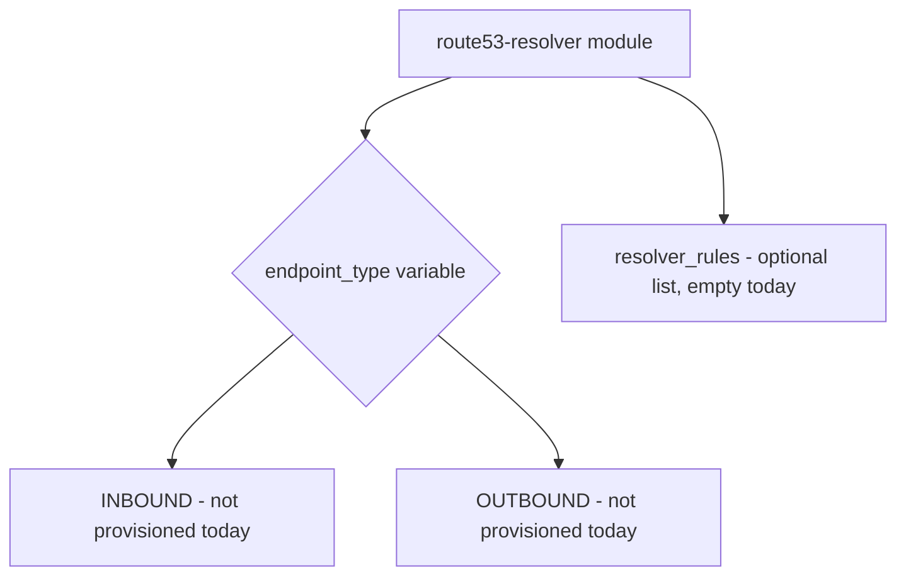

# ADR-003: DNS Strategy and Route 53 Resolver Module Design

## Status

Accepted.

## Context

Workloads inside the IRE need to resolve names. AWS Managed Microsoft AD (ADR-002) already provides integrated DNS for anything joined to it, and every workload that currently exists in this design lives inside Core Recovery or Protected Data — both reachable from that directory's DNS. The question is whether a Route 53 Resolver module is needed now, and if so, what it should build.

Route 53 Resolver has two distinct endpoint types, serving opposite directions of traffic:

## Decision drivers

- Managed AD's integrated DNS already resolves every workload inside the current VPC set; no endpoint is needed for that path today
- The environment has a standing requirement, independent of this ADR, that nothing inside the IRE reach external network destinations — including for DNS resolution
- Named future scenarios (hybrid DNS, on-premises integration, secondary recovery sites, cross-account DNS, another AWS Region) will require resolver rules, which depend on an outbound endpoint existing as their target
- Building a narrowly-scoped module now, for a need that does not yet exist, risks a second module being needed later anyway if the interface does not anticipate resolver rules

## Decision

Build a generic `route53-resolver` module now, capable of provisioning inbound endpoints, outbound endpoints, and resolver rules depending on input variables — but do not provision an outbound endpoint in the current environment.

The module's `endpoint_type` variable is constrained by a `validation` block to `INBOUND` or `OUTBOUND`, following the same pattern already used for enable/disable strings in the `transit-gateway` module. `resolver_rules` is typed as `optional(list(object({...})), [])`, so an endpoint can be created today with no rules attached, and rules can be added later without changing the module's interface.

No endpoint of either type is instantiated in the current environment. The module exists so that the day one of the named future scenarios becomes real, the response is a new module call, not a new module.

## Consequences

The outbound endpoint specifically is not simply deferred as "not needed yet" — it is deliberately withheld, because provisioning it would be a statement that something inside the IRE now needs to resolve external DNS, which is a decision that should be made consciously and documented, not defaulted into. Anyone extending this module to add an outbound endpoint should read this ADR first and record the reason in a new or updated ADR rather than wiring it up to solve an unrelated, local problem.

If a future need genuinely requires reaching external DNS (for example, a component of the offline software supply chain described in ADR-004 running partially inside IRE VPCs rather than entirely in the separate connected staging account), that need should be evaluated against ADR-004's boundary first, since the intended pattern is that external reachability lives in the staging account, not inside the IRE.

## Related

- ADR-002: Managed AD Placement (the reason no endpoint is needed today)
- ADR-004: Recovery Artifact Repository (the boundary that should be checked before an outbound endpoint is ever added)
