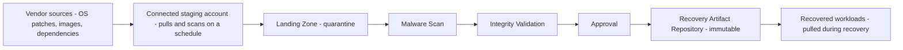

# ADR-004: Recovery Artifact Repository and Offline Software Supply Chain

## Status

Accepted.

## Context

The IRE has no internet access by design. Rebuilding infrastructure during a recovery event still requires external content: operating system patches, container images, Golden AMIs, application dependencies, Terraform providers and modules, Ansible collections, and certificates. This content originates outside the environment and must reach it without creating a live connection that a compromised production environment, or a compromised source, could exploit.

This is a distinct problem from AWS Backup, which is addressed separately. Backup restores your own data; this ADR concerns rebuild material that mostly originates from third-party vendors.

| | Recovery Artifact Repository | AWS Backup vault |
|---|---|---|
| Contents | Patches, images, AMIs, modules, certificates | Snapshots of your own workload data |
| Origin | External vendors | Your own production systems |
| Answers | What do I rebuild the environment with | What do I restore back |

## Decision drivers

- Content must be scanned and validated before it is trusted, the same way backup recovery points are validated before use
- No component inside the IRE should need a live connection to the internet, including for the purpose of pulling patches
- The mechanism should reuse existing patterns in this design rather than invent a new one

## Decision

A connected staging account, entirely outside the IRE, performs all internet-facing work: pulling patches, images, and dependencies, and running an initial scan. It has a one-way push path into the IRE's existing Recovery Content Lifecycle pipeline. The IRE itself never initiates an outbound connection.

This is the same pipeline already defined for general recovery content; this ADR extends its scope to include software supply chain content rather than introducing a second pipeline.

Content types map to specific AWS mechanisms:

| Content | Mechanism |
|---|---|
| OS patches | Systems Manager Patch Manager with a custom baseline pointed at a local mirror, not the public internet |
| Container images | Private ECR inside the IRE, immutable tags, populated by ECR replication from the staging account |
| Golden AMIs | Built by EC2 Image Builder in the staging account, shared or copied into the IRE account at the API level |
| Application dependencies | AWS CodeArtifact, with upstream internet pass-through enabled only on the staging side |
| Terraform providers and Ansible collections | Mirrored in the staging account, pushed into the same artifact store as other repository content |
| Certificates | AWS Private CA operated entirely inside the boundary, or pre-provisioned certificates stored with validity long enough to survive the gap between issuance and a recovery event |

## Consequences

This is a recurring operational commitment, not a one-time build. Patch currency, AMI rebuild cadence, and certificate rotation all need an explicit staleness tolerance defined, in the same way Recovery Time Objective and Recovery Point Objective are already defined for the environment as a whole. Without an owned cadence, this silently degrades into recovering onto content that may be a year or more out of date.

The storage layer for this repository is a regional service, not a VPC resident, reached from IRE VPCs through interface or gateway endpoints. Its account placement, and whether it shares an account with the AWS Backup vault, is addressed separately; both should be evaluated against the same one-way, no-return-path principle described here.

## Related

- ADR-001: Network Firewall Placement (traffic between ingestion compute and this repository may cross the same inspection boundary)
- ADR-003: DNS Strategy (the boundary this repository's design depends on: external reachability stays in the staging account)
