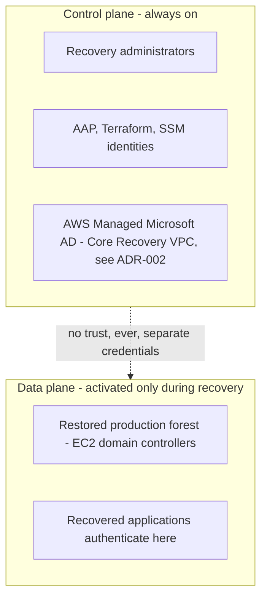
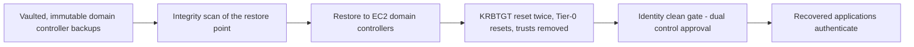

# ADR-005: Dual Active Directory — Control Plane and Data Plane Separation

## Status

Accepted.

## Context

Recovered applications require Active Directory authentication that matches production exactly: the same SIDs, the same service account secrets, the same SPNs, the same machine trusts. AWS Managed Microsoft AD cannot provide this on its own. It is a closed, standalone managed forest — there is no way to replicate another forest's users, groups, and computer objects into it with their original passwords, SIDs, or machine secrets, because inter-forest replication is not something the service exposes, and object provisioning without those attributes produces identities that do not match what recovered applications, ACLs, and service accounts actually expect.

At the same time, continuously synchronizing identity from production into the IRE would replicate whatever compromise is present in production at the moment of sync. A ransomware operator who has dwelled in Active Directory before triggering encryption has typically already created backdoor accounts and modified privileged group membership; a faithful sync copies those changes into the recovery environment along with everything else.

This ADR treats "authenticate recovered applications" and "administer the IRE itself" as two different problems, requiring two different directories.

## Decision drivers

- Recovered applications need identity with production-matching SIDs, secrets, and machine trust; provisioning cannot provide this, only a restored copy of the actual forest can
- The IRE's own administrators, automation, and tooling need a directory that owes nothing to production and cannot inherit a production-side compromise
- No standing trust relationship or synchronization pipeline should exist between the IRE and production, since a pipeline is itself a connection that can carry a compromise
- KRBTGT and other Tier-0 credentials must be rotated before any recovered application is allowed to authenticate against a restored forest

## Decision

Two directories exist, and they never trust each other.

**Control plane.** AWS Managed Microsoft AD, targeted for placement in Core Recovery per ADR-002. Standalone, no trusts, a small population of named recovery administrators, AAP, and automation identities. In the target architecture, this directory is provisioned by Infrastructure as Code and is intended to exist continuously. It is never used to authenticate a recovered application. Deployment is currently disabled in the integrated environment pending approval of the identity, DNS, and credential-handling workflow.

**Data plane.** The production forest itself, restored from immutable, vaulted domain controller backups onto EC2 instances, only at the point a recovery is declared. Before any application is allowed to authenticate against it, a hygiene procedure runs: KRBTGT is reset twice, Tier-0 credential passwords are reset, DSRM is reset, external and forest trusts are removed, and directory synchronization connectors such as Entra Connect are disabled. This directory is what recovered applications, service accounts, and machine trusts actually authenticate against, because it is the only artifact that carries their original SIDs and secrets.

## Consequences

The network placement of the restored forest's domain controllers is a separate, still-open decision from this ADR. The control plane's placement is fixed by ADR-002 (Core Recovery). The data-plane forest, once restored, needs its own quarantined network segment that starts with no route to the rest of the environment until the identity-clean gate is passed, and this segment has not yet been formally placed within the current three-VPC HLD. This should be resolved as a follow-on decision rather than assumed, since restoring Tier-0 identity infrastructure into a shared segment without explicit isolation would undermine the reasoning in ADR-002.

Recovery time for the data plane is bounded by the vaulted backup cadence and the time required to run the hygiene procedure, not by the availability of the control plane, which is already running before a recovery begins. The hygiene procedure should be codified in Ansible Automation Platform and drilled on a fixed cadence; an untested forest recovery procedure is a documentation exercise, not a capability.

## Related

- ADR-002: Managed AD Placement (fixes the control plane's network location)
- ADR-001: Network Firewall Placement (governs the inspection posture the data-plane segment's eventual placement will need to account for)
