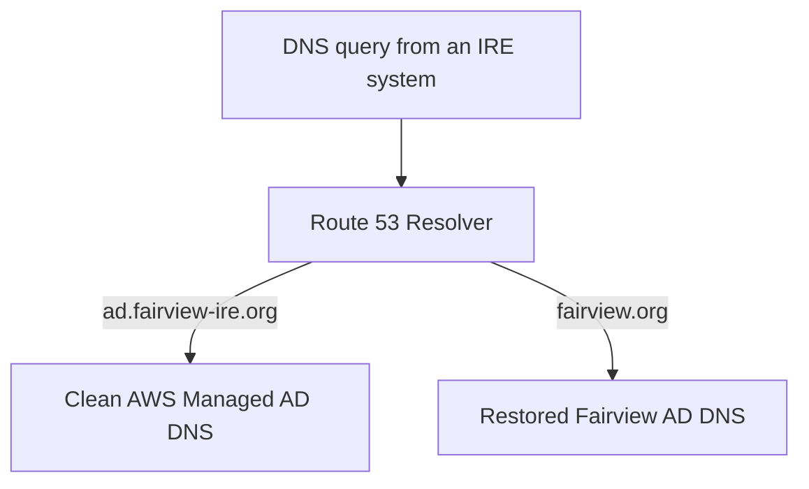

# ADR-003: IRE DNS Authority and Resolution Strategy

- **Status:** Accepted
- **Date:** 2026-08-27
- **Scope:** Fairview IRE customer configuration

## Context

The IRE will contain two separate Active Directory environments:

1. A clean AWS Managed Microsoft AD domain named `ad.fairview-ire.org` for administering the IRE.
2. A restored copy of the on-premises `fairview.org` domain for recovered applications and workloads.

Each Active Directory environment includes Microsoft DNS and owns the DNS records for its domain. Recovered workloads must authenticate against the restored `fairview.org` domain. IRE administrators must continue to use the clean AWS Managed AD domain.

Route 53 Resolver is required to direct DNS queries to the correct DNS authority. Route 53 does not authenticate users or replace Active Directory DNS.

## Decision

The IRE will use the following DNS ownership model:

| Namespace | DNS authority | Purpose |
|---|---|---|
| `ad.fairview-ire.org` | AWS Managed AD DNS | Clean IRE administration |
| `fairview.org` | Restored Fairview AD DNS | Recovered workloads and applications |
| A future AWS-only namespace | Route 53 private hosted zone, if approved | AWS-native services that should not depend on either AD |

Route 53 Resolver will send queries to the correct DNS authority by using domain-specific forwarding rules.

## How authentication works

Route 53 Resolver only helps a workload find the correct domain controller.

For a recovered workload:

1. The workload asks DNS for a `fairview.org` domain controller.
2. Route 53 Resolver forwards the query to the restored Fairview DNS servers.
3. Restored Fairview DNS returns the domain-controller address.
4. The workload connects directly to the restored domain controller for Kerberos, LDAP, Group Policy and authentication.

## Resolver rules

The target design contains two forwarding rules:

| Resolver rule | Forwarding target | Association |
|---|---|---|
| `ad.fairview-ire.org` | AWS Managed AD DNS IP addresses | Only VPCs requiring clean IRE directory resolution |
| `fairview.org` | Restored Fairview DC DNS IP addresses | Initially the Protected Data VPC only |

The `fairview.org` rule will be created only after the restored domain controllers exist and their private DNS IP addresses are known.

## Private hosted zone decision

No Route 53 private hosted zone will be created for either Active Directory domain.

- `ad.fairview-ire.org` is already owned by AWS Managed AD DNS.
- `fairview.org` is already owned by the restored Fairview AD DNS.
- Creating Route 53 hosted zones with either name would duplicate DNS authority and complicate operations.

A private hosted zone is optional, not mandatory. It will be introduced only if Fairview approves a separate AWS-owned namespace for services that should be managed through AWS and Terraform independently of Active Directory.

Records beneath an existing AD namespace may continue to be created in that domain's Microsoft DNS. For example, an IRE management record beneath `ad.fairview-ire.org` may be managed by AWS Managed AD DNS; it does not require a private hosted zone.

## Security and isolation

- No trust relationship is assumed between the clean AWS Managed AD and the restored `fairview.org` domain.
- The restored domain is treated as untrusted until cyber-recovery validation is complete.
- DNS resolution of `fairview.org` will be limited initially to recovered workloads in the Protected Data VPC.
- The restored domain controllers must be prevented from reconnecting to or replicating with production domain controllers during an isolated recovery.
- Core Recovery, Recovery Access and Inspection will not receive `fairview.org` resolution unless a documented operational requirement is approved.

## Terraform ownership

- The reusable Route 53 Resolver endpoint and rule capability remains customer-neutral.
- Fairview domain names, DNS targets and VPC associations remain only in the customer-specific configuration branches.
- The clean Managed AD forwarding rule belongs to the Identity lifecycle.
- The future `fairview.org` forwarding rule belongs to the Recovery lifecycle because it depends on restored domain-controller addresses.
- The existing outbound Resolver endpoint should be reused where lifecycle and isolation requirements permit. A second endpoint will not be created without a documented reason.

## Consequences

### Benefits

- Clear ownership for every DNS namespace.
- Recovered workloads can locate and authenticate against restored Fairview AD.
- IRE administrators remain on a separate clean directory.
- AWS service-name resolution remains available through the VPC Resolver.
- No unnecessary private hosted zone or duplicate DNS records are introduced.

### Trade-offs

- Recovery automation must publish the restored DC DNS addresses before enabling the `fairview.org` forwarding rule.
- DNS and authentication must be validated before application recovery begins.
- Any future cross-domain access requires a separate security decision and is not implied by this ADR.

## Not decided by this ADR

- A trust relationship between the two directories.
- The name of a future AWS-only private namespace.
- Reconnection of the restored domain to production.
- Public DNS or internet-facing records.
