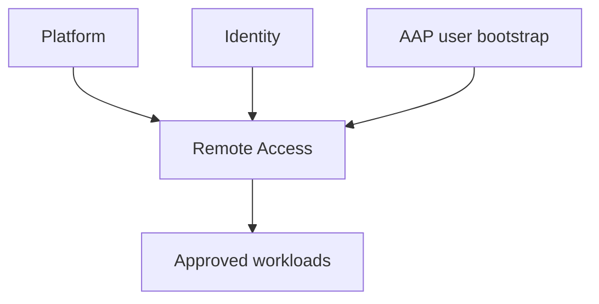

# ADR-006: Separate Remote Access lifecycle stack

## Status

Accepted for validation on `test`. Promotion to any deployed environment
requires a reviewed state-ownership migration.

## Context

Platform creates VPCs, subnets, routing and shared security groups. Identity
creates AWS Managed Microsoft AD. AWS Client VPN with directory authentication
depends on both stacks, so Platform cannot create the final endpoint during its
initial deployment without introducing a reverse dependency on Identity.

Client VPN also applies IPv4 source NAT. A target workload does not see the
client-pool address. It sees the private address of a Client VPN network
interface in an associated subnet. Security-group rules based on the client
pool therefore do not permit the traffic.

## Decision

Create an independent `remote-access` lifecycle stack after Identity.



Remote Access owns:

- the Client VPN endpoint and network associations;
- its dedicated endpoint security group and egress rules;
- Client VPN routes and AD-group authorization rules;
- additive ingress rules on approved Platform security groups; and
- Client VPN connection logs.

Platform continues to own the VPCs, association subnets, route tables and
workload security groups. Identity continues to own Managed AD and its
directory security-group policy. Certificates remain externally owned; AAP
supplies only their ACM ARNs at runtime.

Target ingress uses the selected association-subnet CIDRs from the Platform
contract. It does not use the Client VPN client CIDR.

## Authentication modes

- `directory`: AD username/password plus the required server TLS certificate.
- `directory_and_mutual`: AD username/password and a client certificate. This
  additionally requires an existing ACM client root certificate-chain ARN.

The Git-controlled tfvars select the mode. AAP supplies certificate ARNs and
the approved AD authorization-group SID; Terraform creates no certificates and
stores no AD user passwords.

## Lifecycle order

Creation:

```text
Platform -> Identity -> AD user/group bootstrap -> Remote Access
```

Destruction:

```text
Remote Access -> Identity -> Platform
```

## Existing-state migration

Removing the legacy Client VPN module from Platform changes Terraform resource
ownership. Never apply that Platform change to an environment that still has
Client VPN resources in Platform state. First inventory the exact resource
addresses, create protected state snapshots, transfer/import ownership into
the Remote Access state, and prove that both resulting plans contain no
unintended destruction or replacement.

The deployed customer branch is deliberately excluded from this development
change. Its adoption requires a separate migration plan and approval.
