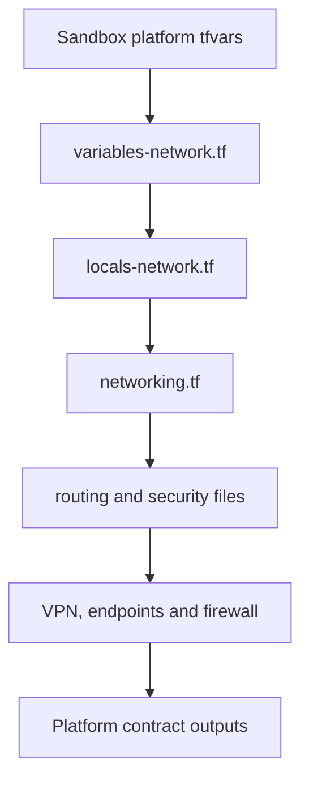

# Terraform and AAP troubleshooting and maintenance workbook

## Purpose

This runbook helps maintainers diagnose the IRE without changing AWS resources,
Terraform state, AAP configuration, or Git history during initial triage.

Use it for:

- unexpected Terraform plans;
- backend or state-ownership uncertainty;
- missing routes, security-group rules, endpoints, or Client VPN access;
- cross-stack contract failures;
- Managed AD deployment problems;
- AAP execution-binding problems; and
- CI or local validation failures.

This guide is customer-neutral. Do not record real credentials, private keys,
passwords, account-specific secrets, or unredacted Terraform state in an issue.

The repository has no supported local full-stack apply. Full IRE deployment is
contract-brokered by AAP/AWX across Persistent, Platform, Identity and Recovery.
Module-validation roots are separate and do not carry the IRE state or approval
model.

## Non-negotiable stop conditions

Stop before apply, migration, import, or manual AWS changes when any of the
following is true:

- the Git revision, Terraform root, backend bucket, key, backend Region,
  deployment Region, workspace, or AWS account is not proven;
- an existing resource may be owned by another Terraform state;
- the plan contains an unexplained create, destroy, or replacement;
- a sensitive or stateful resource changes only for naming or tagging;
- the working tree contains unexpected modifications;
- a plan or state artifact may expose a secret;
- rollback evidence has not been captured for a proposed state operation.

Never use `-lock=false` to bypass state protection. Never delete state entries,
force-unlock, import, move, push, or manually recreate resources until ownership
and rollback have been proven.

## Execution binding worksheet

Complete this from AAP job details and job output before diagnosing Terraform or
AWS drift.

| Evidence | Recorded value |
|---|---|
| Incident/change identifier | |
| AAP job ID and URL | |
| AAP project revision | |
| Git commit | |
| Terraform stack | |
| Terraform root | |
| Environment configuration directory | |
| Explicit tfvars files | |
| Backend bucket | |
| Backend key | |
| Backend Region | |
| Terraform workspace | |
| Deployment Region | |
| Assumed AWS account | |
| Assumed role/session | |
| Plan summary | |
| State resource count | |

The authoritative AAP definitions are:

- `playbooks/vars/terraform_stack_bindings.yml`;
- the `Report derived Terraform execution binding` task;
- the Terraform initialization output; and
- the STS caller-identity verification performed by the assume-role workflow.

## First read-only repository batch

Run from WSL and inspect the complete output before continuing:

```bash
(
  set -euo pipefail

  REPO="/path/to/terraform_modules"
  cd "$REPO"

  echo "=== GIT SAFETY ==="
  git branch --show-current
  git status --short
  git log -1 --oneline

  echo "=== ACTIVE STACK BINDINGS ==="
  sed -n '1,180p' playbooks/vars/terraform_stack_bindings.yml

  echo "=== EXECUTION-BINDING IMPLEMENTATION ==="
  rg -n -C 4 \
    'Report derived Terraform execution binding|terraform_root|terraform_config_root|terraform_backend_key|terraform_stack_var_files' \
    playbooks \
    --glob '*.yml' --glob '*.yaml'

  echo "=== REPOSITORY REFERENCE SCREEN ==="
  rg -n \
    'terraform/environments/sandbox|terraform/stacks/(persistent|platform|identity|remote-access|recovery)' \
    README.md MAINTAINERS.md docs playbooks scripts .github \
    --glob '*.md' --glob '*.yml' --glob '*.yaml' --glob '*.sh' \
    || true
)
```

Expected result: the branch and commit are known, the worktree contains no
unexpected changes, and the selected stack maps to exactly one active root and
one backend key.

## Plan triage

| Symptom | Most likely causes | First evidence |
|---|---|---|
| Nearly the entire stack is `to add` | Empty/wrong state, intentional prior destroy, wrong account, wrong backend key | AAP binding, init output, state inventory, approved destroy record |
| Existing object is proposed for creation | Wrong state ownership or unmanaged/orphaned AWS object | State list plus read-only AWS inventory |
| Replacement after a naming change | AWS name is immutable or Terraform address changed | Plan replacement path and module/resource address |
| Rule exists in tfvars but not in the plan | Wrong revision/file, conditional allowlist, effective-input filtering | AAP revision, explicit var files, runtime allowlist |
| Plan and apply use different results | Revision/input drift or provider/environment difference | Both AAP binding reports and plan artifacts |
| Downstream contract is null/missing | Upstream capability disabled, wrong state key, output renamed | Dependency binding and upstream `terraform output` |

Zero destroys does not by itself make a plan safe. Confirm that every proposed
create is intentional and unowned before approving it.

## State-ownership diagnosis

Use this sequence only after the execution binding is proven:

1. Record the selected state bucket, key, Region, workspace, account and stack.
2. List selected-state addresses read-only using the approved AAP diagnostic
   workflow or the already initialized approved execution workspace.
3. Inventory legacy state with the repository's existing read-only playbook.
4. Inventory corresponding AWS resources through the approved assumed role.
5. Classify every object as current-state owned, legacy-state owned, genuinely
   unmanaged, intentionally absent, or unknown.
6. Stop if any object has two possible owners.

Do not introduce a migration script until existing inventory and migration
playbooks have been inspected. Before an eventual migration, create the
approved Terraform-native rollback snapshot and an exact address map.

## Network dependency trace

For the governed IRE Platform, trace a network value in this order:



| Question | Primary location |
|---|---|
| What VPCs/subnets should exist? | `terraform/environments/sandbox/config/platform.tfvars` |
| Is the topology structurally valid? | `terraform/stacks/platform/variables-network.tf` |
| How are names/defaults normalized? | `terraform/stacks/platform/locals-network.tf` |
| Where are VPC/TGW modules called? | `terraform/stacks/platform/networking.tf` |
| Which inter-VPC paths are allowed? | `platform.tfvars` connectivity plus `routing.tf` |
| Which ports/sources are allowed? | `platform-network-policy.tfvars` plus `security.tf` |
| Which private endpoints exist? | Platform SSM/endpoint bindings plus `ssm-management.tf` |
| What can Identity/Recovery consume? | `terraform/stacks/platform/outputs.tf` |

A consumer of one reusable module should start with that module's README and
matching module-validation root. The consumer does not need the complete IRE
Platform dependency chain.

## Client VPN connects but traffic fails

Check in this order:

1. Client VPN target-network association is present in the intended subnets.
2. Client route exists for the destination CIDR.
3. Client VPN authorization permits the destination network.
4. Source VPC route table has the required TGW/local path.
5. Destination route table has a return path to the Client VPN CIDR.
6. Destination security group allows the actual source model used by Client
   VPN—not merely a similar CIDR or unrelated security group.
7. NACLs, host firewall and the service listener allow the traffic.
8. DNS resolves to the expected private address.

Ping success proves only ICMP reachability. It does not prove TCP/22, RDP, DNS,
AD ports, return routing, or authorization.

Do not add a rule manually in AWS. Compare the effective Terraform plan with
the Git revision and var-file allowlist first.

## Managed AD diagnosis

Before enabling or replacing Managed AD, verify:

- Identity placement resolves to the approved VPC and exactly two subnets in
  different Availability Zones;
- the Platform state publishes those subnet IDs;
- the domain and edition are Git-controlled and customer-neutral in reusable
  code;
- the bootstrap password is injected only by the approved AAP credential;
- ordinary `terraform_variables` cannot override the password;
- the plan guard rejects unexpected directory replacement or destruction;
- DNS, Client VPN authentication and any consumers have an approved dependency
  sequence; and
- no trust or synchronization with recovered production-derived AD is assumed.

The initial password is sensitive but remains in Terraform state because the
AWS provider requires it. AAP protects injection and logging; the encrypted,
access-controlled backend protects the retained state value. Operational
rotation occurs after creation and is not a Terraform variable update.

## CI and local validation failures

| Failure | Diagnosis |
|---|---|
| `ansible.cfg` ignored under WSL | Set `ANSIBLE_CONFIG` explicitly; the Windows-mounted directory may be world-writable |
| Collection role not found | Confirm `ANSIBLE_COLLECTIONS_PATH` includes the repository `collections` directory |
| No module-test roots found | Confirm `terraform/environments/module-tests` exists and contains Terraform roots |
| Changed module has no consumer | Add or repair a module-validation root or lifecycle-stack consumer |
| Lockfile/provider initialization fails | Check Terraform/provider versions and committed lockfile; do not bypass checks |
| Format check fails | Run `terraform fmt -check -recursive terraform/`, inspect, then format intentionally |
| Checkov reports legacy/placeholder files | Confirm scan scope; do not suppress a valid active-root finding merely to get green CI |

Local syntax/static validation does not prove backend selection, account,
permissions, quotas, service availability, routing behavior or replacement
safety. AAP plan-only validation remains mandatory.

## Maintenance workbook

Record evidence for each review; do not mark a control complete from memory.

| Frequency/event | Control | Evidence | Owner | Status/date |
|---|---|---|---|---|
| Every PR | Format, Terraform validation, Ansible/YAML lint, security scan | CI URL | | |
| Every PR | No customer/private values in reusable code | Search output/reviewer | | |
| Every stack plan | Revision, root, bucket, key, Regions and account proven | AAP job | | |
| Every apply | Complete plan reviewed; no unexplained replacement/destroy | Approved plan | | |
| Monthly | Branch protection and feature-to-test flow reviewed | Repository settings/evidence | | |
| Monthly | Stale/empty files and dead references reviewed | Inventory report | | |
| Quarterly | Backend access, encryption, versioning and recovery tested | Control evidence | | |
| Quarterly | AAP credentials, role trust and least privilege reviewed | IAM/AAP evidence | | |
| Recovery exercise | Persistent, Platform, Identity, Recovery sequence validated | Exercise record | | |
| Recovery exercise | SSM, VPN, DNS, AD and workload access paths tested | Test evidence | | |
| Before migration | Source/target ownership and rollback snapshot proven | Mapping/snapshot | | |
| After migration | No duplicate ownership; plan contains no surprises | State/AWS inventory | | |

## Incident handoff template

```text
Summary:
Business/recovery impact:
Last known good AAP job and revision:
Failing AAP job and revision:
Stack/root:
Backend bucket/key/Region:
Deployment account/Region:
Plan summary:
Unexpected resource addresses/actions:
State ownership evidence:
Read-only AWS evidence:
Working-tree status:
Changes explicitly not performed:
Recommended next read-only action:
Stop condition or approval required:
```

Redact account-specific and sensitive values before sharing outside the
approved incident channel. Never attach Terraform state or a secret-bearing
plan artifact to a public issue.
