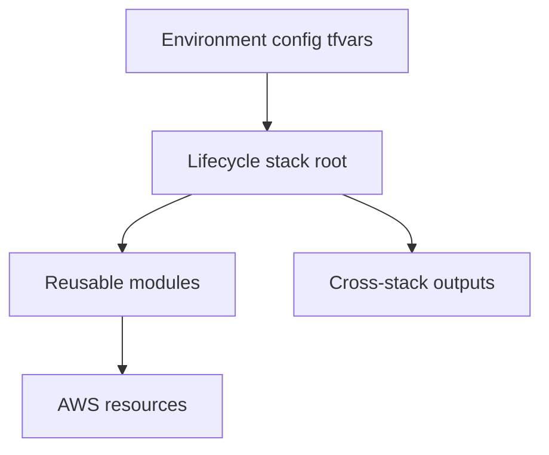

# Terraform configuration reference

## Authoritative model

Terraform logic and environment values are deliberately separate:

| Layer | Location | Ownership |
|---|---|---|
| Reusable implementation | `terraform/modules` | Generic AWS capabilities |
| Lifecycle composition | `terraform/stacks` | Resource and state ownership |
| Sandbox desired state | `terraform/environments/sandbox/config` | Non-sensitive environment values |
| Execution binding | `playbooks/vars/terraform_stack_bindings.yml` | Stack, var-file and dependency contracts |
| Runtime/secret binding | AAP inventory and credentials | Region, role, backend and sensitive values |

## Stack configuration

| Stack | Explicit tfvars |
|---|---|
| Persistent | `common-tags.tfvars`, `persistent.tfvars` |
| Platform | `common-tags.tfvars`, `platform.tfvars`, `platform-network-policy.tfvars` |
| Identity | `common-tags.tfvars`, `identity.tfvars` |
| Recovery | `common-tags.tfvars`, `recovery.tfvars` |

Terraform does not auto-load these files from the environment directory. AAP
passes the approved files explicitly to the selected lifecycle root.

## Platform network trace

| Stage | File |
|---|---|
| Desired topology | `terraform/environments/sandbox/config/platform.tfvars` |
| Input contract | `terraform/stacks/platform/variables-network.tf` |
| Normalization | `terraform/stacks/platform/locals-network.tf` |
| VPC/TGW composition | `terraform/stacks/platform/networking.tf` |
| Connectivity | `terraform/stacks/platform/routing.tf` |
| Network policy | `terraform/environments/sandbox/config/platform-network-policy.tfvars` |
| Security composition | `terraform/stacks/platform/security.tf` |
| Consumer contract | `terraform/stacks/platform/outputs.tf` |

The VPC module owns VPCs, subnets, route tables, associations and an optional
Internet Gateway. Higher-level routing remains in the consuming Platform root.

## Cross-stack contracts

AAP brokers only approved outputs:

- Persistent to Platform: optional Network Firewall logging KMS ARN;
- Persistent to Recovery: backup vault references;
- Platform to Identity: approved VPC/subnet placement contract; and
- Platform to Recovery: network, security-group and management-plane contract.

Operators cannot override lifecycle-owned contracts through ordinary runtime
Terraform variables.

## Sensitive and runtime values

Do not commit:

- backend configuration;
- account IDs, role ARNs or private enterprise bindings;
- passwords, private keys or certificate private material;
- Terraform state or saved plans; or
- AAP credential values.

Managed AD bootstrap credentials are injected through the approved AAP custom
credential and are reserved from ordinary operator variables.

## Safe review method

For any proposed change:

1. identify the owning lifecycle stack and backend key;
2. locate the environment value and typed variable declaration;
3. trace locals, module input, AWS resource and output;
4. confirm downstream contract consumers;
5. run backend-disabled validation;
6. run an AAP plan against the proven revision/account/backend; and
7. stop on any unexplained create, replacement or destroy.

See `MAINTAINERS.md` and `docs/operations/troubleshooting.md` for operational
procedures.
