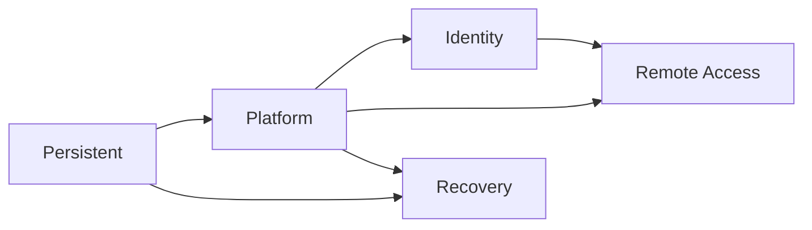

# Terraform architecture-to-code map

## Lifecycle ownership



| Stack | Primary ownership | Main composition files |
|---|---|---|
| Persistent | Backup vaults and optional logging KMS | `main.tf` |
| Platform | VPC, TGW, routing, security, SSM, endpoints and firewall | `networking.tf`, `routing.tf`, `security.tf`, service-specific files |
| Identity | AWS Managed Microsoft AD and private DNS integration | `main.tf` |
| Remote Access | Client VPN, endpoint SG, routes and authorization | `main.tf` |
| Recovery | Temporary compute and backup policy | `compute.tf`, `backup.tf` |

## Reusable module consumers

| Capability | Module | Active consumer |
|---|---|---|
| VPC/subnets/route tables | `vpc` | Platform `networking.tf` |
| Transit Gateway | `transit-gateway` | Platform `networking.tf` |
| Security groups/rules | `security-group`, `security-group-rule` | Platform `security.tf` |
| SSM endpoints | `vpc-endpoints` | Platform `ssm-management.tf` |
| Client VPN | `client-vpn` | Remote Access `main.tf` |
| Network Firewall | `network-firewall`, `network-firewall-policy`, `network-firewall-rule-group`, `network-firewall-logging`, `network-firewall-tls-inspection` | Inspection `main.tf` |
| Network routing | `network-firewall-routing` | Platform `routing.tf` and Inspection `routing.tf` |
| IAM | `iam` | Platform SSM and Recovery backup composition |
| KMS | `kms` | Persistent logging-KMS composition |
| Backup vaults | `backup-*-vault` | Persistent `main.tf` |
| Backup plan/role/selection | `backup-plan`, `backup-role`, `backup-selection` | Recovery `main.tf` |
| EC2/key registration | `ec2`, `key-pair` | Recovery `main.tf` |
| Managed Microsoft AD | `managed-microsoft-ad` | Identity `main.tf` |
| Private DNS forwarding | `route53-resolver` | Identity `main.tf` when enabled |

## Trace order

When troubleshooting a capability, follow:

```text
environment config
  -> stack variable
  -> stack local
  -> stack module call
  -> reusable module input
  -> AWS resource
  -> module output
  -> stack contract output
```

Do not move module `source` declarations into a disconnected central file. A
module call should remain beside the configuration it controls.

## Validation roots

`terraform/environments/module-tests` contains isolated consumer roots for
reusable-module initialization and validation. These roots do not own IRE
lifecycle state and are not full environment examples.

See `docs/terraform/configuration-reference.md` for environment binding and
`docs/operations/troubleshooting.md` for diagnosis.
