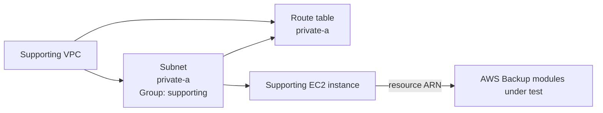

# AWS Backup Module Test

## Purpose

This Terraform root validates the AWS Backup modules used together by the environment:

- `terraform/modules/backup-standard-vault`
- `terraform/modules/backup-logically-air-gapped-vault`
- `terraform/modules/backup-role`
- `terraform/modules/backup-plan`
- `terraform/modules/backup-selection`

They are tested together because a usable backup configuration requires vaults, an IAM role, a plan, and a selection that binds protected resources to the plan.

## What the test validates

The test exercises:

- one standard AWS Backup vault;
- one logically air-gapped vault;
- the IAM role assumed by AWS Backup;
- a daily backup-plan rule;
- a copy action into the logically air-gapped vault;
- one backup selection protecting a real EC2 instance.

## Supporting resources

The following dependencies are not the primary modules under test:

- `module.vpc` provides a real VPC and subnet;
- `module.security_group` provides a security group;
- `module.ec2` provides a real resource ARN for the backup selection.

### Supporting VPC topology

The supporting VPC uses the redesigned VPC module interface:

- route table key `private-a`;
- subnet key `private-a`;
- subnet group `supporting`;
- `availability_zone_index = 0`;
- explicit subnet-to-route-table association;
- `create_internet_gateway = false`;
- no `aws_route` resources.



## Deployment

```bash
cp terraform.tfvars.example terraform.tfvars
terraform init -input=false -reconfigure -backend-config=backend.hcl
terraform fmt -check -recursive
terraform validate
terraform plan -input=false -out=tfplan
terraform apply -input=false tfplan
rm -f tfplan
```

Current default plan expectation:

```text
Plan: 12 to add, 0 to change, 0 to destroy.
```

## Verification

```bash
terraform output
terraform state list
terraform plan -input=false -detailed-exitcode
echo $?
```

Expected outputs:

- `standard_vault_arn`;
- `air_gapped_vault_arn`;
- `backup_plan_id`;
- `backup_selection_id`.

An idempotent deployment returns exit code `0`.

## Destroy

```bash
terraform plan -destroy -input=false -out=tfplan
terraform apply -input=false tfplan
rm -f tfplan
terraform state list
```

A freshly applied test normally destroys cleanly because the scheduled backup has not yet created recovery points. If recovery points exist, empty the vaults in accordance with AWS Backup retention and governance controls before destroying the test environment.

## Scope boundary

The supporting VPC, security group, and EC2 instance are dependencies. Changes to those reusable modules belong in their own module tests. The VPC module creates no routes; routing remains an environment or dedicated routing-module responsibility.
