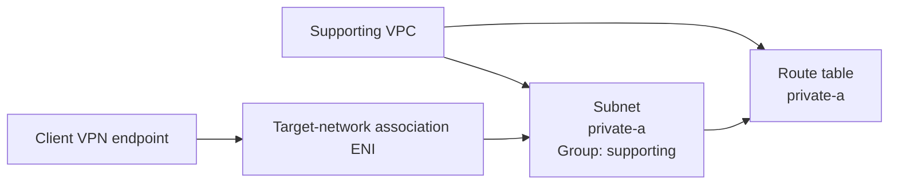

# AWS Client VPN Module Test

## Purpose

This Terraform root validates:

```text
terraform/modules/client-vpn
```

The test proves that the Client VPN module can create its endpoint and required dependent resources using a real VPC subnet and certificate chain.

## What the test validates

The test exercises:

- the Client VPN endpoint;
- CloudWatch logging resources;
- one target-network association;
- one authorization rule;
- mutual-certificate authentication.

Client VPN route resources are intentionally outside this test's scope.

## Supporting resources

The test uses:

- `module.vpc` for one real VPC and subnet;
- `module.security_group` for endpoint ENI traffic;
- operator-supplied ACM certificate ARNs.

### Supporting VPC topology

The supporting VPC uses:

- route table key `private-a`;
- subnet key `private-a`;
- subnet group `supporting`;
- `availability_zone_index = 0`;
- explicit route-table association;
- `create_internet_gateway = false`;
- no `aws_route` resources.



## Certificate source

Terraform does not create server certificates, client certificates, certificate authorities, or private keys. Supply the existing ACM ARNs at runtime for both home-lab and enterprise runs:

```hcl
server_certificate_arn     = "arn:aws:acm:..."
root_certificate_chain_arn = "arn:aws:acm:..."
```

The server certificate ARN is always required. The client root CA certificate-chain ARN is required only for `certificate` and `directory_and_mutual` modes. Individual client certificates and private keys remain outside Terraform and are installed on client devices through the approved certificate process.

## Deployment

```bash
cp terraform.tfvars.example terraform.tfvars
terraform init -input=false -reconfigure -backend-config=backend.hcl
terraform fmt -check -recursive
terraform validate
terraform plan -input=false -out=tfplan
terraform apply -input=false tfplan
rm -f tfplan
```

Certificate resources must not appear in the plan because they are owned outside this Terraform root.

## Verification

```bash
terraform output
terraform state list
terraform plan -input=false -detailed-exitcode
echo $?
```

Expected outputs:

- `client_vpn_endpoint_id`;
- `client_vpn_dns_name`.

## Destroy

```bash
terraform plan -destroy -input=false -out=tfplan
terraform apply -input=false tfplan
rm -f tfplan
terraform state list
```

Externally supplied ACM certificates are not managed or destroyed by this root.

## Scope boundary

The VPC and security group are supporting resources. The VPC module creates no routes. Client VPN routing policy must be defined explicitly by the environment or routing layer.
