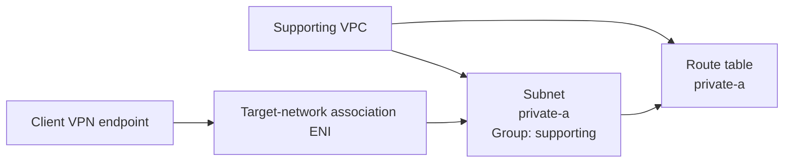

# AWS Client VPN Module Test

## Purpose

This Terraform root validates:

```text
terraform/modules/client-vpn
```

The test proves that the Client VPN module can create its endpoint and required dependent resources using a real VPC subnet and certificate chain.

## What the test validates

The test exercises:

- the Client VPN endpoint;
- CloudWatch logging resources;
- one target-network association;
- one authorization rule;
- mutual-certificate authentication.

Client VPN route resources are intentionally outside this test's scope.

## Supporting resources

The test uses:

- `module.vpc` for one real VPC and subnet;
- `module.security_group` for endpoint ENI traffic;
- generated TLS and ACM resources when certificate ARNs are not supplied.

### Supporting VPC topology

The supporting VPC uses:

- route table key `private-a`;
- subnet key `private-a`;
- subnet group `supporting`;
- `availability_zone_index = 0`;
- explicit route-table association;
- `create_internet_gateway = false`;
- no `aws_route` resources.



## Certificate source

When both certificate ARN variables are omitted, the test generates a temporary self-signed CA and server certificate and imports them into ACM.

For the enterprise path, supply both:

```hcl
server_certificate_arn     = "arn:aws:acm:..."
root_certificate_chain_arn = "arn:aws:acm:..."
```

Both values must be supplied together.

## Deployment

```bash
cp terraform.tfvars.example terraform.tfvars
terraform init -input=false -reconfigure -backend-config=backend.hcl
terraform fmt -check -recursive
terraform validate
terraform plan -input=false -out=tfplan
terraform apply -input=false tfplan
rm -f tfplan
```

Using the generated-certificate path, the current default plan expectation is:

```text
Plan: 17 to add, 0 to change, 0 to destroy.
```

The count can be lower when existing ACM certificates are supplied.

## Verification

```bash
terraform output
terraform state list
terraform plan -input=false -detailed-exitcode
echo $?
```

Expected outputs:

- `client_vpn_endpoint_id`;
- `client_vpn_dns_name`.

## Destroy

```bash
terraform plan -destroy -input=false -out=tfplan
terraform apply -input=false tfplan
rm -f tfplan
terraform state list
```

Certificates generated by this test are destroyed with it. Externally supplied ACM certificates are not managed or destroyed by this root.

## Scope boundary

The VPC, security group, and generated certificates are supporting resources. The VPC module creates no routes. Client VPN routing policy must be defined explicitly by the environment or routing layer.
