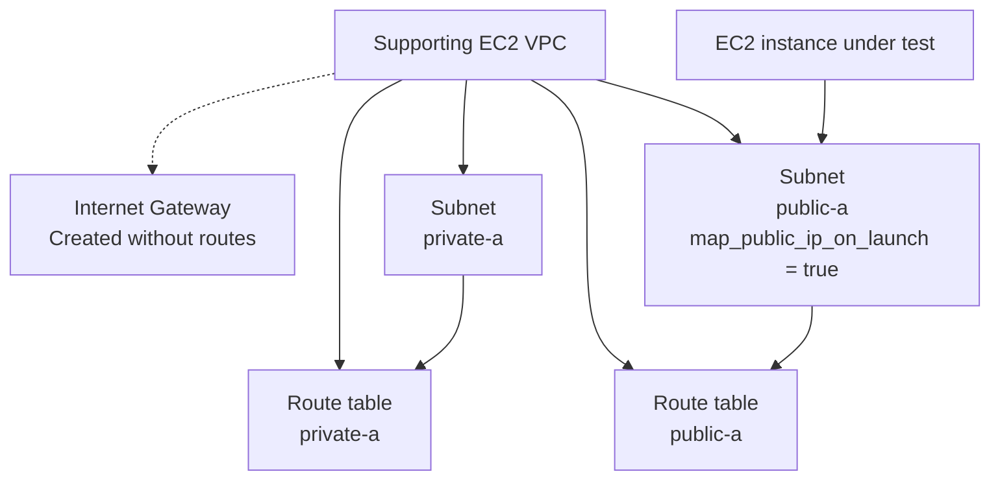

# EC2 Module Test

## Purpose

This Terraform root validates:

```text
terraform/modules/ec2
```

The test proves that the EC2 module can create an instance through its strongly typed `instances` map and consume real subnet, security-group, and key-pair dependencies.

General VPC usage belongs in:

```text
terraform/modules/vpc/README.md
```

## What the test validates

The test exercises:

- EC2 instance creation through `for_each`;
- module tag merging;
- subnet and security-group wiring;
- key-pair wiring where configured by this root;
- optional EC2 attributes and defaults;
- key-based VPC output consumption.

## Supporting VPC topology

The supporting VPC uses the redesigned interface:

- route table `public-a`, group `public`;
- route table `private-a`, group `private`;
- subnet `public-a`, group `public`;
- subnet `private-a`, group `private`;
- both subnets use `availability_zone_index = 0`;
- explicit subnet-to-route-table associations;
- `create_internet_gateway = true`;
- no automatic `aws_route` resources.

The EC2 test consumes:

```hcl
module.vpc.subnet_ids["public-a"]
```



## Connectivity note

The Internet Gateway exists only to exercise the VPC module's optional owned resource. The VPC module creates no route to it.

An instance may receive a public IPv4 address, but it does not have functional internet connectivity without an explicit approved route and the required security controls.

## Deployment

```bash
cp terraform.tfvars.example terraform.tfvars
terraform init -input=false -reconfigure -backend-config=backend.hcl
terraform fmt -check -recursive
terraform validate
terraform plan -input=false -out=tfplan
terraform apply -input=false tfplan
rm -f tfplan
```

Review `terraform.tfvars.example` and set any required local key-pair input before planning.

Current plan expectation:

```text
Plan: 13 to add, 0 to change, 0 to destroy.
```

## Verification

```bash
terraform output
terraform state list
terraform plan -input=false -detailed-exitcode
echo $?
```

Expected outputs:

- `instance_ids`;
- `public_ips`;
- `private_ips`.

## Destroy

```bash
terraform plan -destroy -input=false -out=tfplan
terraform apply -input=false tfplan
rm -f tfplan
terraform state list
```

## Scope boundary

The VPC, security group, and key-pair resources are dependencies, not the main test subject. VPC topology examples and routing guidance belong in the VPC module README. Routes remain outside the reusable VPC module.
