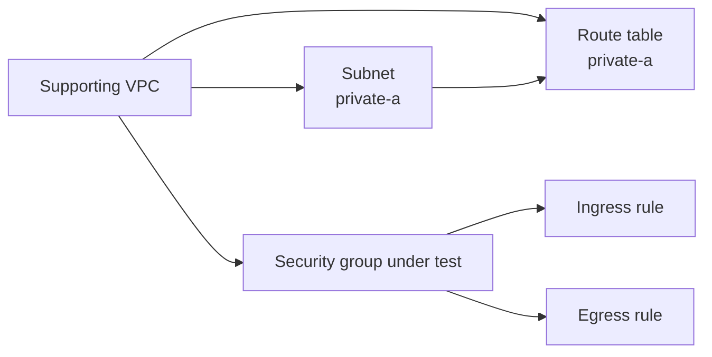

# Security Group Module Test

## Purpose

This Terraform root validates:

- `terraform/modules/security-group`
- `terraform/modules/security-group-rule`

They are tested together because security-group rules require a security group to attach to.

## What the test validates

The test exercises:

- security-group creation;
- ingress-rule creation;
- egress-rule creation;
- ingress/egress rule separation;
- enterprise tagging;
- attachment to a real VPC.

## Supporting VPC

The supporting VPC uses:

- route table key `private-a`;
- subnet key `private-a`;
- subnet group `supporting`;
- `availability_zone_index = 0`;
- explicit route-table association;
- `create_internet_gateway = false`;
- no `aws_route` resources.



## Deployment

```bash
cp terraform.tfvars.example terraform.tfvars
terraform init -input=false -reconfigure -backend-config=backend.hcl
terraform fmt -check -recursive
terraform validate
terraform plan -input=false -out=tfplan
terraform apply -input=false tfplan
rm -f tfplan
```

Current plan expectation:

```text
Plan: 7 to add, 0 to change, 0 to destroy.
```

## Verification

```bash
terraform output
terraform state list
terraform plan -input=false -detailed-exitcode
echo $?
```

Expected output:

- `security_group_ids`.

## Destroy

```bash
terraform plan -destroy -input=false -out=tfplan
terraform apply -input=false tfplan
rm -f tfplan
terraform state list
```

## Scope boundary

The supporting VPC is not under test. Changes to VPC behaviour belong in the VPC module test. The reusable VPC module creates no routes.
