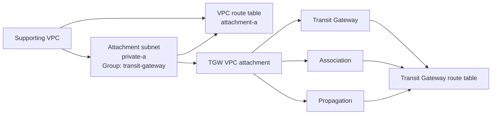

# Transit Gateway Module Test

## Purpose

This Terraform root validates:

```text
terraform/modules/transit-gateway
```

The test proves that the Transit Gateway module can create a gateway, route table, VPC attachment, association, and propagation using real VPC and subnet IDs.

## What the test validates

The test exercises:

- Transit Gateway creation;
- one Transit Gateway route table;
- one VPC attachment;
- one route-table association;
- one route-table propagation;
- explicit subnet selection through a VPC subnet group;
- disabled default association and propagation settings where configured.

The test intentionally does not reproduce the complete multi-VPC IRE segmentation model.

## Supporting VPC topology

The supporting VPC uses:

- route table key `attachment-a`;
- route-table group `transit-gateway`;
- subnet key `private-a`;
- subnet group `transit-gateway`;
- `availability_zone_index = 0`;
- explicit association to route table `attachment-a`;
- `create_internet_gateway = false`;
- no `aws_route` resources.

The attachment consumes:

```hcl
module.vpc.subnet_ids_by_group["transit-gateway"]
```



## Deployment

```bash
cp terraform.tfvars.example terraform.tfvars
terraform init -input=false -reconfigure -backend-config=backend.hcl
terraform fmt -check -recursive
terraform validate
terraform plan -input=false -out=tfplan
terraform apply -input=false tfplan
rm -f tfplan
```

Current plan expectation:

```text
Plan: 9 to add, 0 to change, 0 to destroy.
```

## Verification

```bash
terraform output
terraform state list
terraform plan -input=false -detailed-exitcode
echo $?
```

Expected outputs:

- `transit_gateway_id`;
- `transit_gateway_arn`;
- `route_table_ids`.

## Destroy

```bash
terraform plan -destroy -input=false -out=tfplan
terraform apply -input=false tfplan
rm -f tfplan
terraform state list
```

## Scope boundary

This root validates the Transit Gateway module's resource behaviour, not the entire IRE routing architecture. Recovery Access, Core Recovery, Protected Data, and a possible centralized Inspection VPC must be composed and segmented by the environment. VPC routes and Transit Gateway routing policy remain explicit environment or routing-module responsibilities.
