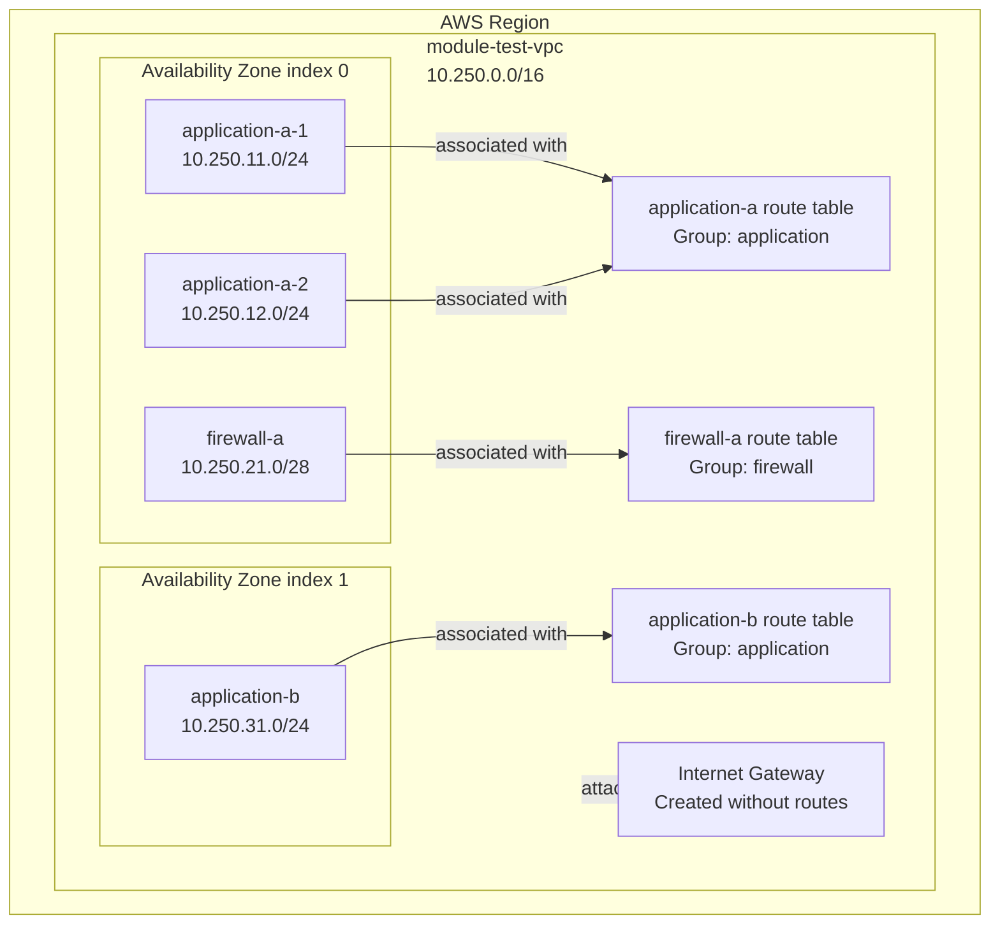

# VPC Module Test Environment

This Terraform root validates the reusable VPC module located at:

```text
terraform/modules/vpc
```

The test is intentionally designed to exercise the redesigned, strongly typed VPC interface rather than a simple one-subnet deployment.

---

## Purpose

This environment verifies that the VPC module can successfully create and manage:

- one VPC;
- multiple caller-defined route tables;
- multiple caller-defined subnets;
- multiple subnets in the same Availability Zone;
- multiple subnets sharing one route table;
- another subnet in the same Availability Zone using a different route table;
- another subnet in a second Availability Zone;
- explicit subnet-to-route-table associations;
- key-based outputs;
- group-based outputs;
- an optional module-owned Internet Gateway;
- no automatic `aws_route` resources.

The test also verifies successful:

- formatting;
- initialization using `backend.hcl`;
- validation;
- planning;
- apply;
- output inspection;
- idempotency;
- destroy;
- empty-state confirmation.

---

## Module under test

```text
terraform/modules/vpc
```

The module is called from:

```text
terraform/environments/module-tests/vpc/networking.tf
```

The topology inputs are defined in:

```text
terraform/environments/module-tests/vpc/locals.tf
```

---

## Test topology

The test creates the following VPC:

```text
VPC name: module-test-vpc
VPC CIDR: 10.250.0.0/16
```

It creates three route tables:

| Route-table key | Group | Purpose in this test |
|---|---|---|
| `application-a` | `application` | Shared by two application subnets in Availability Zone index 0 |
| `application-b` | `application` | Used by the application subnet in Availability Zone index 1 |
| `firewall-a` | `firewall` | Used by the firewall subnet in Availability Zone index 0 |

It creates four subnets:

| Subnet key | CIDR | AZ selector | Group | Route-table key |
|---|---|---:|---|---|
| `application-a-1` | `10.250.11.0/24` | `availability_zone_index = 0` | `application` | `application-a` |
| `application-a-2` | `10.250.12.0/24` | `availability_zone_index = 0` | `application` | `application-a` |
| `firewall-a` | `10.250.21.0/28` | `availability_zone_index = 0` | `firewall` | `firewall-a` |
| `application-b` | `10.250.31.0/24` | `availability_zone_index = 1` | `application` | `application-b` |

The Internet Gateway is enabled:

```hcl
create_internet_gateway = true
```

This validates the module-owned optional resource.

The module must still create no routes.

---

## Topology diagram



This proves that the module does not assume:

- one subnet per Availability Zone;
- one route table per Availability Zone;
- separate hardcoded public and private subnet modes;
- positional subnet output ordering;
- automatic Internet Gateway routes.

---

## Expected resources

With `create_internet_gateway = true`, the expected plan is:

```text
Plan: 13 to add, 0 to change, 0 to destroy.
```

Expected resource quantities:

| Resource | Quantity |
|---|---:|
| `aws_vpc` | 1 |
| `aws_route_table` | 3 |
| `aws_subnet` | 4 |
| `aws_route_table_association` | 4 |
| `aws_internet_gateway` | 1 |
| **Total** | **13** |

The plan must contain no `aws_route` resources.

---

## Supporting resources

There are no supporting Terraform modules or resources outside the VPC module.

The module reads the AWS Availability Zone list using:

```text
data.aws_availability_zones.available
```

All created infrastructure belongs to `module.vpc`.

---

## Prerequisites

Before running this test, confirm:

- Terraform is installed;
- AWS credentials are available;
- the configured AWS Region is valid;
- `backend.hcl` exists in this directory;
- `terraform.tfvars` exists and contains valid enterprise tag values;
- the AWS provider is compatible with major version 6.

Create the local variables file when needed:

```bash
cp terraform.tfvars.example terraform.tfvars
```

Do not commit machine-specific or sensitive values.

---

## Required initialization command

Every initialization in this repository must use `backend.hcl`.

Run:

```bash
terraform init -input=false -reconfigure -backend-config=backend.hcl
```

Do not replace this with a plain `terraform init`.

---

## Test workflow

Run all commands from:

```text
terraform/environments/module-tests/vpc
```

### 1. Check formatting

```bash
terraform fmt -check -recursive
```

To apply formatting when required:

```bash
terraform fmt -recursive
```

### 2. Initialize

```bash
terraform init -input=false -reconfigure -backend-config=backend.hcl
```

### 3. Validate

```bash
terraform validate
```

Expected result:

```text
Success! The configuration is valid.
```

### 4. Create a saved plan

```bash
terraform plan -input=false -out=tfplan
```

Expected summary:

```text
Plan: 13 to add, 0 to change, 0 to destroy.
```

### 5. Review the plan

```bash
terraform show tfplan
```

Confirm:

- one VPC is created;
- three route tables are created;
- four subnets are created;
- four route-table associations are created;
- one Internet Gateway is created;
- no `aws_route` resources are present;
- no resources are changed or destroyed.

### 6. Apply the saved plan

```bash
terraform apply -input=false tfplan
```

### 7. Remove the saved plan

```bash
rm -f tfplan
```

Saved Terraform plan files must not be committed.

---

## Output verification

Inspect all outputs:

```bash
terraform output
```

### VPC outputs

```bash
terraform output vpc_id
terraform output vpc_cidr
```

### Complete subnet details

```bash
terraform output subnets
```

Verify that the output contains:

- `application-a-1`;
- `application-a-2`;
- `firewall-a`;
- `application-b`.

Verify that:

- `application-a-1` and `application-a-2` resolve to the same Availability Zone;
- `firewall-a` resolves to that same Availability Zone;
- `application-b` resolves to a different Availability Zone;
- each subnet reports the expected `route_table_key`;
- each subnet reports a populated `route_table_id`.

### Subnet IDs by key

```bash
terraform output subnet_ids
```

The output must be keyed by subnet name rather than returned as a positional list.

### Subnet IDs by group

```bash
terraform output subnet_ids_by_group
```

Expected groups:

```text
application
firewall
```

The `application` group must include three subnet IDs.

The `firewall` group must include one subnet ID.

### Route-table IDs by key

```bash
terraform output route_table_ids
```

Expected keys:

```text
application-a
application-b
firewall-a
```

### Route-table IDs by group

```bash
terraform output route_table_ids_by_group
```

Expected groups:

```text
application
firewall
```

### Internet Gateway ID

```bash
terraform output -raw internet_gateway_id
```

The output should begin with:

```text
igw-
```

---

## Terraform state verification

Inspect state:

```bash
terraform state list
```

Expected patterns include:

```text
module.vpc.aws_vpc.this
module.vpc.aws_route_table.this["application-a"]
module.vpc.aws_route_table.this["application-b"]
module.vpc.aws_route_table.this["firewall-a"]
module.vpc.aws_subnet.this["application-a-1"]
module.vpc.aws_subnet.this["application-a-2"]
module.vpc.aws_subnet.this["application-b"]
module.vpc.aws_subnet.this["firewall-a"]
module.vpc.aws_route_table_association.this["application-a-1"]
module.vpc.aws_route_table_association.this["application-a-2"]
module.vpc.aws_route_table_association.this["application-b"]
module.vpc.aws_route_table_association.this["firewall-a"]
module.vpc.aws_internet_gateway.this[0]
```

Confirm that the module created no routes:

```bash
terraform state list | grep 'aws_route\.' || true
```

A correct result returns no `aws_route` resource addresses.

`aws_route_table` and `aws_route_table_association` are expected and must not be confused with `aws_route`.

---

## Idempotency test

After a successful apply, run:

```bash
terraform plan -input=false -detailed-exitcode
```

Immediately check the exit code:

```bash
echo $?
```

Expected result:

```text
0
```

Exit-code meanings:

| Exit code | Meaning |
|---:|---|
| `0` | No changes are required |
| `1` | Terraform encountered an error |
| `2` | Terraform detected changes |

An exit code of `0` confirms idempotency.

---

## Destroy workflow

### 1. Create a destroy plan

```bash
terraform plan -destroy -input=false -out=tfplan
```

### 2. Review the destroy plan

```bash
terraform show tfplan
```

Expected resource count:

```text
Plan: 0 to add, 0 to change, 13 to destroy.
```

### 3. Apply the destroy plan

```bash
terraform apply -input=false tfplan
```

### 4. Remove the saved plan

```bash
rm -f tfplan
```

### 5. Confirm empty state

```bash
terraform state list
```

Expected result:

No resource addresses are returned.

---

## Test assertions

The test passes only when all of the following are true:

- [ ] `terraform fmt -check -recursive` succeeds.
- [ ] Initialization uses `backend.hcl`.
- [ ] `terraform validate` succeeds.
- [ ] The plan reports 13 resources to add.
- [ ] The plan reports 0 resources to change.
- [ ] The plan reports 0 resources to destroy.
- [ ] No `aws_route` resources appear.
- [ ] Apply succeeds.
- [ ] Multiple subnets exist in Availability Zone index 0.
- [ ] Two application subnets share the `application-a` route table.
- [ ] The firewall subnet uses a different route table in the same Availability Zone.
- [ ] The `application-b` subnet exists in Availability Zone index 1.
- [ ] Key-based subnet outputs are populated.
- [ ] Group-based subnet outputs are populated.
- [ ] Key-based route-table outputs are populated.
- [ ] Group-based route-table outputs are populated.
- [ ] The Internet Gateway output contains an `igw-` ID.
- [ ] Idempotency returns exit code 0.
- [ ] Destroy removes all 13 resources.
- [ ] Terraform state is empty after destroy.
- [ ] `tfplan` is removed.

---

## Why the Internet Gateway remains enabled

The committed module-test configuration intentionally uses:

```hcl
create_internet_gateway = true
```

This ensures the optional resource owned by the module remains covered by the normal module test.

It also verifies the module's security boundary:

> Creating the Internet Gateway must not create any routes.

A separate test is not required merely to prove that the resource can be toggled on.

The module default remains:

```hcl
create_internet_gateway = false
```

Consumers must enable it explicitly.

---

## Relationship to future AWS Network Firewall work

This test does not deploy AWS Network Firewall.

The test prepares the VPC module for later firewall integration by proving that:

- firewall subnets can coexist with application subnets in the same Availability Zone;
- firewall subnets can use dedicated route tables;
- application subnets can share route tables;
- route-table IDs are exposed by stable keys;
- firewall subnet IDs can be selected by group;
- the optional Internet Gateway can exist without automatic routing.

AWS Network Firewall integration must begin only after:

- this VPC module is complete;
- this module test passes;
- active VPC consumers are migrated;
- Sandbox is migrated to the new interface;
- migration plans show no unintended replacement.

Firewall routes must remain in the Sandbox environment or a dedicated routing module.

---

## Files in this test root

| File | Purpose |
|---|---|
| `README.md` | Documents the module-test topology and test procedure |
| `backend.hcl` | Supplies backend values during initialization |
| `locals.tf` | Defines enterprise tags and the VPC test topology |
| `networking.tf` | Calls the VPC module |
| `outputs.tf` | Exposes values used to verify the topology |
| `provider.tf` | Configures the AWS provider |
| `terraform.tfvars` | Local test values; normally not committed |
| `terraform.tfvars.example` | Shareable example values |
| `variables.tf` | Defines strongly typed root variables |
| `versions.tf` | Declares Terraform and provider requirements |

---

## Final expected outcome

A complete successful test produces:

```text
13 resources created
0 aws_route resources
key-based outputs populated
group-based outputs populated
Internet Gateway ID populated
idempotency exit code 0
13 resources destroyed
Terraform state empty
```

This confirms that the redesigned VPC module is ready for careful active-consumer migration before AWS Network Firewall is introduced into Sandbox.
