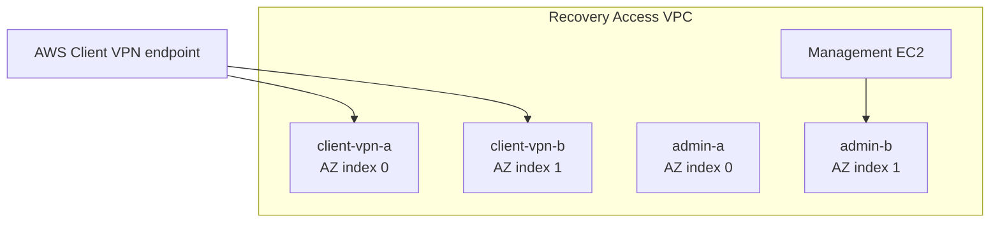

# VPN Test Environment

## Purpose

This deployable root validates the repository's Client VPN composition using a
Recovery Access VPC, a management EC2 instance, security controls, approved
certificates, and enterprise tags.

It demonstrates how the reusable VPC module can support the IRE architecture
without embedding architectural roles inside the module.

## Recovery Access topology

| Subnet | Group | AZ selection | Route table |
|---|---|---:|---|
| `client-vpn-a` | `client-vpn` | index 0 | `client-vpn-a` |
| `client-vpn-b` | `client-vpn` | index 1 | `client-vpn-b` |
| `admin-a` | `admin-tools` | index 0 | `admin-a` |
| `admin-b` | `admin-tools` | index 1 | `admin-b` |

The Client VPN associations are generated from every subnet in the
`client-vpn` group. The management EC2 instance uses the explicit `admin-b`
subnet key.

No Internet Gateway or route resources are created.



## Local configuration

```bash
cp terraform.tfvars.example terraform.tfvars
cp backend.hcl.example backend.hcl
```

Both resulting files are ignored by Git and must not be committed.

## Deployment

```bash
terraform init -input=false -reconfigure -backend-config=backend.hcl
terraform fmt -check -recursive
terraform validate
terraform plan -input=false -var-file=terraform.tfvars -out=tfplan
terraform apply -input=false tfplan
rm -f tfplan
```

## Verification

```bash
terraform output
terraform state list
terraform plan -input=false -var-file=terraform.tfvars -detailed-exitcode
echo $?
```

An idempotent deployment returns exit code `0`.

## Destroy

```bash
terraform plan -destroy -input=false -var-file=terraform.tfvars -out=tfplan
terraform apply -input=false tfplan
rm -f tfplan
terraform state list
```

## Architecture boundary

The VPC module owns the VPC, subnets, route tables, associations, and optional
Internet Gateway only.

The environment owns subnet roles, CIDRs, Client VPN placement, management
workload placement, security rules, routing policy, and future Transit Gateway
or Network Firewall integration.
