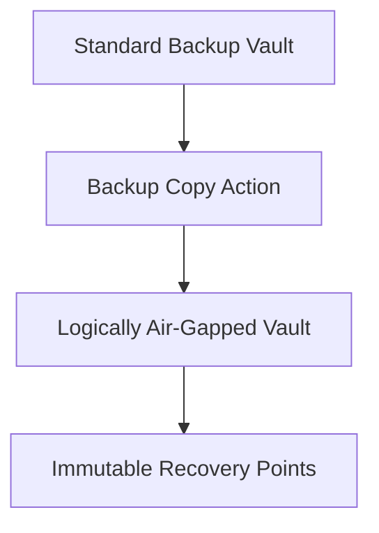
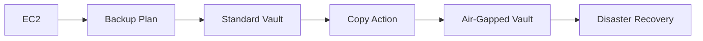

# AWS Backup Logically Air-Gapped Vault Module

## Overview

This module creates an **AWS Backup Logically Air-Gapped Vault**.

Unlike a Standard Backup Vault, an Air-Gapped Vault is designed to provide immutable backup protection by isolating copied recovery points from the primary backup environment.

Recovery points are copied into this vault using **AWS Backup Copy Actions**.

---

## Architecture



---

## Enterprise Recovery Architecture



---

## Resource Created

| Resource | Purpose |
|----------|---------|
| aws_backup_logically_air_gapped_vault | Stores immutable recovery points |

---

## Inputs

| Name | Type | Description |
|------|------|-------------|
| name | string | Vault name |
| min_retention_days | number | Minimum retention period |
| max_retention_days | number | Maximum retention period |
| encryption_key_arn | string | Optional KMS key ARN |
| tags | map(string) | Resource tags |

---

## Outputs

| Name | Description |
|------|-------------|
| id | Vault ID |
| arn | Vault ARN |
| name | Vault name |

---

## Example Usage

```hcl
module "backup_logically_air_gapped_vault" {

  source = "../../modules/backup-logically-air-gapped-vault"

  name = "ire-airgapped-backup-vault"

  min_retention_days = 30

  max_retention_days = 365

  tags = local.default_tags

}
```

---

## Enterprise Notes

- Designed for ransomware resilience.
- Recovery points cannot be directly written by backup jobs.
- Receives recovery points through Backup Copy Actions.
- Helps satisfy compliance and cyber recovery requirements.
- Recommended for enterprise disaster recovery environments.