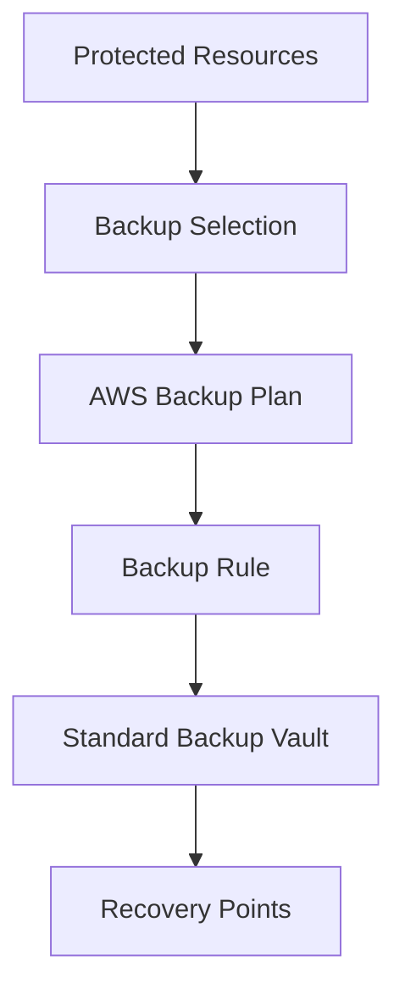
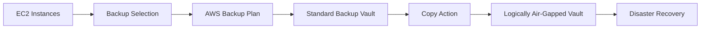
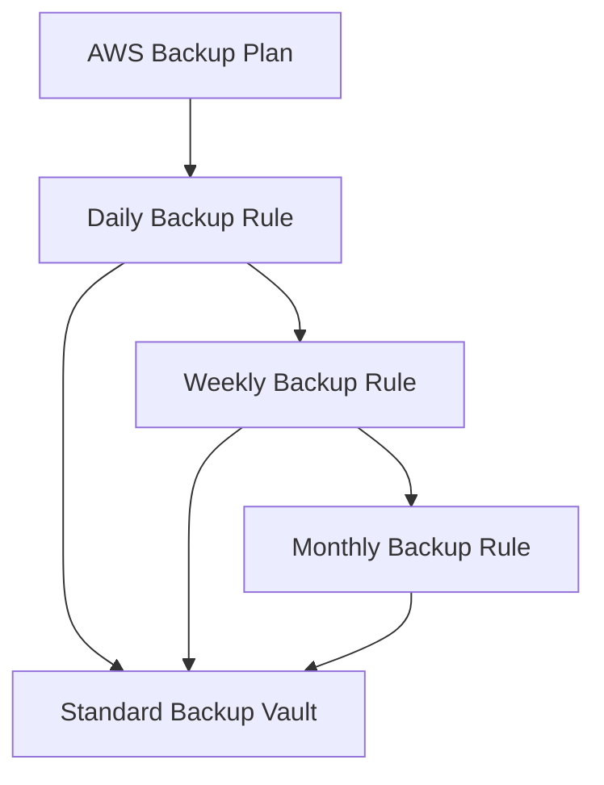
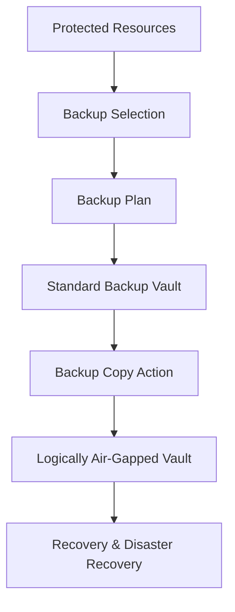

# AWS Backup Plan Module

## Overview

This Terraform module creates an **AWS Backup Plan**, which defines the backup schedule, lifecycle, and destination vault for protected AWS resources.

An AWS Backup Plan acts as the policy engine for AWS Backup. It determines **when backups run**, **where recovery points are stored**, and **how long backups are retained**.

In enterprise environments, Backup Plans are typically associated with resources through **Backup Selections** and can optionally copy recovery points to a **Logically Air-Gapped Vault** for enhanced cyber resilience.

---

## Architecture



---

## Enterprise Recovery Architecture



---

## Backup Plan Components



---

## Resource Created

| Resource | Purpose |
|----------|---------|
| aws_backup_plan | Defines backup schedules, lifecycle rules, and destination vault |

---

## Inputs

| Name | Type | Description |
|------|------|-------------|
| name | string | Name of the Backup Plan |
| backup_vault_name | string | Destination Standard Backup Vault |
| rules | map(object) | Collection of backup rules |
| tags | map(string) | Resource tags |

---

## Outputs

| Name | Description |
|------|-------------|
| id | Backup Plan ID |
| arn | Backup Plan ARN |
| version | Current Backup Plan version |

---

## Example Usage

```hcl
module "backup_plan" {

  source = "../../modules/backup-plan"

  name = "ire-backup-plan"

  backup_vault_name = module.backup_standard_vault.name

  rules = {

    daily = {

      schedule = "cron(0 5 ? * * *)"

      start_window      = 60
      completion_window = 180

      lifecycle = {

        cold_storage_after = 30
        delete_after       = 365

      }

    }

  }

  tags = local.default_tags

}
```

---

## Enterprise Notes

- Defines the backup policy for protected resources.
- Supports multiple backup rules within a single plan.
- Stores recovery points in an AWS Backup Standard Vault.
- Can be extended with **Copy Actions** to replicate recovery points to a **Logically Air-Gapped Vault**.
- Resources are associated with Backup Plans through **AWS Backup Selections**.
- Supports lifecycle policies for transitioning recovery points to cold storage and automatic expiration.
- Designed to support enterprise backup strategies with daily, weekly, monthly, and custom schedules.

---

## Typical Enterprise Backup Workflow

