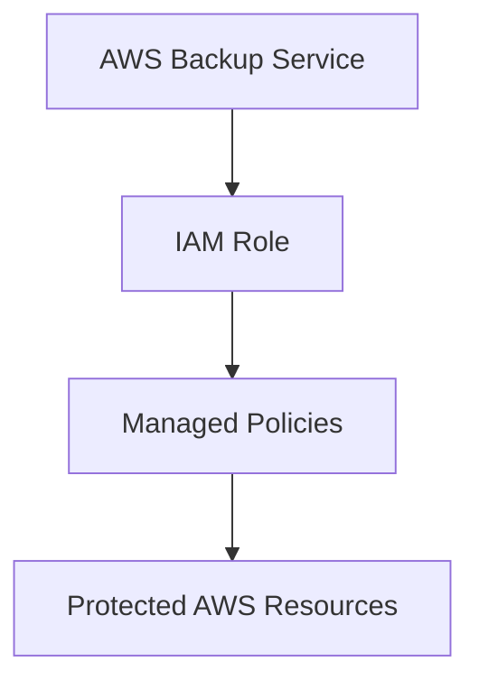
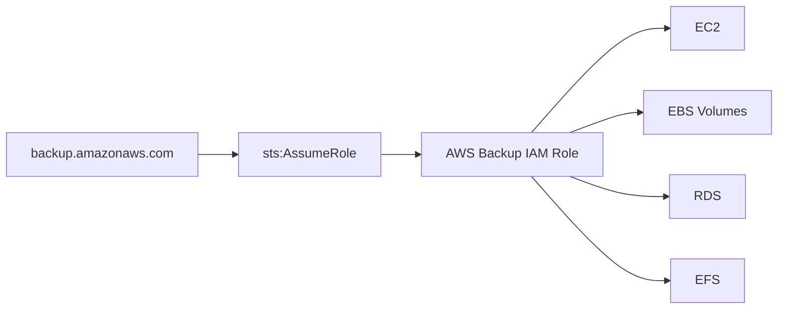

# AWS Backup IAM Role Module

## Overview

This module creates the IAM Role assumed by **AWS Backup** to perform backup and restore operations.

The role includes the required trust relationship for the AWS Backup service and attaches the AWS managed IAM policies required to create and restore backups.

---

## Architecture



---

## IAM Trust Relationship



---

## Resource Created

| Resource | Purpose |
|----------|---------|
| aws_iam_role | IAM Role assumed by AWS Backup |
| aws_iam_role_policy_attachment | Backup permissions |
| aws_iam_role_policy_attachment | Restore permissions |

---

## Inputs

| Name | Type | Description |
|------|------|-------------|
| name | string | IAM Role name |
| tags | map(string) | Resource tags |

---

## Outputs

| Name | Description |
|------|-------------|
| id | Role ID |
| arn | Role ARN |
| name | Role name |

---

## Example Usage

```hcl
module "backup_role" {

  source = "../../modules/backup-role"

  name = "ire-backup-role"

  tags = local.org_tags

}
```

---

## Enterprise Notes

- Uses Terraform's `aws_iam_policy_document` data source to generate the IAM trust policy.
- Follows the principle of least privilege by attaching AWS-managed service role policies.
- Enables AWS Backup to assume the role using AWS Security Token Service (STS).
- Includes managed policies for both backup and restore operations.
- Intended for use with AWS Backup Plans and Backup Selections.