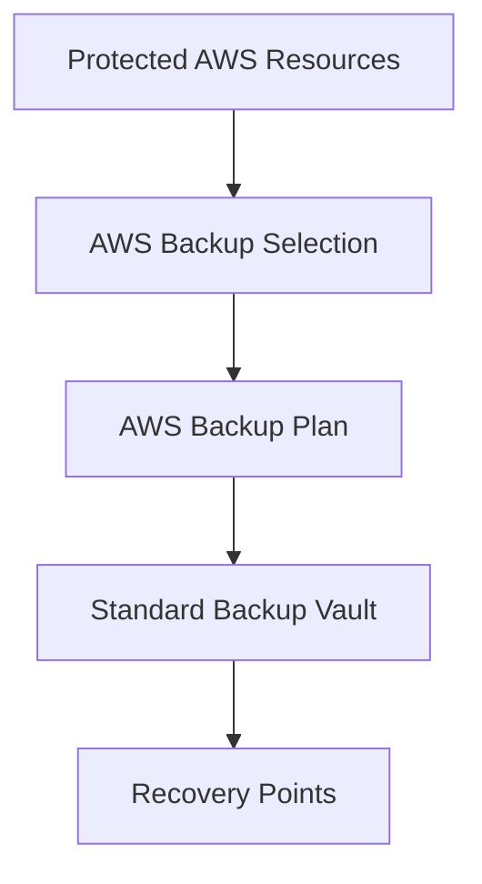
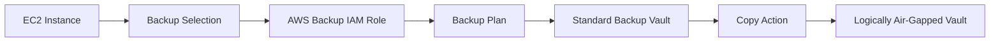
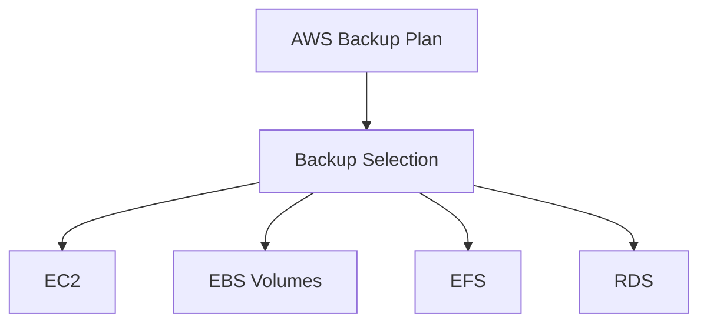
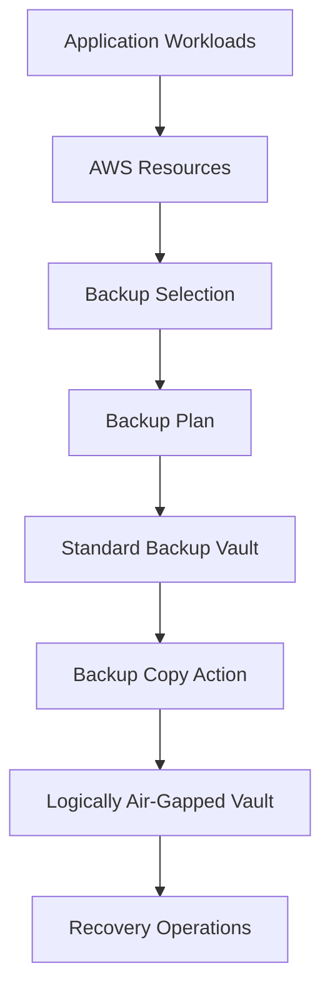

# AWS Backup Selection Module

## Overview

This Terraform module creates an **AWS Backup Selection**, which associates one or more AWS resources with an existing AWS Backup Plan.

While an AWS Backup Plan defines the backup schedule, retention policy, and destination vault, a Backup Selection specifies **which AWS resources should be protected**. It also identifies the IAM Role that AWS Backup assumes to perform backup and restore operations.

This separation enables organizations to reuse Backup Plans across multiple workloads while applying different selections to specific applications or environments.

---

## Architecture



---

## Enterprise Recovery Workflow



---

## AWS Backup Components



---

## Resource Created

| Resource | Purpose |
|----------|---------|
| aws_backup_selection | Associates AWS resources with an AWS Backup Plan |

---

## Inputs

| Name | Type | Description |
|------|------|-------------|
| name | string | Name of the Backup Selection |
| backup_plan_id | string | ID of the Backup Plan |
| iam_role_arn | string | ARN of the IAM Role assumed by AWS Backup |
| resources | list(string) | List of AWS resource ARNs to protect |
| tags | map(string) | Resource tags (reserved for future use) |

---

## Outputs

| Name | Description |
|------|-------------|
| id | Backup Selection ID |

---

## Example Usage

```hcl
module "backup_selection" {

  source = "../../modules/backup-selection"

  name = "ire-backup-selection"

  backup_plan_id = module.backup_plan.id

  iam_role_arn = module.backup_role.arn

  resources = [

    module.ec2.instance_arns["core-recovery"]

  ]

  tags = local.default_tags

}
```

---

## Enterprise Notes

- Associates AWS resources with an existing AWS Backup Plan.
- Supports protecting multiple AWS resources through a single Backup Selection.
- Uses an IAM Role that grants AWS Backup permission to perform backup and restore operations.
- Works with EC2, EBS, EFS, RDS, DynamoDB, FSx, Storage Gateway, and other AWS Backup supported services.
- Resources are identified using their Amazon Resource Names (ARNs).
- Multiple Backup Selections can reference the same Backup Plan to simplify enterprise backup management.
- This module is designed to support scalable backup strategies across multiple workloads and environments.

---

## Typical Enterprise Backup Flow



---

## Related Modules

| Module | Purpose |
|---------|---------|
| backup-standard-vault | Stores primary recovery points |
| backup-logically-air-gapped-vault | Stores immutable backup copies |
| backup-plan | Defines backup schedules and retention policies |
| backup-role | IAM Role assumed by AWS Backup |
| backup-selection | Associates AWS resources with a Backup Plan |

---

## AWS Documentation

- AWS Backup
- AWS Backup Plans
- AWS Backup Selections
- AWS Backup Vaults
- AWS Backup Copy Actions
- AWS Backup Logically Air-Gapped Vaults