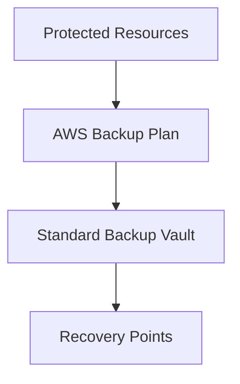
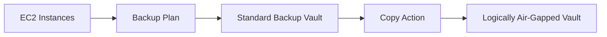

# AWS Backup Standard Vault Module

## Overview

This Terraform module creates an **AWS Backup Standard Vault**, which serves as the primary storage location for recovery points created by AWS Backup jobs.

Recovery points stored in a Standard Vault can later be copied to a **Logically Air-Gapped Vault** to provide protection against ransomware, accidental deletion, and malicious administrators.

---

## Architecture



---

## Enterprise Backup Flow



---

## Resource Created

| Resource | Purpose |
|----------|---------|
| aws_backup_vault | Stores AWS Backup recovery points |

---

## Inputs

| Name | Type | Description |
|------|------|-------------|
| name | string | Name of the Backup Vault |
| tags | map(string) | Resource tags |

---

## Outputs

| Name | Description |
|------|-------------|
| id | Vault ID |
| arn | Vault ARN |
| name | Vault name |
| recovery_points | Number of recovery points |

---

## Example Usage

```hcl
module "backup_standard_vault" {

  source = "../../modules/backup-standard-vault"

  name = "ire-standard-backup-vault"

  tags = local.org_tags

}
```

---

## Enterprise Notes

- Primary destination for AWS Backup jobs.
- Supports lifecycle policies.
- Can be used as the source for backup copy operations.
- Integrates with AWS Backup Plans.
- Recommended as the first stage of a multi-tier backup strategy.