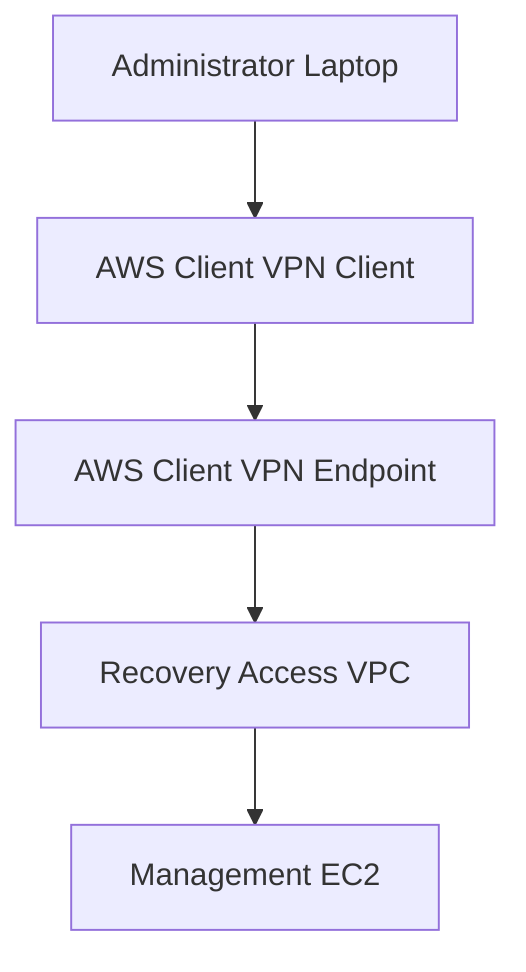
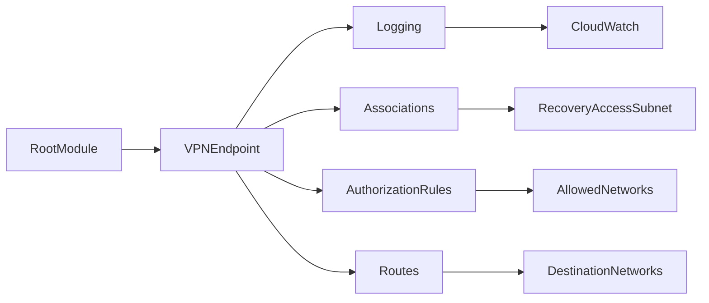
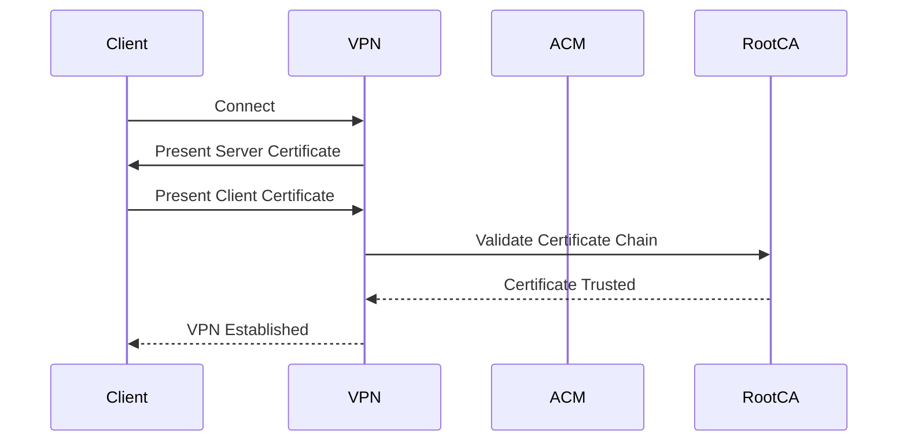
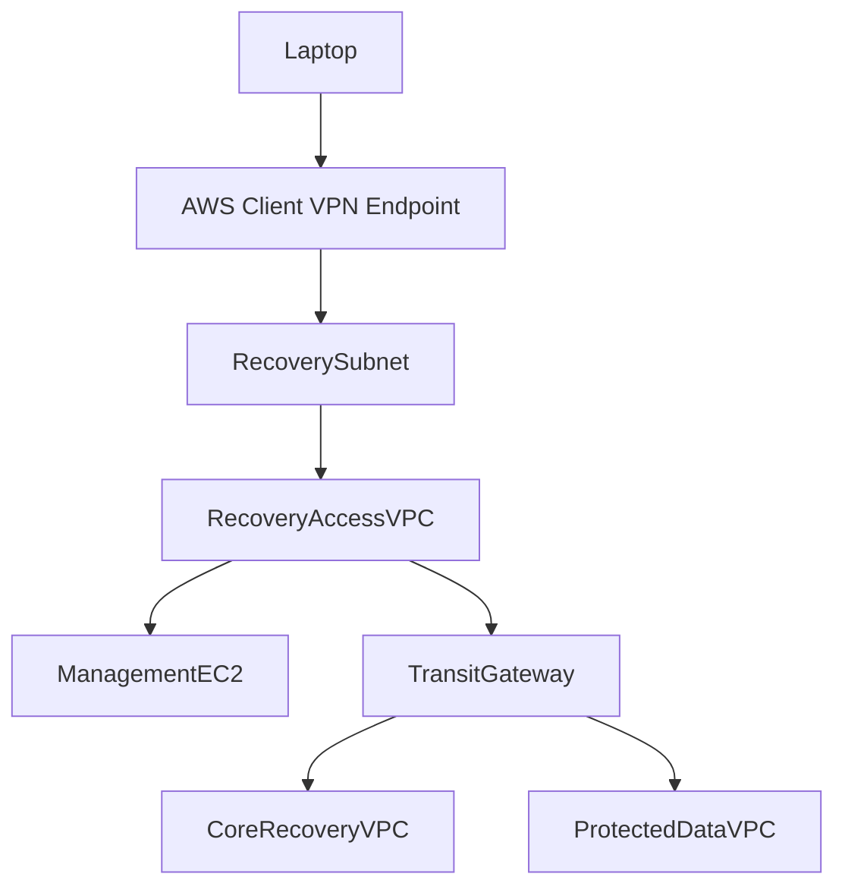

# AWS Client VPN Terraform Module

## Overview

This Terraform module provisions an AWS Client VPN endpoint using **certificate-based mutual authentication**.

The module creates the resources required to securely connect administrators to an AWS environment while keeping the implementation modular and reusable.

Current features include:

- Client VPN Endpoint
- Mutual (certificate) authentication
- CloudWatch connection logging
- Network Associations
- Authorization Rules
- Custom Routes
- Security Group attachment
- Split Tunnel support

---

# Architecture



---

# Module Architecture



---

# Authentication Flow

This module currently uses **Mutual Authentication**.



---

# Network Flow



---

# Resources Created

| Resource | Terraform Resource |
|----------|--------------------|
| Client VPN Endpoint | aws_ec2_client_vpn_endpoint |
| Network Association | aws_ec2_client_vpn_network_association |
| Authorization Rule | aws_ec2_client_vpn_authorization_rule |
| Client VPN Route | aws_ec2_client_vpn_route |
| CloudWatch Log Group | aws_cloudwatch_log_group |
| CloudWatch Log Stream | aws_cloudwatch_log_stream |

---

# Inputs

| Name | Type | Required | Description |
|------|------|----------|-------------|
| name | string | Yes | Name of the Client VPN endpoint |
| client_cidr_block | string | Yes | CIDR block assigned to VPN clients |
| server_certificate_arn | string | Yes | ACM server certificate ARN |
| root_certificate_chain_arn | string | Yes | ACM Root CA certificate ARN |
| vpc_id | string | Yes | VPC containing the associated subnets |
| network_associations | map(object) | Yes | Subnets associated with the endpoint |
| security_group_ids | list(string) | Yes | Security groups attached to VPN ENIs |
| authorization_rules | map(object) | No | Authorization rules |
| routes | map(object) | No | Client VPN routes |
| split_tunnel | bool | No | Enable split tunnel |
| transport_protocol | string | No | udp or tcp |
| vpn_port | number | No | VPN listener port |
| dns_servers | list(string) | No | DNS servers pushed to clients |
| session_timeout_hours | number | No | VPN session timeout |
| enable_connection_logging | bool | No | Enable CloudWatch logging |
| log_retention_in_days | number | No | Log retention period |
| tags | map(string) | No | Resource tags |

---

# Outputs

| Output | Description |
|---------|-------------|
| id | Client VPN Endpoint ID |
| arn | Client VPN Endpoint ARN |
| dns_name | Endpoint DNS name |
| network_association_ids | Network Association IDs |
| log_group_name | CloudWatch Log Group |

---

# Example

```hcl
module "client_vpn" {

  source = "../../modules/client-vpn"

  name = "ire-client-vpn"

  server_certificate_arn     = var.server_certificate_arn
  root_certificate_chain_arn = var.root_certificate_chain_arn

  client_cidr_block = "192.168.0.0/16"

  vpc_id = module.recovery_access.vpc_id

  network_associations = {
    for key, subnet in module.recovery_access.subnets :
    key => {
      subnet_id = subnet.id
    }
    if subnet.group == "client-vpn"
  }

  security_group_ids = [
    module.security_group.security_group_ids["management"]
  ]

  authorization_rules = {

    recovery_access = {

      target_network_cidr = module.recovery_access.vpc_cidr

      authorize_all_groups = true

    }

  }

  routes = {}

}
```

---

# Important Notes

## Automatic VPC Route

AWS automatically creates a route to the CIDR block of the VPC associated with the Client VPN endpoint.

Do **not** create a duplicate route for the associated VPC.

Only create routes for remote networks such as Transit Gateway destinations.

---

## Certificate Requirements

The server certificate **must** exist in AWS Certificate Manager (ACM).

The client certificate must be signed by the trusted Root Certificate Authority configured for the endpoint.

---

## Split Tunnel

When enabled, only traffic destined for authorized networks traverses the VPN.

Internet-bound traffic continues to use the client's local network connection.

---

# Future Enhancements

Planned improvements include:

- IAM Identity Center (SAML) authentication
- Active Directory authentication
- Group-based authorization
- Certificate automation
- Multi-region deployment
- Client Connect Handler
- Client Login Banner

---

# References

- AWS Client VPN Documentation
- Terraform AWS Provider Documentation