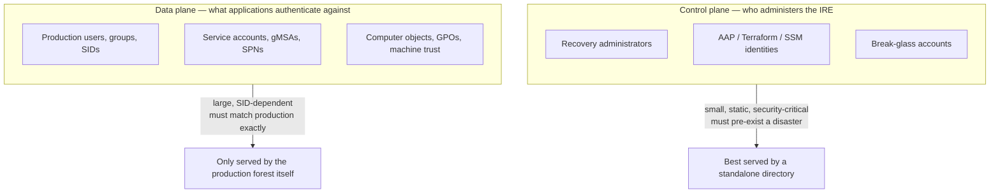
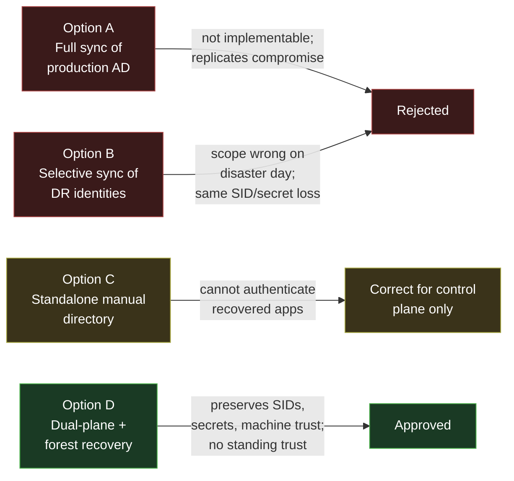
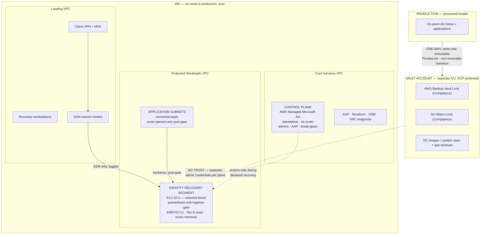
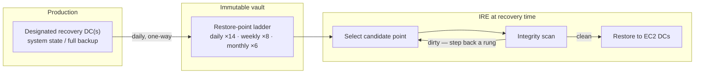
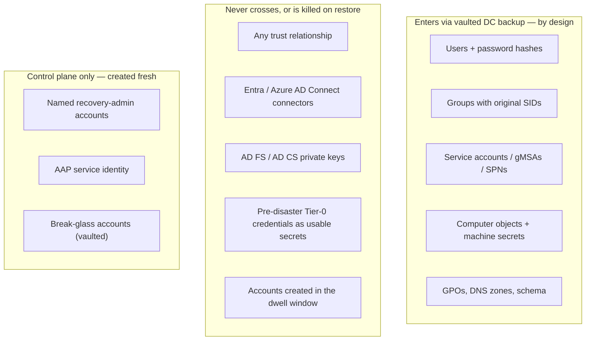
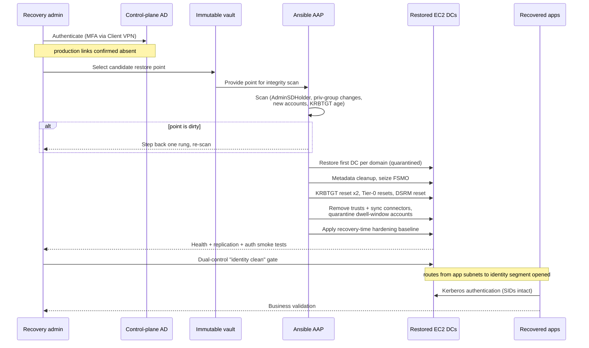

# IRE Identity Recovery Architecture

**Active Directory strategy for an Isolated Recovery Environment (IRE) on AWS**

This document sets out the identity architecture for authenticating recovered applications inside an Isolated Recovery Environment after a ransomware event, without ever establishing trust with a production environment that is presumed compromised. It evaluates the common design options, explains why most of them fail under review, and specifies the recommended design in enough detail to implement, operate, and defend to an audit or architecture review board.

---

## Table of contents

- [1. Context and problem statement](#1-context-and-problem-statement)
- [2. Two assumptions that must be challenged first](#2-two-assumptions-that-must-be-challenged-first)
- [3. The two identity planes](#3-the-two-identity-planes)
- [4. Options considered](#4-options-considered)
- [5. Recommended architecture (Option D)](#5-recommended-architecture-option-d)
- [6. Identity synchronization strategy](#6-identity-synchronization-strategy)
- [7. What is and is not brought into the IRE](#7-what-is-and-is-not-brought-into-the-ire)
- [8. Security controls](#8-security-controls)
- [9. Recovery workflow](#9-recovery-workflow)
- [10. Operational procedures and drill cadence](#10-operational-procedures-and-drill-cadence)
- [11. Risks and mitigations](#11-risks-and-mitigations)
- [12. Arguments against this recommendation](#12-arguments-against-this-recommendation)
- [13. Decision matrix and scores](#13-decision-matrix-and-scores)
- [14. Compliance mapping](#14-compliance-mapping)
- [15. Final verdict](#15-final-verdict)

---

## 1. Context and problem statement

The IRE is a recovery estate on AWS, isolated from production and activated only during a disaster. It uses private networking only, has no internet access, and is reached through AWS Client VPN or a dedicated recovery workstation. It contains a Landing VPC, Core Services VPC, Protected Workloads VPC, shared services, AWS Managed Microsoft AD, Amazon S3, Red Hat Ansible Automation Platform (AAP), Terraform, AWS Systems Manager, and AWS Backup.

Production identity today lives in an on-premises Microsoft Active Directory. Recovered applications require Active Directory authentication. The controlling constraint is that **there must be no trust relationship with production until production is declared clean** — so the directory inside the IRE must be able to authenticate recovered applications on its own.

The question this document answers: *what directory do recovered applications authenticate against, and how does the identity data get there without importing the compromise?*

---

## 2. Two assumptions that must be challenged first

Before comparing options, two assumptions embedded in the usual framing have to be corrected, because two popular options are built on top of them and collapse once the assumptions are examined.

### 2.1 You cannot replicate production AD into AWS Managed Microsoft AD

AWS Managed Microsoft AD is a **closed, managed forest**. Customers do not receive Domain Admin or Enterprise Admin rights on it. As a consequence you cannot:

- establish inter-forest AD replication into it (replication only occurs *within* a forest);
- import password hashes (this requires privileges AWS reserves);
- import SIDs — every object provisioned into Managed AD receives a **new SID in a new forest**;
- import computer-account secrets — machine account passwords cannot be exported or imported at all.

So "synchronize all of production AD into Managed AD" is not an implementable architecture. What is actually possible is *provisioning objects without their passwords and without their SIDs*. That distinction is fatal, because:

- every ACL on every recovered file server, database, and application references **production SIDs**, which the new objects do not carry;
- recovered domain-joined servers trust the **production domain**, not Managed AD, so each must be unjoined and rejoined — breaking gMSAs, SPNs, and Kerberos delegation;
- service accounts whose passwords are embedded in application configuration would all require reset during the disaster.

### 2.2 "No trust with production" is necessary but not sufficient

A trust relationship is only one propagation channel. A **synchronization pipeline is itself a standing connection** to a potentially compromised source. Ransomware operators commonly dwell in AD for weeks before encryption — creating accounts, elevating privileges, tampering with `AdminSDHolder`. Any faithful, continuous sync **replicates those changes into the recovery directory**. Copying identity from a compromised source produces a compromised recovery directory with better uptime.

> The Sheltered Harbor principle applies to identity exactly as it applies to financial records: vaulted data must be **immutable and validated**, not merely **copied**.

---

## 3. The two identity planes

The requirement "Managed AD must authenticate recovered applications independently" hides two different problems. Separating them is the key architectural move.

| | Control plane | Data plane |
|---|---|---|
| Population | Tens of accounts | Thousands of users, hundreds of service accounts |
| Lifetime | Always on, before any disaster | Materialized at recovery time |
| Requirement | Owes nothing to production | Must match production SIDs, secrets, SPNs exactly |
| Correct technology | AWS Managed Microsoft AD (standalone) | Restored production forest on EC2 DCs |

Any design that forces a single directory to serve both planes is either over-exposing the control plane or under-serving the applications. That single mistake is what sinks the first three options below.

---

## 4. Options considered

### Option A — Full synchronization of production AD

Not implementable as described (section 2.1). Reframed as object provisioning, it delivers identities with new SIDs, no passwords, and no machine trust, while maintaining a standing pipeline that faithfully replicates any compromise present in production. Maximal coupling, minimal recovery value. **Rejected.**

### Option B — Selective synchronization of DR-required identities

Smaller replicated surface than A, but the same structural problems: a standing pipeline with production-read credentials, the same SID/secret/machine-trust loss, and an added failure mode — **the scope is wrong on disaster day**. At 20 applications a precise identity dependency map may be maintainable; at 300 applications across business units, the probability that recovery is blocked by an out-of-scope service account, nested group, or SPN approaches certainty. **Rejected as a primary mechanism.**

### Option C — Fully standalone, manually managed directory

The right *security* posture: no pipeline, no production credentials, clean Zero Trust story, tiny attack surface. But a hand-maintained directory cannot authenticate recovered production applications — wrong SIDs, no matching service-account secrets, no SPNs, no machine trust — and at thousands of users it is permanently stale. **Correct answer to the wrong question:** keep it, but only as the control-plane directory.

### Option D — Dual-plane: standalone Managed AD + forest recovery from immutable backup

Recovered applications do not need *an* Active Directory; they need *their* Active Directory — same forest, same SIDs, same service accounts, same SPNs, same machine trusts. The only artifact that satisfies that is a **restored copy of the production forest**, taken from immutable vaulted backups, restored onto self-managed EC2 domain controllers in a quarantined segment, and put through the Microsoft forest-recovery hygiene procedure before any application touches it. **Approved** (detailed below).

---

## 5. Recommended architecture (Option D)

Two directories that never trust each other. A standalone Managed AD runs continuously as the control plane. The production forest is restored, on demand, from an immutable vault as the data plane.

**Control plane (always on).** AWS Managed Microsoft AD in Core Services VPC, standalone forest, zero trusts, on the order of tens of objects, managed as IaC and fronted by MFA via Client VPN and recovery workstations. Authenticates recovery admins, AAP, and administrative tooling — nothing else.

**Data plane (activated at declaration).** An Identity Recovery segment hosting restored EC2 domain controllers of the production forest. At the scale described (300 apps in five years) a dedicated Identity VPC is preferable to a subnet. No route exists between this segment and anything else until the hygiene runbook completes and a formal "identity clean" gate is passed; only then do application subnets receive routes to it. It never has a route toward production.

**Vault.** A dedicated AWS account in a separate OU, guarded by SCPs that deny every deletion path, holding DC images/system state and application backups under AWS Backup Vault Lock and S3 Object Lock in **Compliance** mode. Ingestion is one-way over PrivateLink; production holds only write credentials that cannot shorten retention or delete objects.

**Access.** Client VPN authenticates against the control-plane directory only. All administration of data-plane DCs is via SSM Session Manager with full session logging into the vault account — no network-level trust between planes is required.

---

## 6. Identity synchronization strategy

There is **no live synchronization**. The only flow of production identity into the IRE is the vaulted backup stream of designated recovery domain controllers — the sole mechanism that preserves passwords, SIDs, SPNs, and machine trust, and the only one whose content can be validated at a point in time.

### Synchronization frequency

| Item | Cadence |
|---|---|
| DC system-state / full backup to vault | Daily (RPO 24h; tighten to 6–12h if identity churn justifies) |
| Restore-point ladder | Daily ×14, weekly ×8, monthly ×6 — sized to exceed credible dwell time |
| Control-plane directory changes | Change-driven via IaC; quarterly access recertification |
| Restore-and-validate drill | Quarterly |
| Full forest-recovery drill | Semi-annually |

---

## 7. What is and is not brought into the IRE

**Brought in (via the restored forest, not a sync):** every object the forest contains — users with hashes, groups with their real SIDs, service accounts, gMSAs, SPNs, computer objects with machine secrets, GPOs, DNS, schema. Completeness is the point.

**Never brought in, or neutralized on restore:** all trust relationships (removed before network gates open); Entra/Azure AD Connect service accounts and connectors (disabled on restore); AD FS / AD CS private keys from production (treated as compromised, reissued in-IRE if needed); pre-disaster Tier-0 credentials as usable secrets (all reset; **KRBTGT reset twice** unconditionally); any account created or modified in the suspected dwell window (quarantined pending review).

**Control plane:** nothing from production, ever — no accounts, no groups, no naming that even implies a relationship. Its members are created fresh and managed as code.

---

## 8. Security controls

| Domain | Control |
|---|---|
| Immutability | AWS Backup Vault Lock + S3 Object Lock, both Compliance mode, retention greater than assumed dwell time |
| Vault isolation | Dedicated account, separate OU, SCP deny on deletion and lifecycle changes, separate credentials |
| Directionality | One-way ingestion; production cannot read or modify the vault; the IRE cannot reach production |
| Network | No internet egress anywhere; VPC endpoints only; inter-plane traffic brokered, not trusted |
| Administration | SSM Session Manager only, full session recording to the vault account |
| Authentication | MFA on the control-plane directory and on Client VPN; PAW-style recovery workstations |
| Golden Ticket defense | KRBTGT reset twice during the hygiene runbook (procedural kill, not incidental) |
| Automation secrets | AAP credential store, vaulted, no plaintext, `no_log` on credential tasks |
| Detection | GuardDuty and VPC flow logs in IRE accounts; AD integrity scanning at restore time |
| Governance | Dual-control approval on the "declare identity clean" gate |

---

## 9. Recovery workflow

1. Disaster declared; IRE activated; absence of production links confirmed.
2. Recovery admins authenticate to the control plane (Managed AD + MFA) via Client VPN.
3. Candidate restore point selected; integrity scan run; if dirty, step back a rung and repeat.
4. AAP restores the first DC per domain into the quarantined identity segment.
5. AAP hygiene runbook: metadata cleanup → FSMO seizure → KRBTGT ×2 → Tier-0 resets → DSRM reset → trusts and sync connectors removed → dwell-window accounts quarantined → recovery-time hardening baseline applied.
6. Validation gate (dual control): directory health, replication, and authentication smoke tests → **"identity clean" declared**.
7. Routes opened from application subnets to the identity segment only.
8. Applications restored from immutable backups authenticate against the restored forest; service accounts function without reconfiguration.
9. Business validation; production rebuild proceeds independently; any eventual re-migration is a planned project, never a trust.

---

## 10. Operational procedures and drill cadence

| Frequency | Activity |
|---|---|
| Daily | Automated backup-success and vault-immutability attestation |
| Weekly | Restore-point catalogue review |
| Quarterly | Restore-and-validate drill; control-plane access recertification |
| Semi-annually | Full forest-recovery drill with timed RTO and application authentication smoke tests; runbook update |
| Continuous | AAP playbook changes flow through the repository's `feature → development → main` CI gates |

> An untested forest recovery is not a capability, it is a hope. The drill cadence is the control; documentation alone is not.

---

## 11. Risks and mitigations

| Risk | Mitigation |
|---|---|
| All restore points poisoned (dwell time exceeds retention) | Retention ladder sized beyond assumed dwell; monthly points held 6+ months; reduce production detection time with continuous AD threat monitoring |
| Restore fails or was never tested | Mandatory drill cadence with executive-visible RTO metrics; drills are the control |
| AD expertise unavailable at event time | Runbook fully codified in AAP; incident-response retainer; cross-trained secondary team |
| Vault misconfiguration voids immutability | Compliance-mode locks (irreversible), SCP guardrails, quarterly attestation, config-drift alarms |
| Restored forest reintroduces hygiene debt | Recovery-time hardening baseline in the runbook; accepted-breakage policy pre-agreed with application owners |
| Restore pipeline becomes an attack path | Pipeline treated as Tier-0: dedicated account, no standing credentials, break-glass only, fully logged |
| Control-plane directory drifts into data-plane use | Hard object-count guardrail plus policy: any application integration with the control-plane directory is an architecture violation |

---

## 12. Arguments against this recommendation

A recommendation that cannot survive its own critique is not ready for a review board. The honest case against Option D:

1. **It assumes the AD backups are clean and restorable.** If attacker dwell time exceeds the retention ladder, every restore point is poisoned. If forest recovery has never been drilled, the first real restore happens during the disaster. Without integrity scanning and drills, Option D degrades into something *more* dangerous than Option C, because it is trusted more.
2. **It assumes AD-competent people are available under pressure.** Forest recovery needs someone who understands FSMO seizure, metadata cleanup, and Kerberos. If organizational AD depth is one person, the RTO is that person's availability. The AAP codification is the mitigation, backed by an IR retainer.
3. **It restores the attacker's preferred terrain.** The forest's hygiene debt — stale accounts, over-privileged groups, legacy protocols, unconstrained delegation — returns with the restore. The hygiene runbook addresses Tier-0; the long tail is mitigated by a recovery-time hardening baseline, accepting some application breakage as the price.
4. **Self-managed EC2 DCs reintroduce operational burden** that Managed AD was chosen to avoid: patching, monitoring, and Tier-0 protection of the DC images and the restore path, all of which become Tier-0 responsibilities.
5. **The vault account becomes the crown jewel.** Everything depends on one account's immutability and isolation. A Vault Lock set to Governance instead of Compliance, or a retention shorter than dwell time, silently voids the design.
6. **There are estates where a lighter option wins.** A handful of SaaS-fronted applications with no SID-dependent ACLs and no consequential service accounts would make forest recovery over-engineering. The stated trajectory — 300 apps, multiple business units, hundreds of service accounts — is the opposite of that world, which is why Option D is the fit here.

**Assumptions being made:** applications are genuinely AD-integrated (SIDs, gMSAs, Kerberos matter); backup coverage exceeds realistic attacker dwell time; the organization funds two drills a year; regulators accept restored-forest identity — which they do, as this is the NIST SP 800-184 and Sheltered Harbor-aligned pattern.

---

## 13. Decision matrix and scores

| Criterion | A — Full sync | B — Selective | C — Standalone manual | D — Dual-plane + forest recovery |
|---|:---:|:---:|:---:|:---:|
| Technically feasible as described | No | No | Yes | Yes |
| Apps authenticate without rejoin / re-ACL | No | No | No | **Yes** |
| Replicates production compromise | High | Medium | None | None (validated point) |
| Standing pipeline to defend | Yes | Yes | No | Backup only, one-way, immutable |
| Golden Ticket neutralization | Incidental | Incidental | N/A | **Procedural (KRBTGT ×2)** |
| RTO at 300 applications | Very poor | Poor to failing | Failing | **Flat with scale** |
| Identity RPO | Sync lag (poisoned) | Sync lag (poisoned + gaps) | Undefined (drift) | Backup cadence, validated |
| Sheltered Harbor / NIST 800-184 alignment | Weak | Weak | Partial | **Strong** |

### Scores out of 10

| Option | Security | Recoverability | Operational Simplicity | Scalability | Compliance | Enterprise Readiness |
|---|:---:|:---:|:---:|:---:|:---:|:---:|
| A — Full sync | 2 | 3 | 3 | 3 | 2 | **2** |
| B — Selective sync | 4 | 4 | 2 | 3 | 4 | **3** |
| C — Standalone manual | 8 | 2 | 6 | 2 | 5 | **3** |
| **D — Dual-plane + forest recovery** | **9** | **9** | **6** | **9** | **9** | **9** |

---

## 14. Compliance mapping

| Framework | How Option D aligns |
|---|---|
| AWS Well-Architected (Security, Reliability) | Isolation, least privilege, immutable recovery data, drilled recovery procedures |
| AWS security best practices | No standing cross-environment trust, one-way immutable vaulting, SSM-brokered access, no internet egress |
| Microsoft AD best practices | Forest recovery per Microsoft guidance; double KRBTGT reset; Tier-0 isolation; trust and sync-connector removal |
| NIST Cybersecurity Framework | Protect (immutability), Detect (integrity scanning), Recover (drilled forest recovery) |
| NIST SP 800-61 | Codified, repeatable incident recovery procedure |
| NIST SP 800-184 | Validated recovery points; recovery independent of the compromised source |
| CIS Controls | Controlled use of admin privileges; secure configuration; audit logging |
| Sheltered Harbor | Immutable, validated vault the source cannot destroy |
| Zero Trust (NIST SP 800-207) | No implicit trust between planes or toward production; per-plane credentials |
| Enterprise identity management | Clean separation of control-plane and data-plane identity |

---

## 15. Final verdict

**Approve Option D, and only Option D**, subject to two non-negotiable conditions:

1. Vault Lock in **Compliance** mode with a retention ladder formally sized against a documented, signed-off dwell-time assumption.
2. The semi-annual forest-recovery drill funded and scheduled **before the first production backup lands in the vault** — because an untested forest recovery is a hope, not a capability.

Options A and B fail on technical feasibility before they even reach the security argument. Option C is not wrong so much as incomplete — it is the control plane of the correct answer mistaken for the whole answer. Option D is the design that preserves the one thing recovered applications actually require, their real identity data with SIDs and secrets intact, while importing none of the compromise and holding no trust with production.

> The one-sentence rationale for any review board: **a synchronized copy of a compromised directory is a compromised directory with better availability.**