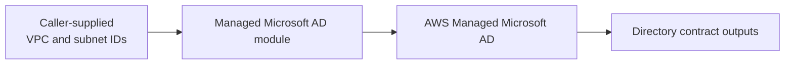

# AWS Managed Microsoft AD Module

## Purpose

This module provisions one AWS Managed Microsoft AD directory in a caller-selected VPC and exactly two private subnets.

The module is infrastructure-neutral. It does not select a VPC, subnet group, CIDR, Availability Zone, Region, directory domain, or IRE trust boundary. Those decisions belong to the consuming stack and its environment configuration.

In the IRE Sandbox, the Identity stack currently selects the Core Recovery VPC and the `directory-services` subnet group through the Platform contract.

## Architecture



AWS operates the underlying domain controllers, replication, patching, and service availability. This module owns only the Directory Service resource and its Terraform contract.

## Usage

```hcl
module "managed_microsoft_ad" {
  source = "../../modules/managed-microsoft-ad"

  domain_name = "admin.ire.example"
  password    = var.managed_ad_password
  edition     = "Standard"

  vpc_id     = local.approved_vpc_id
  subnet_ids = local.approved_directory_subnet_ids

  # External networks only; AWS owns rules for the directory VPC CIDR.
  client_cidr_blocks = local.approved_external_client_cidrs

  tags = local.org_tags
}
```

Do not place a real password, customer domain, account identifier, or organization-specific tag value in reusable module code.

## Inputs

| Input | Type | Required | Description |
|---|---|---:|---|
| `domain_name` | `string` | Yes | Approved directory FQDN |
| `password` | `string` | Yes | Sensitive bootstrap password for the directory `Admin` account |
| `edition` | `string` | No | `Standard` by default; `Enterprise` when explicitly selected |
| `vpc_id` | `string` | Yes | Existing VPC in which AWS creates the directory |
| `subnet_ids` | `list(string)` | Yes | Exactly two private subnet IDs in different Availability Zones |
| `client_cidr_blocks` | `set(string)` | No | External client CIDRs requiring AD access; exclude the directory VPC CIDR because AWS owns its baseline rules |
| `tags` | `map(string)` | No | Customer-neutral resource tags |

The password must:

- contain 8–64 characters;
- not contain `admin`, case-insensitively;
- contain at least three of uppercase, lowercase, number, and special-character categories.

## Outputs

| Output | Description |
|---|---|
| `directory_id` | AWS Directory Service directory identifier |
| `access_url` | Directory access URL |
| `dns_ip_addresses` | AWS-managed directory DNS server addresses |
| `directory_name` | Directory FQDN |
| `security_group_id` | Security group created for the managed directory |

Consumers should use outputs rather than reconstructing resource identifiers or querying by display name.

## Password lifecycle and Terraform state

AWS provider `6.57.1` requires the sensitive `password` argument and does not provide a write-only alternative for `aws_directory_service_directory`. Consequently, the bootstrap password is retained in Terraform state even though Terraform redacts it from normal CLI output.

Required controls:

1. Inject the bootstrap password from an approved AAP secret credential.
2. Never store the password in Git, ordinary Job Template YAML, shell history, or plan artifacts outside the protected AAP workspace.
3. Use an encrypted, tightly access-controlled Terraform backend.
4. Rotate the directory `Admin` password through an approved operational workflow immediately after successful creation.
5. Treat the bootstrap value retained in state as invalid after rotation.
6. Supply a new approved bootstrap credential before any intentionally authorized directory recreation.

The resource ignores subsequent Terraform password configuration changes. Password rotation therefore does not propose replacement of the directory.

## Replacement and destruction risk

Changes to the directory domain, edition, VPC, or subnets can require replacement. A directory replacement is a Tier-0 identity event and must not be approved merely because a plan contains no unrelated destroys.

Before apply:

- confirm the intended Identity backend and AWS account;
- inspect the complete resource action;
- stop on unexpected replacement or destruction;
- confirm DNS and Client VPN dependencies;
- use the dedicated Identity apply authorization.

Directory destruction remains controlled by the Identity lifecycle destroy guardrails. This module does not set `prevent_destroy`, because reusable Sandbox environments must remain intentionally removable through the approved workflow.

## Responsibilities outside this module

This module does not manage:

- VPCs, subnets, routes, Transit Gateway, or Network Firewall;
- Client VPN endpoints or authentication configuration;
- directory users, groups, MFA, or administrative role assignment;
- trusts, synchronization, or restored EC2 domain controllers;
- Route 53 Resolver endpoints or rules;
- password rotation automation;
- AWS organization-level logging or security services.

The IRE design permits no trust or synchronization between this clean administrative directory and the restored production-derived forest.

## Validation

The repository includes a composite module-test root at:

`terraform/environments/module-tests/managed-microsoft-ad`

Run repository validation with:

```bash
bash scripts/ci/terraform-validate-all.sh
```

Environment deployment validation remains separate from static Terraform validation.
