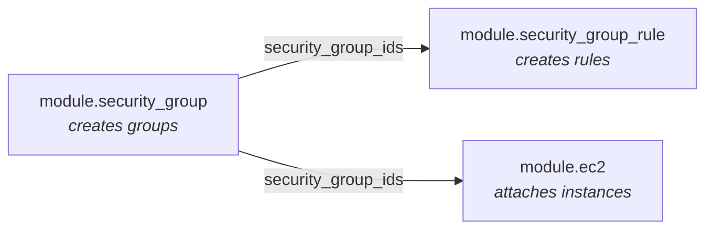

# Security Group Module

Creates AWS security groups from a map of definitions. This module creates the security group **shells only** — rules are managed separately by the [`security-group-rule`](../security-group-rule) module.

---

## Why rules are separate

This split is deliberate and worth understanding, because it solves two real problems.

**Inline and standalone rules conflict.** The `aws_security_group` resource supports inline `ingress` and `egress` blocks, and AWS also offers standalone rule resources. If both are used on the same group they fight: Terraform sees rules it does not manage inline and tries to remove them on every apply. A module must pick one approach. This library picks standalone rules.

**Groups often need to reference each other.** A common pattern is "the app tier may reach the database tier, and the database tier may reply to the app tier." With inline rules that is a circular dependency Terraform cannot resolve. With standalone rules, both groups are created first, then rules referencing either group are added afterwards — no cycle.



---

## Usage

```hcl
module "security_group" {
  source = "../../modules/security-group"

  tags = {
    org_environment = "replace-with-approved-environment"
    org_project_name = "replace-with-approved-project-name"
    org_managed_by = "Terraform"
  }

  security_groups = {

    management = {
      description = "Management"
      vpc_id      = module.recovery_access.vpc_id
    }

    core = {
      description = "Core Recovery"
      vpc_id      = module.core_recovery.vpc_id
    }

    protected = {
      description = "Protected Data"
      vpc_id      = module.protected_data.vpc_id

      tags = {
        Sensitivity = "High"
      }
    }
  }
}
```

Then attach rules and instances by referencing the output map:

```hcl
module "security_group_rule" {
  source = "../../modules/security-group-rule"

  rules = {
    core-ssh = {
      type              = "ingress"
      security_group_id = module.security_group.security_group_ids["core"]

      ip_protocol = "tcp"
      from_port   = 22
      to_port     = 22

      cidr_ipv4 = module.recovery_access.vpc_cidr
    }
  }
}
```

---

## Inputs

| Name | Type | Default | Required | Description |
|---|---|---|:---:|---|
| `security_groups` | `map(object)` | `{}` | no | Security groups to create. The map key becomes the group name. |
| `tags` | `map(string)` | `{}` | no | Tags applied to every group, before per-group overrides. |

### `security_groups` object

| Attribute | Type | Default | Description |
|---|---|---|---|
| `description` | `string` | required | Group description. AWS requires a non-empty value and rejects the request otherwise. |
| `vpc_id` | `string` | required | VPC the group belongs to. |
| `tags` | `map(string)` | `{}` | Tags for this group, merged over the module-level `tags` input. |

---

## Outputs

| Name | Type | Description |
|---|---|---|
| `security_group_ids` | `map(string)` | Group name → security group ID. |

---

## Design notes

**The map key is the group name.** It becomes `name` in AWS, the `Name` tag, and the output key. Security group names must be unique within a VPC, so the same key may be reused across different VPCs — as the sandbox does not, but legitimately could.

**Description is required, not optional.** AWS rejects a security group with an empty description. Making it a required attribute in the type turns a runtime API error into a plan-time type error.

**No rules means no access.** A group created by this module with no accompanying rules permits nothing inbound. AWS's own implicit default egress-allow rule is not created by this resource, so an instance in a rule-less group has no connectivity at all until rules are added.

---

## Terraform concepts used

| Concept | Where | Why it is used |
|---|---|---|
| `for_each` over a map | `security-group.tf` | One group per named entry |
| `optional()` in object types | `variables.tf` | `tags` may be omitted entirely |
| Map comprehension + `merge()` | `locals.tf` | Precompute per-group tags with clear precedence |
| `for` comprehension in outputs | `outputs.tf` | Return IDs keyed by group name |

---

## Requirements

Inherited from the calling configuration. This module has no populated `versions.tf`; see the repository README's known limitations.

| Requirement | Version |
|---|---|
| Terraform | `>= 1.10.0` (as used by the sandbox environment) |
| AWS provider | `~> 6.0` |
