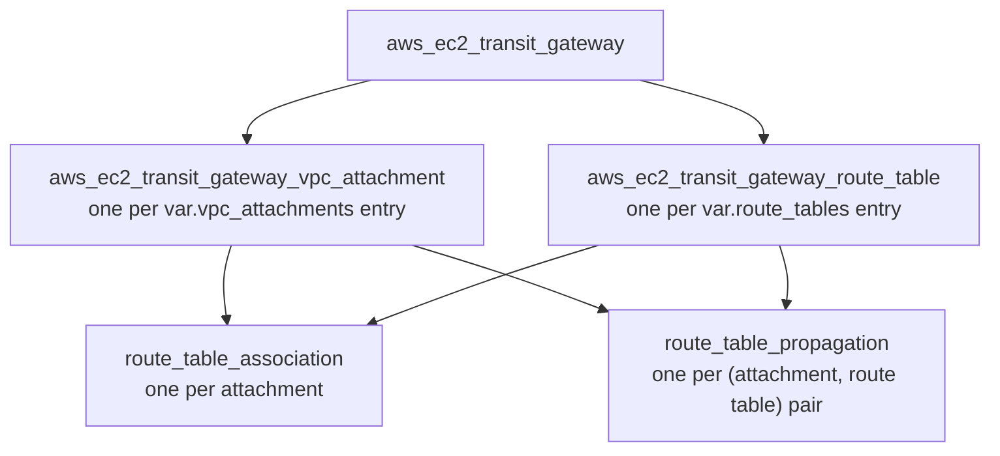

# Transit Gateway Module

Creates an AWS Transit Gateway with VPC attachments and **segmented routing**: one route table per routing domain, with explicit associations and propagations rather than the default any-to-any connectivity.

This is the module that enforces the network trust model. Reachability between VPCs is a product of how attachments associate and propagate, so a topology is expressed as data rather than described in a comment.

---

## Association and propagation

Understanding these two concepts is the whole module.

| Concept | Question it answers | Cardinality |
|---|---|---|
| **Association** | When this attachment sends traffic into the TGW, which route table does it consult? | Exactly one per attachment |
| **Propagation** | Which route tables learn this attachment's VPC CIDR? | Zero or more per attachment |

Association controls where you look up routes. Propagation controls who can see you. A VPC can only reach another VPC when the *associated* route table has learned the target's CIDR through a *propagation*.

If no propagation puts a CIDR into a route table, there is no route — not a denied route, an absent one. That absence is the security property.

---

## What it creates



---

## Usage

### Three-tier segmented topology

This produces a chain where the first and third tiers cannot reach each other:

```hcl
module "transit_gateway" {
  source = "../../modules/transit-gateway"

  name = "ire-transit-gateway"

  # Disabling the defaults is what makes segmentation possible.
  # Left enabled, every attachment would join one shared route table.
  default_route_table_association = "disable"
  default_route_table_propagation = "disable"

  # One route table per routing domain. The map key is referenced by
  # attachments; `name` is the friendly name shown in the console.
  route_tables = {
    recovery_access = { name = "Recovery Access" }
    core_recovery   = { name = "Core Recovery" }
    protected_data  = { name = "Protected Data" }
  }

  vpc_attachments = {

    recovery_access = {
      vpc_id     = module.recovery_access.vpc_id
      subnet_ids = module.recovery_access.subnet_ids_by_group["transit-gateway"]

      route_table  = "recovery_access"
      propagate_to = ["core_recovery"]
    }

    core_recovery = {
      vpc_id     = module.core_recovery.vpc_id
      subnet_ids = module.core_recovery.subnet_ids_by_group["transit-gateway"]

      route_table  = "core_recovery"
      propagate_to = ["recovery_access", "protected_data"]
    }

    protected_data = {
      vpc_id     = module.protected_data.vpc_id
      subnet_ids = module.protected_data.subnet_ids_by_group["transit-gateway"]

      route_table  = "protected_data"
      propagate_to = ["core_recovery"]
    }
  }

  tags = {
    Name        = "ire-transit-gateway"
    org_project_name = "replace-with-approved-project-name"
    org_environment = "replace-with-approved-environment"
  }
}
```

Trace one line to see how it works. The `recovery_access` route table learns a CIDR only when some attachment propagates into it — and only `core_recovery` does. So Recovery Access can reach Core Recovery and nothing else. The same reasoning applies to `protected_data`. Recovery Access and Protected Data therefore have no path between them:

| From ↓ / To → | Recovery Access | Core Recovery | Protected Data |
|---|---|---|---|
| **Recovery Access** | — | ✅ | ❌ no route |
| **Core Recovery** | ✅ | — | ✅ |
| **Protected Data** | ❌ no route | ✅ | — |

### Flat topology, when segmentation is not needed

Point every attachment at one shared route table and propagate everything into it:

```hcl
module "transit_gateway" {
  source = "../../modules/transit-gateway"

  name = "shared-tgw"

  route_tables = {
    main = { name = "Main" }
  }

  vpc_attachments = {
    app = {
      vpc_id       = module.app_vpc.vpc_id
      subnet_ids   = module.app_vpc.subnet_ids_by_group["transit-gateway"]
      route_table  = "main"
      propagate_to = ["main"]
    }

    data = {
      vpc_id       = module.data_vpc.vpc_id
      subnet_ids   = module.data_vpc.subnet_ids_by_group["transit-gateway"]
      route_table  = "main"
      propagate_to = ["main"]
    }
  }
}
```

---

## Inputs

| Name | Type | Default | Required | Description |
|---|---|---|:---:|---|
| `name` | `string` | — | yes | Transit Gateway name, used as the description and `Name` tag. |
| `route_tables` | `map(object)` | `{}` | no | Route tables to create. Map key is the internal identifier attachments reference. |
| `vpc_attachments` | `map(object)` | `{}` | no | VPC attachments to create. |
| `amazon_side_asn` | `number` | `64512` | no | BGP ASN for the AWS side. Only relevant once VPN or Direct Connect attachments exist. |
| `dns_support` | `string` | `"enable"` | no | `"enable"` or `"disable"`. |
| `vpn_ecmp_support` | `string` | `"enable"` | no | `"enable"` or `"disable"`. |
| `auto_accept_shared_attachments` | `string` | `"disable"` | no | Auto-accept cross-account attachments. |
| `default_route_table_association` | `string` | `"disable"` | no | Validated to `"enable"` or `"disable"`. |
| `default_route_table_propagation` | `string` | `"disable"` | no | Validated to `"enable"` or `"disable"`. |
| `tags` | `map(string)` | `{}` | no | Tags merged onto every resource in the module. |

### `route_tables` object

| Attribute | Type | Default | Description |
|---|---|---|---|
| `name` | `string` | required | Friendly name shown in the AWS console. |
| `tags` | `map(string)` | `{}` | Tags specific to this route table. |

### `vpc_attachments` object

| Attribute | Type | Default | Description |
|---|---|---|---|
| `vpc_id` | `string` | required | VPC to attach. |
| `subnet_ids` | `list(string)` | required | One subnet per AZ. AWS places an attachment ENI in each. |
| `route_table` | `string` | required | Key from `route_tables` this attachment associates with. |
| `propagate_to` | `list(string)` | required | Keys from `route_tables` this attachment propagates into. May be empty. |
| `dns_support` | `string` | `"enable"` | Per-attachment DNS support. |
| `ipv6_support` | `string` | `"disable"` | Per-attachment IPv6 support. |
| `appliance_mode_support` | `string` | `"disable"` | Enable for stateful inspection appliances, so flows stay symmetric. |
| `tags` | `map(string)` | `{}` | Tags specific to this attachment. |

Note that the values in `route_table` and `propagate_to` are validated by Terraform's map lookup rather than a `validation` block. A key that does not exist in `route_tables` produces an index error at plan time — the plan still fails safely, but the message is less descriptive than a custom validation would be.

---

## Outputs

| Name | Type | Description |
|---|---|---|
| `id` | `string` | Transit Gateway ID. This is what VPC route tables use as a route target. |
| `arn` | `string` | Transit Gateway ARN. |
| `attachment_ids` | `map(string)` | Attachment key → ID, for static TGW routes and inspection routing. |
| `route_table_ids` | `map(string)` | Route table key → ID, for adding static routes outside this module. |
| `association_default_route_table_id` | `string` | The default association route table AWS creates automatically. |
| `propagation_default_route_table_id` | `string` | The default propagation route table AWS creates automatically. |

The two default route table outputs are exposed for inspection. When association and propagation defaults are disabled, as they are here, those tables exist but are unused.

---

## Design notes

**Attachment IDs support external routing.** The `attachment_ids`
output allows an environment or dedicated routing module to create static
Transit Gateway routes toward a named VPC attachment. This is required for
centralized inspection patterns where spoke route tables direct approved
destinations toward an Inspection VPC attachment.

**Attachments belong in private subnets.** The attachment ENIs need no public addressing. Listing one subnet per AZ gives the attachment high availability.

**Subnets are the attachment's, not the route's.** A common misreading is that `subnet_ids` limits which subnets can use the Transit Gateway. It does not — it only places the ENIs. All subnets in the VPC can route to the TGW provided their route table has a route to it.

**Route tables carry no static routes yet.** `routes.tf` is present but empty. Blackhole routes and static overrides would live there. Today reachability is entirely propagation-driven, which is sufficient for the current topology.

**RAM sharing is not implemented.** `ram.tf` is reserved for cross-account attachment sharing.

---

## Terraform concepts used

| Concept | Where | Why it is used |
|---|---|---|
| `for_each` over a map | `attachments.tf`, `route-tables.tf`, `associations.tf` | One resource per named entry |
| `optional()` in object types | `variables.tf` | Callers supply only what they need; the module reads every attribute safely |
| `flatten()` + nested `for` | `propagations.tf` | Flatten a one-to-many relationship into a keyed map for `for_each` |
| `validation` blocks | `variables.tf` | Reject anything other than `"enable"`/`"disable"` at plan time |
| `merge()` | `attachments.tf`, `route-tables.tf` | Three-level tag precedence |
| Implicit dependencies | throughout | Resource references build the graph; no `depends_on` is needed |

The `flatten()` expression in `propagations.tf` is worth reading closely — it is the standard idiom for turning a one-to-many mapping into something `for_each` accepts, and it appears constantly in real Terraform.

---

## Requirements

| Requirement | Version |
|---|---|
| Terraform | `>= 1.6.0` |
| AWS provider | `~> 6.0` |
