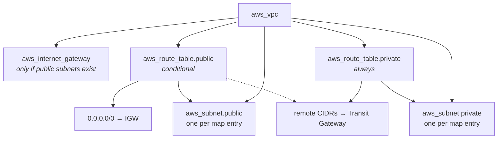

# VPC Module

Creates an AWS VPC with public and/or private subnets spread across Availability Zones, route tables, an optional Internet Gateway, and optional routes toward a Transit Gateway.

The module is topology-agnostic. It knows nothing about the Isolated Recovery Environment or any other design — remote networks are passed in as route lists, so the same module builds an internet-facing VPC and a fully isolated one depending only on its inputs.

---

## What it creates



The public tier is entirely optional. Pass no `public_subnets` and the module creates no public subnets, no Internet Gateway, no public route table, and no default route — the VPC has no path to the internet at all. That is how the Core Recovery and Protected Data VPCs are built.

The private route table never receives a `0.0.0.0/0` route under any configuration. Private subnets reach other networks only through Transit Gateway routes you supply explicitly.

---

## Usage

### Isolated VPC — no internet path

```hcl
module "core_recovery" {
  source = "../../modules/vpc"

  vpc_name                = "core-recovery"
  cidr_block              = "10.101.0.0/16"
  availability_zone_count = 2

  private_subnets = {
    private-a = "10.101.11.0/24"
    private-b = "10.101.12.0/24"
  }

  # Reachable peers, routed via the Transit Gateway.
  private_transit_gateway_routes = [
    {
      destination_cidr_block = "10.100.0.0/16"
      transit_gateway_id     = module.transit_gateway.id
    },
    {
      destination_cidr_block = "10.102.0.0/16"
      transit_gateway_id     = module.transit_gateway.id
    }
  ]

  tags = {
    Tier = "Recovery"
  }
}
```

### VPC with a public tier

```hcl
module "recovery_access" {
  source = "../../modules/vpc"

  vpc_name                = "recovery-access"
  cidr_block              = "10.100.0.0/16"
  availability_zone_count = 2

  # Supplying this map is what enables the Internet Gateway,
  # the public route table, and the 0.0.0.0/0 default route.
  public_subnets = {
    public-a = "10.100.1.0/24"
    public-b = "10.100.2.0/24"
  }

  private_subnets = {
    private-a = "10.100.11.0/24"
    private-b = "10.100.12.0/24"
  }

  public_transit_gateway_routes = [
    {
      destination_cidr_block = "10.101.0.0/16"
      transit_gateway_id     = module.transit_gateway.id
    }
  ]

  private_transit_gateway_routes = [
    {
      destination_cidr_block = "10.101.0.0/16"
      transit_gateway_id     = module.transit_gateway.id
    }
  ]
}
```

---

## Inputs

| Name | Type | Default | Required | Description |
|---|---|---|:---:|---|
| `vpc_name` | `string` | — | yes | Name of the VPC. Used as the `Name` tag and as the prefix for every subnet, route table, and gateway name. |
| `cidr_block` | `string` | — | yes | CIDR block for the VPC. |
| `private_subnets` | `map(string)` | — | yes | Map of subnet key → CIDR. Must contain at least one entry. |
| `availability_zone_count` | `number` | `2` | no | Number of AZs to spread subnets across. Must be `>= 2`. |
| `public_subnets` | `map(string)` | `{}` | no | Map of subnet key → CIDR. An empty map disables the entire public tier. |
| `enable_dns_support` | `bool` | `true` | no | Enable DNS resolution in the VPC. |
| `enable_dns_hostnames` | `bool` | `true` | no | Enable DNS hostnames in the VPC. |
| `tags` | `map(string)` | `{}` | no | Additional tags merged onto every resource. |
| `public_transit_gateway_routes` | `list(object)` | `[]` | no | Routes added to the public route table. Ignored when there is no public tier. |
| `private_transit_gateway_routes` | `list(object)` | `[]` | no | Routes added to the private route table. |

Both route list objects have the shape:

```hcl
{
  destination_cidr_block = string
  transit_gateway_id     = string
}
```

### Validation

Two `validation` blocks reject bad input at plan time rather than at the AWS API:

- `availability_zone_count >= 2` — a single-AZ deployment has no high availability.
- `length(private_subnets) > 0` — every VPC in this design must have a private tier.

---

## Outputs

| Name | Type | Description |
|---|---|---|
| `vpc_id` | `string` | VPC ID. |
| `vpc_cidr` | `string` | VPC CIDR block. Useful for building security group rules that reference a whole tier. |
| `public_subnet_ids` | `list(string)` | Public subnet IDs. Empty when there is no public tier. |
| `private_subnet_ids` | `list(string)` | Private subnet IDs. This is the input the Transit Gateway module expects for attachments. |
| `public_subnet_map` | `map(string)` | Subnet key → ID, for selecting a specific subnet by name. |
| `private_subnet_map` | `map(string)` | Subnet key → ID. |
| `public_route_table_id` | `string` | Public route table ID, or `null` when there is no public tier. |
| `private_route_table_id` | `string` | Private route table ID. |
| `internet_gateway_id` | `string` | Internet Gateway ID, or `null` when none was created. |

`public_subnet_ids` and `private_subnet_ids` are lists; `*_subnet_map` returns the same data keyed by name. Prefer the map when you need one specific subnet, since list ordering should not be relied on.

---

## Design notes

**AZ assignment is deterministic.** `data.aws_availability_zones` supplies the region's AZ names, `slice()` takes the first `availability_zone_count`, and each subnet's position in the sorted key list selects its AZ. The first subnet lands in the first AZ, the second in the second, and so on — no hardcoded AZ names, so the module works in any region.

**The public tier is a single toggle.** `local.has_public_subnets` is derived from whether `public_subnets` is empty, and drives `count` on the Internet Gateway, public route table, and default route together. There is no separate `create_internet_gateway` flag to keep in sync.

**One shared private route table.** All private subnets share a single route table. This is intentional for the current design. A future firewall or NAT deployment that needs per-AZ egress paths will require splitting this into one route table per AZ.

**Routes are inputs, not inference.** The module never discovers its peers. Passing routes in keeps it free of any assumption about the surrounding topology.

---

## Terraform concepts used

This module is a good introduction to several core language features. The inline comments in the source explain each in place:

| Concept | Where | Why it is used |
|---|---|---|
| `for_each` over a map | `subnets.tf` | Key-addressed subnets, so removing one does not recreate the others |
| `count` as a toggle | `routing.tf` | Conditional existence of the IGW and public route table |
| `locals` | `locals.tf` | Compute tags and AZ selection once, reuse everywhere |
| Data source | `data.tf` | Look up region AZs instead of hardcoding names |
| `merge()` | throughout | Layered tag precedence |
| `slice()`, `keys()`, `index()` | `locals.tf`, `subnets.tf` | Deterministic subnet-to-AZ mapping |
| `try()` | `outputs.tf` | Return `null` instead of erroring on conditional resources |
| `for` comprehension | `routing.tf`, `outputs.tf` | Convert route lists into keyed maps; build subnet maps |
| `validation` blocks | `variables.tf` | Fail at plan time on invalid input |

---

## Requirements

| Requirement | Version |
|---|---|
| Terraform | `>= 1.10.0` |
| AWS provider | `~> 6.0` |
