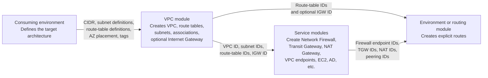
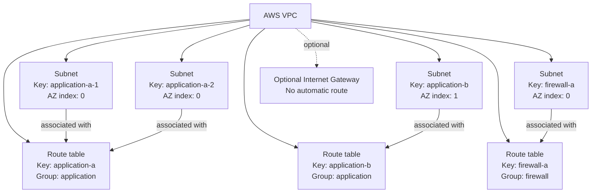
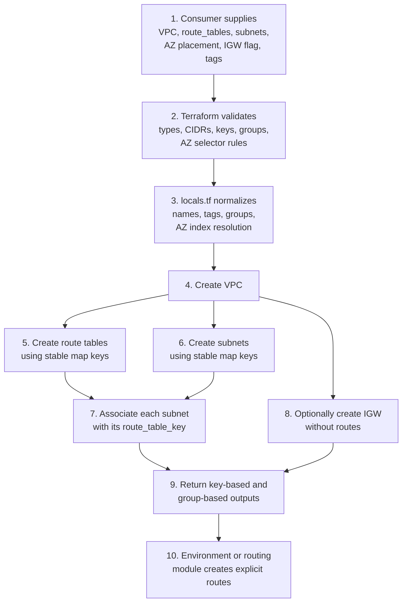
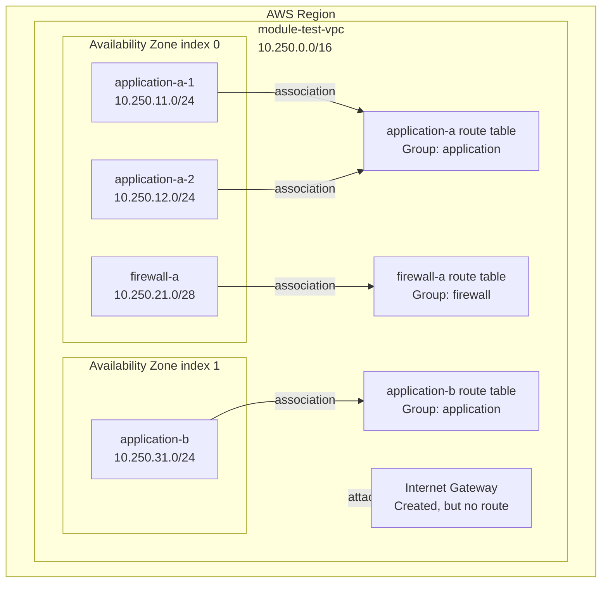
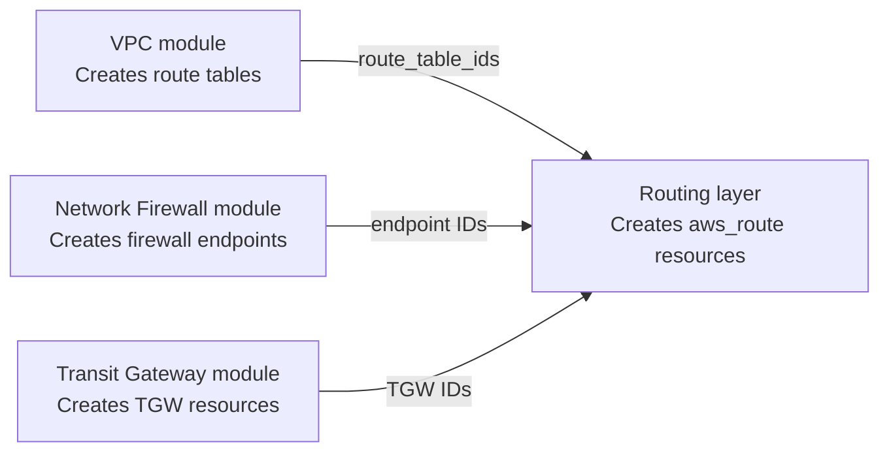
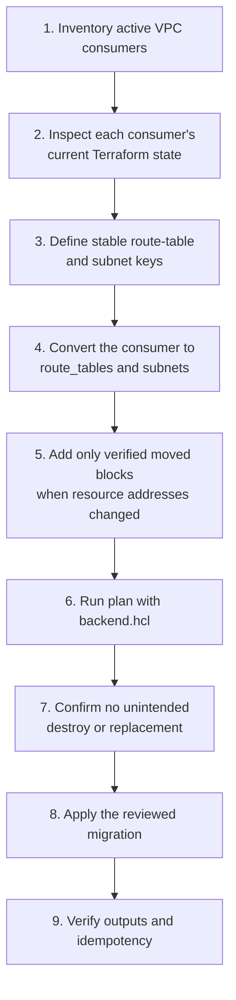
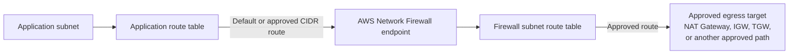
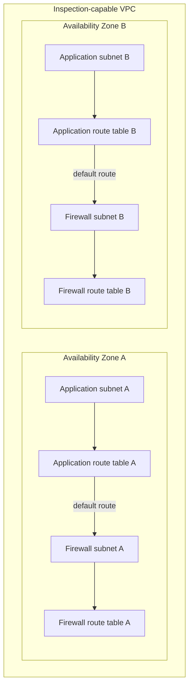
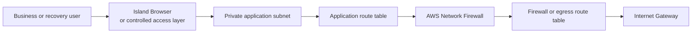
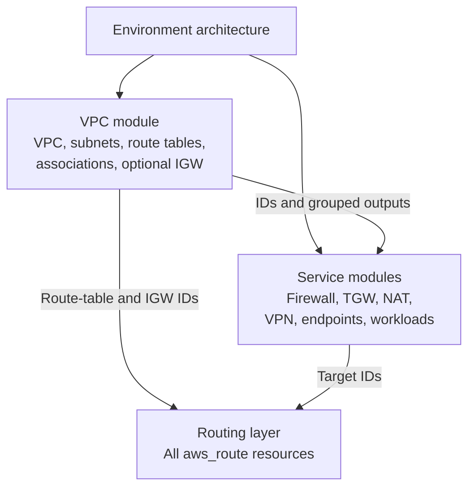

# AWS VPC Terraform Module

Creates an enterprise-pluggable AWS Virtual Private Cloud (VPC) foundation through one strongly typed Terraform interface.

The consuming environment defines:

- the VPC CIDR;
- the route tables required by the architecture;
- the subnets required by the architecture;
- the Availability Zone placement of every subnet;
- the route table used by every subnet;
- whether the VPC should own an Internet Gateway;
- the enterprise tags applied to the resources.

The module creates:

- the VPC;
- route tables;
- subnets;
- subnet-to-route-table associations;
- an optional Internet Gateway.

The module intentionally creates **no routes**.

Routes to AWS Network Firewall, Transit Gateway, NAT Gateway, Internet Gateway, VPC peering, VPN, or other targets belong to the consuming environment or to a dedicated routing module.

---

## Table of contents

1. [Purpose](#purpose)
2. [Plain-English networking concepts](#plain-english-networking-concepts)
3. [What this module creates](#what-this-module-creates)
4. [What this module does not create](#what-this-module-does-not-create)
5. [Responsibility boundary](#responsibility-boundary)
6. [Module topology model](#module-topology-model)
7. [How the module works end to end](#how-the-module-works-end-to-end)
8. [Quick start](#quick-start)
9. [Complete tested topology](#complete-tested-topology)
10. [Understanding stable map keys](#understanding-stable-map-keys)
11. [Understanding route tables](#understanding-route-tables)
12. [Understanding subnets](#understanding-subnets)
13. [Availability Zone placement](#availability-zone-placement)
14. [Understanding groups](#understanding-groups)
15. [Internet Gateway behaviour](#internet-gateway-behaviour)
16. [Public IP assignment](#public-ip-assignment)
17. [Route ownership](#route-ownership)
18. [Inputs](#inputs)
19. [Outputs](#outputs)
20. [Output consumption examples](#output-consumption-examples)
21. [Naming behaviour](#naming-behaviour)
22. [Tagging behaviour](#tagging-behaviour)
23. [Input validation](#input-validation)
24. [Common validation failures](#common-validation-failures)
25. [Operational workflow](#operational-workflow)
26. [Verification](#verification)
27. [Idempotency testing](#idempotency-testing)
28. [Destroy workflow](#destroy-workflow)
29. [State migration guidance](#state-migration-guidance)
30. [Consumer migration guidance](#consumer-migration-guidance)
31. [Future AWS Network Firewall integration](#future-aws-network-firewall-integration)
32. [Future Island Browser controlled-egress use case](#future-island-browser-controlled-egress-use-case)
33. [Troubleshooting](#troubleshooting)
34. [Enterprise design principles](#enterprise-design-principles)
35. [Module files](#module-files)
36. [Requirements](#requirements)
37. [Consumer checklist](#consumer-checklist)

---

## Purpose

This module provides the reusable VPC foundation for AWS environments that need more control than a basic public/private subnet abstraction can provide.

It supports topologies where:

- multiple subnets exist in the same Availability Zone;
- several subnets share one route table;
- different subnet roles in the same Availability Zone use different route tables;
- subnet groups are selected by logical purpose;
- route tables are selected by stable keys;
- an Internet Gateway may exist without any automatic internet route;
- routing is introduced later after dependent services are available.

This design is suitable for:

- Isolated Recovery Environments;
- Core Recovery VPCs;
- Protected Data VPCs;
- inspection VPCs;
- AWS Network Firewall deployments;
- Transit Gateway attachment designs;
- VPC endpoint subnets;
- application and database subnet tiers;
- management networks;
- controlled ingress and egress patterns;
- future Island Browser connectivity.

The module is architecture-neutral. Names such as `application`, `firewall`, `management`, or `transit-gateway` are caller-defined labels. The module does not infer behaviour from them.

---

## Plain-English networking concepts

### What is a VPC?

A VPC is a private network boundary inside AWS.

It is similar to creating a logically isolated network in a data centre. AWS resources such as EC2 instances, load balancers, directory services, VPC endpoints, and firewalls can be deployed inside it.

A VPC receives an IPv4 CIDR block, for example:

```text
10.250.0.0/16
```

That CIDR defines the overall address space available to the VPC.

### What is a subnet?

A subnet is a smaller network created inside the VPC CIDR.

For example:

```text
VPC:    10.250.0.0/16
Subnet: 10.250.11.0/24
```

The subnet CIDR must fall inside the VPC CIDR and must not overlap another subnet in the same VPC.

Subnets are commonly separated by purpose:

- application workloads;
- database workloads;
- AWS Network Firewall endpoints;
- Transit Gateway attachments;
- interface VPC endpoints;
- domain controllers;
- management services;
- load balancers;
- controlled ingress or egress components.

### What is an Availability Zone?

An Availability Zone is an isolated AWS location inside a Region.

A Region such as `us-east-1` may expose Availability Zones such as:

```text
us-east-1a
us-east-1b
us-east-1c
```

A subnet exists in exactly one Availability Zone.

A VPC spans a Region, but each subnet is placed in one Availability Zone.

For high availability, architectures usually place corresponding resources in at least two Availability Zones.

This module also supports multiple subnets in the same Availability Zone. That is required for advanced designs where application, firewall, Transit Gateway, endpoint, and management subnets coexist in one Availability Zone.

### What is a route table?

A route table contains traffic-forwarding decisions.

Every subnet must be associated with one route table.

A route table may contain decisions such as:

- send local VPC traffic directly;
- send default traffic to AWS Network Firewall;
- send approved traffic to a Transit Gateway;
- send internet traffic to a NAT Gateway;
- send traffic to an Internet Gateway;
- send traffic to a VPC peering connection;
- send traffic to another supported target.

This module creates route tables and associates subnets with them.

It does not create the destination routes.

### What is an Internet Gateway?

An Internet Gateway is an AWS resource that may provide a VPC with internet connectivity.

Creating or attaching an Internet Gateway does not make a subnet public.

A subnet only gains a usable internet path when all required components exist, including:

- an Internet Gateway;
- an explicit route to the Internet Gateway;
- suitable public IP addressing;
- appropriate security group rules;
- appropriate network ACL rules;
- any mandatory inspection or governance controls.

This module can create the Internet Gateway but never creates the route automatically.

---

## What this module creates

The module creates:

- one `aws_vpc`;
- one `aws_route_table` for every entry in `route_tables`;
- one `aws_subnet` for every entry in `subnets`;
- one `aws_route_table_association` for every subnet;
- optionally, one `aws_internet_gateway`.

The module uses caller-defined map keys as stable Terraform identities.

Example:

```hcl
route_tables = {
  application-a = {
    group = "application"
  }
}
```

creates:

```text
aws_route_table.this["application-a"]
```

Example:

```hcl
subnets = {
  application-a-1 = {
    # subnet configuration
  }
}
```

creates:

```text
aws_subnet.this["application-a-1"]
```

---

## What this module does not create

The module does not create:

- `aws_route` resources;
- default internet routes;
- NAT Gateway routes;
- AWS Network Firewall routes;
- Transit Gateway routes;
- VPC peering routes;
- VPN routes;
- route propagation;
- NAT Gateways;
- AWS Network Firewall resources;
- Network Firewall endpoint routes;
- Transit Gateway attachments;
- VPC peering connections;
- Site-to-Site VPN attachments;
- Client VPN endpoints;
- VPC endpoints;
- security groups;
- network ACLs;
- load balancers;
- EC2 instances;
- directory services.

Those responsibilities remain with the consuming environment or with dedicated service and routing modules.

---

## Responsibility boundary



The separation is intentional:

- the VPC module owns network containers;
- service modules own services and gateways;
- the routing layer owns traffic paths;
- the environment owns the overall architecture.

This prevents the VPC module from becoming tightly coupled to one implementation.

---

## Module topology model

The module accepts one topology model:

```text
VPC
├── Route tables
├── Subnets
│   └── Every subnet explicitly selects one route table
└── Optional Internet Gateway
```



This model proves that:

- multiple subnets can exist in one Availability Zone;
- multiple subnets can share one route table;
- another subnet in the same Availability Zone can use a different route table;
- another subnet can exist in a second Availability Zone;
- route-table selection is explicit;
- output selection does not depend on list positions;
- Internet Gateway ownership is independent from route creation.

---

## How the module works end to end



### Step 1: Define the VPC

The consumer provides:

```hcl
vpc_name   = "module-test-vpc"
cidr_block = "10.250.0.0/16"
```

The module creates:

```text
aws_vpc.this
```

### Step 2: Define route tables

The consumer provides a map:

```hcl
route_tables = {
  application-a = {
    group = "application"
  }

  firewall-a = {
    group = "firewall"
  }
}
```

The module creates one route table per key:

```text
aws_route_table.this["application-a"]
aws_route_table.this["firewall-a"]
```

### Step 3: Define subnets

Every subnet defines:

- a CIDR block;
- a logical group;
- a route-table key;
- exactly one Availability Zone selector.

Example:

```hcl
application-a-1 = {
  cidr_block              = "10.250.11.0/24"
  availability_zone_index = 0
  group                   = "application"
  route_table_key         = "application-a"
}
```

The module creates:

```text
aws_subnet.this["application-a-1"]
```

### Step 4: Resolve Availability Zone placement

When a subnet uses:

```hcl
availability_zone_index = 0
```

the module reads the AWS Region's available Availability Zones and selects the first available AZ.

When a subnet uses:

```hcl
availability_zone_index = 1
```

the module selects the second available AZ.

The consumer may instead provide:

```hcl
availability_zone = "us-east-1a"
```

or:

```hcl
availability_zone_id = "use1-az1"
```

Exactly one selector is permitted.

### Step 5: Associate each subnet with a route table

A subnet selects a route table using:

```hcl
route_table_key = "application-a"
```

The module creates an association between the subnet and:

```text
aws_route_table.this["application-a"]
```

Several subnets may reference the same route table.

### Step 6: Optionally create an Internet Gateway

When:

```hcl
create_internet_gateway = true
```

the module creates:

```text
aws_internet_gateway.this[0]
```

It does not create:

```text
0.0.0.0/0 -> Internet Gateway
```

That route must be created explicitly outside this module.

### Step 7: Return outputs

The module returns:

- VPC identifiers;
- subnet details keyed by subnet key;
- subnet IDs keyed by subnet key;
- subnet IDs grouped by subnet group;
- route-table details keyed by route-table key;
- route-table IDs keyed by route-table key;
- route-table IDs grouped by route-table group;
- an optional Internet Gateway ID.

### Step 8: Create routes outside the VPC module

The environment or routing module uses the returned IDs to create approved routes toward:

- Network Firewall endpoints;
- Transit Gateway;
- NAT Gateway;
- Internet Gateway;
- VPC peering;
- VPN;
- another supported target.

---

## Quick start

```hcl
module "vpc" {
  source = "../../modules/vpc"

  vpc_name   = "example-vpc"
  cidr_block = "10.100.0.0/16"

  route_tables = {
    application-a = {
      group = "application"
    }

    application-b = {
      group = "application"
    }
  }

  subnets = {
    application-a = {
      cidr_block              = "10.100.10.0/24"
      group                   = "application"
      route_table_key         = "application-a"
      availability_zone_index = 0
    }

    application-b = {
      cidr_block              = "10.100.20.0/24"
      group                   = "application"
      route_table_key         = "application-b"
      availability_zone_index = 1
    }
  }

  create_internet_gateway = false

  tags = {
    org_environment  = "Dev"
    org_managed_by   = "Terraform"
    org_project_name = "Example"
  }
}
```

This creates:

- one VPC;
- two route tables;
- two subnets;
- two route-table associations;
- no Internet Gateway;
- no routes.

---

## Complete tested topology

The following example matches the module-test topology that passed:

- formatting;
- initialization with `backend.hcl`;
- validation;
- plan;
- apply;
- output verification;
- idempotency;
- destroy;
- empty-state verification.

```hcl
locals {
  vpc = {
    vpc_name   = "module-test-vpc"
    cidr_block = "10.250.0.0/16"

    route_tables = {
      application-a = {
        name  = "module-test-vpc-application-a"
        group = "application"
      }

      application-b = {
        name  = "module-test-vpc-application-b"
        group = "application"
      }

      firewall-a = {
        name  = "module-test-vpc-firewall-a"
        group = "firewall"
      }
    }

    subnets = {
      application-a-1 = {
        cidr_block              = "10.250.11.0/24"
        availability_zone_index = 0
        group                   = "application"
        route_table_key         = "application-a"
      }

      application-a-2 = {
        cidr_block              = "10.250.12.0/24"
        availability_zone_index = 0
        group                   = "application"
        route_table_key         = "application-a"
      }

      firewall-a = {
        cidr_block              = "10.250.21.0/28"
        availability_zone_index = 0
        group                   = "firewall"
        route_table_key         = "firewall-a"
      }

      application-b = {
        cidr_block              = "10.250.31.0/24"
        availability_zone_index = 1
        group                   = "application"
        route_table_key         = "application-b"
      }
    }
  }
}
```

The module call is:

```hcl
module "vpc" {
  source = "../../../modules/vpc"

  vpc_name   = local.vpc.vpc_name
  cidr_block = local.vpc.cidr_block

  route_tables = local.vpc.route_tables
  subnets      = local.vpc.subnets

  create_internet_gateway = true

  tags = local.org_tags
}
```

### Tested resource count

With `create_internet_gateway = true`, the topology creates:

| Resource | Quantity |
|---|---:|
| VPC | 1 |
| Route tables | 3 |
| Subnets | 4 |
| Route-table associations | 4 |
| Internet Gateway | 1 |
| **Total** | **13** |

No `aws_route` resources are created.

With `create_internet_gateway = false`, the same topology creates 12 resources.

### Tested topology diagram



The test proves that:

- `application-a-1` and `application-a-2` are in the same Availability Zone;
- both application subnets share one route table;
- `firewall-a` is in the same Availability Zone but uses a separate route table;
- `application-b` is placed in another Availability Zone;
- group-based outputs return related resources;
- the optional Internet Gateway can be created independently;
- Internet Gateway creation does not create routes;
- the configuration is idempotent.

---

## Understanding stable map keys

Map keys are important because Terraform uses them as resource identities.

Consider:

```hcl
route_tables = {
  application-a = {
    group = "application"
  }
}
```

The key is:

```text
application-a
```

The key becomes part of the Terraform resource address:

```text
aws_route_table.this["application-a"]
```

Similarly:

```hcl
subnets = {
  application-a-1 = {
    # ...
  }
}
```

becomes:

```text
aws_subnet.this["application-a-1"]
```

### Why keys are safer than positional lists

A positional lookup is fragile:

```hcl
module.vpc.subnet_ids[0]
```

Adding or removing another subnet can change positions.

A key-based lookup is explicit:

```hcl
module.vpc.subnet_ids["application-a-1"]
```

Adding another unrelated subnet does not change this lookup.

### Key-change warning

Changing a map key changes the Terraform resource address.

Changing:

```text
application-a-1
```

to:

```text
app-a-1
```

may cause Terraform to interpret the original resource as removed and the new resource as newly created.

A reviewed `moved` block may be required to preserve the existing resource.

Choose stable keys before production deployment.

---

## Understanding route tables

The `route_tables` input is a strongly typed map.

```hcl
route_tables = {
  application-a = {
    name  = "module-test-vpc-application-a"
    group = "application"

    tags = {
      org_component = "application-routing"
    }
  }
}
```

The object type is:

```hcl
map(object({
  name  = optional(string)
  group = optional(string, "default")
  tags  = optional(map(string), {})
}))
```

### Route-table key

The map key is the stable Terraform identity.

Example:

```text
application-a
```

### Route-table name

The optional `name` field controls the AWS `Name` tag.

When omitted, the module derives:

```text
<vpc_name>-<route_table_key>-rt
```

Example:

```text
module-test-vpc-application-a-rt
```

### Route-table group

The `group` field is metadata used by grouped outputs.

Example:

```hcl
group = "application"
```

It does not add routes or change traffic flow.

### Route-table tags

Resource-specific tags may be supplied using:

```hcl
tags = {
  org_component = "application-routing"
}
```

These tags are merged with module-level tags.

---

## Understanding subnets

The `subnets` input is a strongly typed map.

```hcl
subnets = {
  application-a-1 = {
    name                    = "module-test-application-a-1"
    cidr_block              = "10.250.11.0/24"
    group                   = "application"
    route_table_key         = "application-a"
    availability_zone_index = 0
    map_public_ip_on_launch = false

    tags = {
      org_component = "application"
    }
  }
}
```

The object type is:

```hcl
map(object({
  name                    = optional(string)
  cidr_block              = string
  group                   = optional(string, "default")
  route_table_key         = string
  availability_zone       = optional(string)
  availability_zone_id    = optional(string)
  availability_zone_index = optional(number)
  map_public_ip_on_launch = optional(bool, false)
  tags                    = optional(map(string), {})
}))
```

### Subnet key

The map key is the stable Terraform identity.

Example:

```text
application-a-1
```

### Subnet name

When `name` is omitted, the module derives:

```text
<vpc_name>-<subnet_key>
```

Example:

```text
module-test-vpc-application-a-1
```

### CIDR block

The `cidr_block` must be a valid IPv4 CIDR.

Example:

```hcl
cidr_block = "10.250.11.0/24"
```

The consumer is responsible for ensuring that subnet CIDRs:

- fall inside the VPC CIDR;
- do not overlap;
- fit the enterprise IP allocation.

Terraform validates CIDR syntax and rejects duplicate CIDRs inside the input map.

AWS performs the final validation that subnet CIDRs belong to the VPC and do not overlap existing subnets.

### Route-table key

Every subnet explicitly selects one route table:

```hcl
route_table_key = "application-a"
```

This key must exist in `route_tables`.

### Subnet group

The `group` field is metadata used by grouped outputs.

It does not make the subnet public, private, application, firewall, management, or database-aware.

### Public IP assignment

The optional setting:

```hcl
map_public_ip_on_launch = true
```

only controls whether eligible resources launched into the subnet automatically receive public IPv4 addresses.

It does not create internet routing.

---

## Availability Zone placement

Every subnet must configure exactly one of:

- `availability_zone`;
- `availability_zone_id`;
- `availability_zone_index`.

Supplying none is invalid.

Supplying more than one is also invalid.

### Option 1: Availability Zone index

```hcl
availability_zone_index = 0
```

The module retrieves the Availability Zones currently available in the selected AWS Region.

Index `0` selects the first returned AZ.

Index `1` selects the second returned AZ.

This method is useful for reusable single-account or Region-portable deployments.

Multiple subnets may use the same index:

```hcl
application-a-1 = {
  availability_zone_index = 0
  # ...
}

application-a-2 = {
  availability_zone_index = 0
  # ...
}

firewall-a = {
  availability_zone_index = 0
  # ...
}
```

All three subnets are placed in the same Availability Zone.

An index outside the available AZ range fails through a Terraform lifecycle precondition.

### Option 2: Availability Zone name

```hcl
availability_zone = "us-east-1a"
```

Use an explicit AZ name when the consuming environment intentionally controls account-local AZ placement.

AZ names are account-specific mappings.

`us-east-1a` in one account may not represent the same physical AWS facility as `us-east-1a` in another account.

### Option 3: Availability Zone ID

```hcl
availability_zone_id = "use1-az1"
```

Availability Zone IDs identify the same physical AZ across AWS accounts.

Use AZ IDs when a multi-account architecture requires physical Availability Zone alignment.

### Selector comparison

| Selector | Example | Best suited for |
|---|---|---|
| `availability_zone_index` | `0` | Portable regional layouts and single-account deployments |
| `availability_zone` | `us-east-1a` | Explicit account-local AZ naming |
| `availability_zone_id` | `use1-az1` | Physical AZ alignment across AWS accounts |

---

## Understanding groups

Groups are labels for selecting related resources from module outputs.

Possible subnet groups include:

```text
application
firewall
transit-gateway
endpoints
management
database
```

Possible route-table groups include:

```text
application
firewall
egress
transit-gateway
```

Groups do not create behaviour.

For example:

```hcl
group = "firewall"
```

does not automatically:

- create AWS Network Firewall;
- create firewall endpoints;
- create firewall routes;
- inspect traffic.

It only allows consumers to request:

```hcl
module.vpc.subnet_ids_by_group["firewall"]
```

The architecture remains controlled by the consuming environment.

### Group-based output example

With the tested topology:

```hcl
module.vpc.subnet_ids_by_group["application"]
```

returns the IDs for:

- `application-a-1`;
- `application-a-2`;
- `application-b`.

The returned values are lists because more than one resource may belong to the same group.

---

## Internet Gateway behaviour

The Internet Gateway is optional.

### Create an Internet Gateway

```hcl
create_internet_gateway = true
```

The module creates one Internet Gateway and attaches it to the VPC.

The gateway ID becomes available through:

```hcl
module.vpc.internet_gateway_id
```

### Do not create an Internet Gateway

```hcl
create_internet_gateway = false
```

This is the default.

The output becomes:

```text
null
```

### Important security boundary

Creating the Internet Gateway does not:

- create a default route;
- change any route table;
- make any subnet public;
- expose a workload;
- enable outbound connectivity;
- enable inbound connectivity.

A consuming environment must explicitly create approved routing.

This supports controlled designs such as:

- Island Browser outbound access;
- AWS Network Firewall-inspected egress;
- NAT Gateway egress;
- explicitly approved public ingress.

---

## Public IP assignment

A subnet can use:

```hcl
map_public_ip_on_launch = true
```

This means eligible resources launched into the subnet may automatically receive public IPv4 addresses.

Public connectivity still requires:

1. an Internet Gateway;
2. an explicit route to the Internet Gateway;
3. security group permissions;
4. network ACL permissions;
5. any required inspection or governance controls.

For isolated IRE workload subnets, the expected value is generally:

```hcl
map_public_ip_on_launch = false
```

This is the module default.

---

## Route ownership

The VPC module intentionally creates no `aws_route` resources.

### Why routes are separated

Routes depend on resources that may not exist when the VPC is first created.

For example:

- Network Firewall routes require firewall endpoint IDs;
- Transit Gateway routes require a Transit Gateway;
- NAT routes require NAT Gateway IDs;
- VPC peering routes require a peering connection;
- VPN routes depend on the final attachment design.

Keeping routes outside the VPC module provides:

- clearer ownership;
- easier dependency management;
- less architectural coupling;
- simpler module testing;
- safer route changes;
- easier service replacement;
- reusable VPC infrastructure.

### Correct ownership model



### Example route created by an environment

The following pattern belongs outside the VPC module:

```hcl
resource "aws_route" "application_default_to_firewall" {
  route_table_id         = module.vpc.route_table_ids["application-a"]
  destination_cidr_block = "0.0.0.0/0"

  vpc_endpoint_id = local.network_firewall_endpoint_ids["us-east-1a"]
}
```

The exact endpoint-ID extraction should be implemented and reviewed in the Network Firewall or routing integration layer.

### Example Internet Gateway route

```hcl
resource "aws_route" "approved_internet_gateway_route" {
  route_table_id         = module.vpc.route_table_ids["approved-ingress"]
  destination_cidr_block = "0.0.0.0/0"
  gateway_id             = module.vpc.internet_gateway_id
}
```

Only create such a route when the architecture explicitly approves it.

---

## Inputs

### VPC inputs

| Name | Type | Default | Required | Description |
|---|---|---:|:---:|---|
| `vpc_name` | `string` | — | yes | Name of the VPC and default prefix used for generated resource names. |
| `cidr_block` | `string` | — | yes | Primary IPv4 CIDR assigned to the VPC. |
| `enable_dns_support` | `bool` | `true` | no | Enables DNS resolution through the Amazon-provided DNS server. |
| `enable_dns_hostnames` | `bool` | `true` | no | Enables DNS hostnames inside the VPC. |
| `create_internet_gateway` | `bool` | `false` | no | Creates an Internet Gateway without creating routes. |
| `tags` | `map(string)` | `{}` | no | Common tags applied to every resource owned by the module. |

### Route-table input

| Name | Type | Required | Description |
|---|---|:---:|---|
| `route_tables` | `map(object(...))` | yes | Route tables keyed by stable caller-defined identifiers. At least one entry is required. |

Route-table object:

```hcl
object({
  name  = optional(string)
  group = optional(string, "default")
  tags  = optional(map(string), {})
})
```

### Subnet input

| Name | Type | Required | Description |
|---|---|:---:|---|
| `subnets` | `map(object(...))` | yes | Subnets with explicit CIDRs, AZ placement, groups, and route-table associations. At least one entry is required. |

Subnet object:

```hcl
object({
  name                    = optional(string)
  cidr_block              = string
  group                   = optional(string, "default")
  route_table_key         = string
  availability_zone       = optional(string)
  availability_zone_id    = optional(string)
  availability_zone_index = optional(number)
  map_public_ip_on_launch = optional(bool, false)
  tags                    = optional(map(string), {})
})
```

The module does not use `any`.

All nested inputs are explicitly typed.

---

## Outputs

### VPC outputs

| Output | Description |
|---|---|
| `vpc_id` | ID of the VPC. |
| `vpc_arn` | ARN of the VPC. |
| `vpc_cidr` | Primary IPv4 CIDR assigned to the VPC. |

### Subnet outputs

| Output | Description |
|---|---|
| `subnets` | Complete subnet information keyed by subnet key. |
| `subnet_ids` | Subnet IDs keyed by subnet key. |
| `subnet_ids_by_group` | Subnet ID lists grouped by subnet group. |

### Route-table outputs

| Output | Description |
|---|---|
| `route_tables` | Complete route-table information keyed by route-table key. |
| `route_table_ids` | Route-table IDs keyed by route-table key. |
| `route_table_ids_by_group` | Route-table ID lists grouped by route-table group. |

### Internet Gateway output

| Output | Description |
|---|---|
| `internet_gateway_id` | Internet Gateway ID, or `null` when the gateway is disabled. |

### Complete `subnets` output shape

Each subnet entry contains:

```hcl
{
  id                      = string
  arn                     = string
  name                    = string
  cidr_block              = string
  availability_zone       = string
  availability_zone_id    = string
  group                   = string
  route_table_key         = string
  route_table_id          = string
  map_public_ip_on_launch = bool
}
```

### Complete `route_tables` output shape

Each route-table entry contains:

```hcl
{
  id    = string
  arn   = string
  name  = string
  group = string
}
```

---

## Output consumption examples

### Retrieve the VPC ID

```hcl
module.vpc.vpc_id
```

### Retrieve the VPC ARN

```hcl
module.vpc.vpc_arn
```

### Retrieve the VPC CIDR

```hcl
module.vpc.vpc_cidr
```

### Retrieve one subnet ID

```hcl
module.vpc.subnet_ids["firewall-a"]
```

### Retrieve all application subnet IDs

```hcl
module.vpc.subnet_ids_by_group["application"]
```

### Retrieve complete subnet details

```hcl
module.vpc.subnets["firewall-a"]
```

Example attributes:

```hcl
module.vpc.subnets["firewall-a"].id
module.vpc.subnets["firewall-a"].arn
module.vpc.subnets["firewall-a"].name
module.vpc.subnets["firewall-a"].cidr_block
module.vpc.subnets["firewall-a"].availability_zone
module.vpc.subnets["firewall-a"].availability_zone_id
module.vpc.subnets["firewall-a"].group
module.vpc.subnets["firewall-a"].route_table_key
module.vpc.subnets["firewall-a"].route_table_id
module.vpc.subnets["firewall-a"].map_public_ip_on_launch
```

### Retrieve one route-table ID

```hcl
module.vpc.route_table_ids["application-a"]
```

### Retrieve all firewall route-table IDs

```hcl
module.vpc.route_table_ids_by_group["firewall"]
```

### Retrieve complete route-table details

```hcl
module.vpc.route_tables["application-a"]
```

### Retrieve the optional Internet Gateway

```hcl
module.vpc.internet_gateway_id
```

---

## Naming behaviour

### VPC Name tag

The VPC uses:

```text
<vpc_name>
```

Example:

```text
module-test-vpc
```

### Route-table Name tag

When `name` is supplied:

```hcl
route_tables = {
  application-a = {
    name = "custom-application-route-table"
  }
}
```

the supplied name is used.

When `name` is omitted, the module derives:

```text
<vpc_name>-<route_table_key>-rt
```

Example:

```text
module-test-vpc-application-a-rt
```

### Subnet Name tag

When `name` is supplied, the supplied name is used.

When `name` is omitted, the module derives:

```text
<vpc_name>-<subnet_key>
```

Example:

```text
module-test-vpc-application-a-1
```

### Internet Gateway Name tag

The Internet Gateway uses:

```text
<vpc_name>-igw
```

Example:

```text
module-test-vpc-igw
```

---

## Tagging behaviour

The module supports:

- common module-level tags;
- resource-specific tags;
- a module-generated `Name` tag.

### Tag precedence

Tags are merged in this order:

1. module-level `tags`;
2. resource-specific `tags`;
3. module-generated `Name` tag.

Later values override matching earlier values.

### Example module-level tags

```hcl
tags = {
  org_it_cost_center       = "replace-with-approved-cost-center"
  org_department           = "Example_Department"
  org_cmdb_calculated_app  = "Example_Department"
  org_business_criticality = "3"
  org_environment          = "Dev"
  org_data_classification  = "Internal"
  org_project_name         = "AWS-IRE"
  org_managed_by           = "Terraform"
}
```

### Example resource-specific tags

```hcl
route_tables = {
  firewall-a = {
    group = "firewall"

    tags = {
      org_component = "network-firewall-routing"
    }
  }
}
```

The resulting route table receives the common tags, the resource-specific tags, and the module-controlled Name tag.

### Name-tag authority

The module-generated `Name` tag is applied last and remains authoritative.

A consumer should use the explicit `name` field instead of attempting to override `Name` through `tags`.

---

## Input validation

The module validates inputs before AWS resource creation where possible.

### VPC validations

- `vpc_name` must not be empty.
- `cidr_block` must be a valid IPv4 CIDR.

### Route-table validations

- at least one route table must exist;
- route-table keys must not be empty;
- an optional route-table name must not be empty;
- every route-table group must contain a non-empty value.

### Subnet validations

- at least one subnet must exist;
- subnet keys must not be empty;
- an optional subnet name must not be empty;
- every subnet CIDR must be valid;
- duplicate subnet CIDRs are rejected;
- every subnet group must be non-empty;
- every `route_table_key` must be non-empty;
- every `route_table_key` must reference an existing route-table key;
- exactly one AZ selector must be configured;
- explicit AZ names and AZ IDs must not be empty;
- AZ indexes must be non-negative whole numbers.

### Lifecycle precondition

When an AZ index cannot be resolved because it exceeds the available AZ count, Terraform fails with a clear precondition error instead of allowing AWS to select an unintended Availability Zone.

### Validation responsibilities that remain with AWS or the consumer

The current Terraform validations do not replace all network design checks.

The consumer must still ensure that:

- every subnet CIDR is inside the VPC CIDR;
- subnet CIDRs do not overlap;
- the CIDR plan fits the approved enterprise IP allocation;
- the selected Availability Zones support the intended services;
- the selected route-table topology matches the approved architecture.

AWS validates resource-level constraints during planning or apply where applicable.

---

## Common validation failures

### Empty VPC name

Invalid:

```hcl
vpc_name = ""
```

Expected error:

```text
vpc_name must not be empty.
```

### Invalid VPC CIDR

Invalid:

```hcl
cidr_block = "10.250.0.0"
```

Expected error:

```text
cidr_block must be a valid IPv4 CIDR block.
```

### Missing route table

Invalid:

```hcl
route_tables = {}
```

Expected error:

```text
At least one route table must be configured.
```

### Empty route-table group

Invalid:

```hcl
route_tables = {
  application-a = {
    group = ""
  }
}
```

Expected error:

```text
Every route-table group must contain a non-empty value.
```

### Missing subnet

Invalid:

```hcl
subnets = {}
```

Expected error:

```text
At least one subnet must be configured.
```

### Unknown route-table key

Invalid:

```hcl
subnets = {
  application-a = {
    cidr_block              = "10.250.11.0/24"
    availability_zone_index = 0
    group                   = "application"
    route_table_key         = "does-not-exist"
  }
}
```

Expected error:

```text
Every subnet route_table_key must reference an existing key in route_tables.
```

### No Availability Zone selector

Invalid:

```hcl
application-a = {
  cidr_block      = "10.250.11.0/24"
  group           = "application"
  route_table_key = "application-a"
}
```

Expected error:

```text
Every subnet must configure exactly one of availability_zone, availability_zone_id, or availability_zone_index.
```

### Multiple Availability Zone selectors

Invalid:

```hcl
application-a = {
  cidr_block              = "10.250.11.0/24"
  route_table_key         = "application-a"
  availability_zone       = "us-east-1a"
  availability_zone_index = 0
}
```

Exactly one selector is allowed.

### Invalid Availability Zone index

Invalid:

```hcl
availability_zone_index = -1
```

Invalid:

```hcl
availability_zone_index = 1.5
```

The index must be a non-negative whole number.

### Duplicate subnet CIDRs

Invalid:

```hcl
subnets = {
  subnet-one = {
    cidr_block              = "10.250.11.0/24"
    route_table_key         = "application-a"
    availability_zone_index = 0
  }

  subnet-two = {
    cidr_block              = "10.250.11.0/24"
    route_table_key         = "application-a"
    availability_zone_index = 1
  }
}
```

Expected error:

```text
Subnets must not contain duplicate IPv4 CIDR blocks.
```

### Availability Zone index outside the regional range

Invalid example:

```hcl
availability_zone_index = 99
```

Expected behaviour:

Terraform resolves the AZ to `null` and the subnet lifecycle precondition fails with a clear error asking the consumer to verify the configured Availability Zone selector.

---

## Operational workflow

Run commands from the consuming Terraform root, not from `terraform/modules/vpc`.

For this repository, every `terraform init` must use `backend.hcl`.

### 1. Check formatting

```bash
terraform fmt -check -recursive
```

To automatically apply formatting:

```bash
terraform fmt -recursive
```

### 2. Initialize Terraform

```bash
terraform init \
  -input=false \
  -reconfigure \
  -backend-config=backend.hcl
```

The exact required one-line form is:

```bash
terraform init -input=false -reconfigure -backend-config=backend.hcl
```

### 3. Validate configuration

```bash
terraform validate
```

### 4. Create a saved plan

```bash
terraform plan \
  -input=false \
  -out=tfplan
```

### 5. Review the plan

```bash
terraform show tfplan
```

For the tested topology with the Internet Gateway enabled, verify:

```text
Plan: 13 to add, 0 to change, 0 to destroy.
```

Also verify that no `aws_route` resources appear.

### 6. Apply the saved plan

```bash
terraform apply \
  -input=false \
  tfplan
```

### 7. Remove the saved plan

```bash
rm -f tfplan
```

Do not commit `tfplan`.

---

## Verification

### Inspect all outputs

```bash
terraform output
```

### Inspect complete subnet information

```bash
terraform output subnets
```

### Inspect subnet IDs by key

```bash
terraform output subnet_ids
```

### Inspect grouped subnet IDs

```bash
terraform output subnet_ids_by_group
```

### Inspect route-table IDs

```bash
terraform output route_table_ids
```

### Inspect grouped route-table IDs

```bash
terraform output route_table_ids_by_group
```

### Inspect the Internet Gateway ID

```bash
terraform output -raw internet_gateway_id
```

When enabled, the ID should begin with:

```text
igw-
```

### Inspect Terraform state

```bash
terraform state list
```

Expected resource patterns include:

```text
module.vpc.aws_vpc.this
module.vpc.aws_route_table.this["application-a"]
module.vpc.aws_route_table.this["application-b"]
module.vpc.aws_route_table.this["firewall-a"]
module.vpc.aws_subnet.this["application-a-1"]
module.vpc.aws_subnet.this["application-a-2"]
module.vpc.aws_subnet.this["application-b"]
module.vpc.aws_subnet.this["firewall-a"]
module.vpc.aws_route_table_association.this["application-a-1"]
module.vpc.aws_route_table_association.this["application-a-2"]
module.vpc.aws_route_table_association.this["application-b"]
module.vpc.aws_route_table_association.this["firewall-a"]
module.vpc.aws_internet_gateway.this[0]
```

### Verify that no routes were created

```bash
terraform state list | grep 'aws_route\.' || true
```

A correct VPC-module-only deployment should not return `aws_route` resources.

`aws_route_table` and `aws_route_table_association` are expected and are different resource types.

---

## Idempotency testing

Idempotency means that running Terraform again after a successful apply produces no infrastructure changes.

Run:

```bash
terraform plan \
  -input=false \
  -detailed-exitcode
```

Terraform exit codes are:

| Exit code | Meaning |
|---:|---|
| `0` | Plan succeeded and no changes are required. |
| `1` | Terraform encountered an error. |
| `2` | Plan succeeded but changes are required. |

Check the result immediately:

```bash
echo $?
```

A successful idempotency result is:

```text
0
```

Do not use only the human-readable plan text when automating idempotency checks. Use `-detailed-exitcode`.

---

## Destroy workflow

### 1. Create a saved destroy plan

```bash
terraform plan \
  -destroy \
  -input=false \
  -out=tfplan
```

### 2. Review the destroy plan

```bash
terraform show tfplan
```

For the tested topology with the Internet Gateway enabled, the destroy plan should include 13 resources.

### 3. Apply the destroy plan

```bash
terraform apply \
  -input=false \
  tfplan
```

### 4. Remove the saved plan

```bash
rm -f tfplan
```

### 5. Confirm state is empty

```bash
terraform state list
```

The command should return no resource addresses.

---

## State migration guidance

The file `state-migrations.tf` is reserved for reviewed Terraform `moved` blocks.

A moved block tells Terraform that an existing resource address has changed.

Example structure:

```hcl
moved {
  from = aws_subnet.old_address
  to   = aws_subnet.this["reviewed-key"]
}
```

Do not copy this example into the module without verifying actual state.

### Rules for migration blocks

- Do not add speculative moved blocks.
- Inspect the existing consumer's Terraform state first.
- Confirm the exact source address.
- Confirm the exact destination address.
- Review whether resource arguments remain compatible.
- Test the migration against a plan.
- Confirm the plan does not destroy and recreate the existing AWS resource.
- Retain required moved blocks until supported consumers have completed migration.

The redesigned interface may require different mappings for different historical consumers. Migration decisions must therefore be based on real state rather than assumptions.

---

## Consumer migration guidance

Existing consumers of an older VPC module interface must be migrated carefully.

### Migration sequence



### Migration rules

- migrate one active consumer at a time;
- preserve existing CIDRs unless the architecture requires a deliberate change;
- preserve existing Availability Zone placement;
- preserve existing route-table relationships;
- avoid renaming stable keys unnecessarily;
- do not introduce legacy and advanced dual-mode logic;
- keep routes in the environment or routing module;
- review every replacement shown by `terraform plan`;
- do not integrate AWS Network Firewall until the VPC module and active consumers are migrated successfully.

## Future AWS Network Firewall integration

The VPC module is designed to support AWS Network Firewall integration without owning firewall routing.

A future Sandbox topology may define:

- application subnets;
- dedicated firewall subnets;
- one or more route tables per Availability Zone;
- an optional Internet Gateway;
- Transit Gateway attachment subnets;
- endpoint subnets.

### Example inspected-egress flow



### Ownership after firewall integration

The VPC module creates:

- the VPC;
- application subnets;
- firewall subnets;
- route tables;
- subnet associations;
- optionally, the Internet Gateway.

The Network Firewall modules create:

- firewall rule groups;
- firewall policy;
- firewall;
- logging configuration;
- firewall endpoints.

The environment or routing module creates:

- application-to-firewall routes;
- firewall-to-egress routes;
- return-path routes;
- Transit Gateway routes;
- ingress routes;
- any Island Browser-specific route.

Do not add AWS Network Firewall routes directly to this VPC module.

### Example two-AZ firewall layout



The VPC module supports this structure because every subnet explicitly chooses its route table and Availability Zone.

---

## Future Island Browser controlled-egress use case

The optional Internet Gateway is useful for future controlled-egress designs.

A possible logical flow is:



The exact production flow must be approved by architecture, networking, and security teams.

This module only provides the network containers and optional Internet Gateway.

It does not:

- create the Island Browser service;
- create firewall rules;
- create routes;
- bypass inspection;
- automatically provide public access.

---

## Troubleshooting

### `terraform init` fails because backend values are missing

Use the required initialization command from the consuming environment:

```bash
terraform init -input=false -reconfigure -backend-config=backend.hcl
```

Confirm that `backend.hcl` exists in the environment root and is not being replaced by another collaborator's local backend values.

### Terraform reports an unknown `route_table_key`

Confirm that every subnet references a key that exists exactly in `route_tables`.

Example valid relationship:

```hcl
route_tables = {
  application-a = {
    group = "application"
  }
}

subnets = {
  application-a-1 = {
    cidr_block              = "10.250.11.0/24"
    route_table_key         = "application-a"
    availability_zone_index = 0
  }
}
```

Map keys are case-sensitive.

### Terraform reports that exactly one AZ selector is required

Check the subnet object.

Valid:

```hcl
availability_zone_index = 0
```

Invalid:

```hcl
availability_zone       = "us-east-1a"
availability_zone_index = 0
```

Only one selector may be configured.

### Terraform cannot resolve an Availability Zone index

The selected index may exceed the number of available Availability Zones in the current Region or account.

Inspect available zones using AWS tooling or choose a smaller index.

### AWS rejects a subnet CIDR

Check that:

- the subnet CIDR is inside the VPC CIDR;
- the subnet does not overlap another subnet;
- the CIDR is permitted by the enterprise IP plan.

### The Internet Gateway exists but there is no internet connectivity

This is expected.

The module creates no route to the Internet Gateway.

Also verify:

- explicit routing;
- public IP assignment;
- security groups;
- network ACLs;
- firewall inspection paths;
- return routing.

### A key rename shows resource replacement

A map key is part of the Terraform resource address.

Revert the unnecessary rename or add a reviewed `moved` block based on the actual state address.

### A plan unexpectedly includes `aws_route`

The VPC module itself should not create `aws_route` resources.

Determine whether the routes come from:

- the consuming environment;
- a routing module;
- an older module implementation;
- stale files not removed during the redesign.

### A saved `tfplan` file appears in Git status

Remove it:

```bash
rm -f tfplan
```

Saved plan files should not be committed.

### Empty accidental files appear inside the module

Inspect and remove unintended artifacts such as command-output files before committing.

Only expected Terraform and documentation files should remain inside the module directory.

---

## Enterprise design principles

### One clean interface

The module has one subnet and route-table interface.

It does not support parallel legacy and advanced modes.

### Strong typing

All inputs use explicit Terraform types.

The module does not use `any`.

### Stable resource identities

Caller-defined map keys become Terraform `for_each` identities.

### Key-based outputs

Consumers select resources by meaningful keys instead of positional indexes.

### Architecture-neutral groups

Groups make output selection easier without creating architectural assumptions.

### Explicit Availability Zone placement

Every subnet deliberately selects its Availability Zone using one supported method.

### Multiple subnets per Availability Zone

The module does not assume one subnet per AZ.

### Shared or dedicated route tables

Several subnets may share one route table, or each subnet may use a separate route table.

### No automatic routes

Internet Gateway creation never creates routes.

No gateway, firewall, Transit Gateway, NAT, peering, VPN, or endpoint routes are inferred.

### Clear ownership

VPC containers belong to this module.

Traffic paths belong to the environment or routing module.

### Enterprise reusability

The module contains no IRE-specific routing assumptions and can be consumed by other AWS environments.

### Predictable naming

Names are either explicitly supplied by the consumer or derived from stable map keys.

### Provider compatibility

The module targets AWS provider major version 6.

### Developer readability

Source files and this README explain the reason for each design boundary so that new developers can understand the module without first knowing the full IRE architecture.

---

## Module files

| File | Purpose |
|---|---|
| `README.md` | Usage, behaviour, design, migration, and operational documentation. |
| `data.tf` | Reads available AWS Availability Zones. |
| `internet-gateway.tf` | Creates the optional Internet Gateway. |
| `locals.tf` | Normalizes naming, tagging, groups, and AZ placement. |
| `outputs.tf` | Exposes key-based and group-based resource information. |
| `route-tables.tf` | Creates route tables and subnet associations. |
| `state-migrations.tf` | Reserved for reviewed Terraform moved blocks. |
| `subnets.tf` | Creates explicitly placed subnets. |
| `variables.tf` | Defines the strongly typed module interface and validations. |
| `versions.tf` | Declares Terraform and AWS provider requirements. |
| `vpc.tf` | Creates the VPC. |

The removed legacy files are replaced by the single-interface implementation:

- legacy routing logic does not belong in the VPC module;
- subnet-specific route-table legacy files are replaced by explicit route-table maps and associations;
- route resources remain outside the module.

---

## Requirements

| Requirement | Supported version |
|---|---|
| Terraform | `>= 1.10.0` |
| AWS provider | `~> 6.0` |

The AWS provider constraint permits compatible AWS provider 6.x releases while preventing an unreviewed major-version upgrade.

---

## Consumer checklist

Before using the module, confirm the following:

- [ ] The consuming root uses AWS provider version 6.
- [ ] Terraform version is at least 1.10.
- [ ] The VPC CIDR is approved.
- [ ] Every subnet CIDR is inside the VPC CIDR.
- [ ] Subnet CIDRs do not overlap.
- [ ] Route-table keys are stable and meaningful.
- [ ] Subnet keys are stable and meaningful.
- [ ] Every subnet references an existing route-table key.
- [ ] Every subnet configures exactly one AZ selector.
- [ ] AZ indexes are valid for the selected Region.
- [ ] Groups are used only as labels.
- [ ] Required enterprise tags are supplied.
- [ ] `create_internet_gateway` is enabled only when the architecture requires the owned gateway.
- [ ] Internet Gateway creation is not mistaken for internet routing.
- [ ] Route resources are placed in the environment or routing module.
- [ ] No speculative `moved` blocks are added.
- [ ] Initialization uses `backend.hcl`.
- [ ] `terraform fmt -check -recursive` succeeds.
- [ ] `terraform validate` succeeds.
- [ ] The plan contains no unexpected replacements.
- [ ] The VPC-module-only plan contains no `aws_route` resources.
- [ ] Apply succeeds.
- [ ] Outputs match the intended topology.
- [ ] Idempotency returns exit code `0`.
- [ ] Test infrastructure is destroyed when no longer required.
- [ ] `terraform state list` is empty after test destruction.
- [ ] Saved `tfplan` files are removed before commit.
- [ ] Active consumers are migrated before AWS Network Firewall integration.

---

## Final responsibility summary



The key rule is:

> This module creates the network structure.
> The environment decides how traffic flows through that structure.
